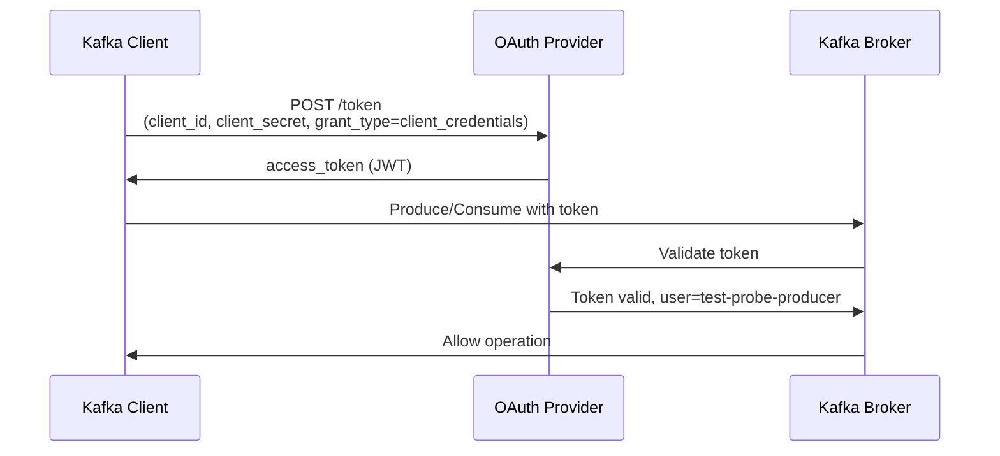
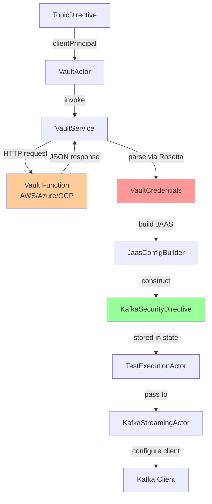

# 01 Security Overview

**Last Updated:** 2025-11-26
**Status:** Active - Vault integration complete, Kafka SASL/OAuth operational
**Component:** Security Architecture
**Related Documents:**
- [01.1 Vault Integration](01.1-vault-integration.md)
- [01.2 Kafka Authentication](01.2-kafka-authentication.md)
- [ADR-VAULT-001: Rosetta Mapping Pattern](../../adr/ADR-VAULT-001-rosetta-mapping-pattern.md)
- [ADR-VAULT-002: Cloud-Native Authentication](../../adr/ADR-VAULT-002-cloud-native-authentication.md)

---

## Table of Contents

- [Overview](#overview)
- [Security Layers](#security-layers)
- [Authentication Methods](#authentication-methods)
- [Authorization Patterns](#authorization-patterns)
- [Credential Management](#credential-management)
- [Security Boundaries](#security-boundaries)
- [Threat Model](#threat-model)
- [Compliance Considerations](#compliance-considerations)

---

## Overview

The Test-Probe framework implements a defense-in-depth security architecture that separates concerns across multiple layers. Security is not an afterthought but a foundational design principle woven into the actor system, service layer, and external integrations.

**Core Security Principles:**

1. **Zero Trust Architecture**: No implicit trust between components
2. **Least Privilege**: Each service principal has minimum required permissions
3. **Credential Separation**: Vault credentials != Kafka credentials
4. **Cloud-Native Identity**: IAM roles/service accounts over static secrets
5. **Fail-Safe Defaults**: Deny by default, explicit allow required
6. **Defense in Depth**: Multiple independent security controls

**Security Scope:**

| Component | Security Control | Status |
|-----------|------------------|--------|
| Vault Access | Cloud IAM (AWS/Azure/GCP) | ✅ Complete |
| Kafka Authentication | OAuth 2.0 (SASL_SSL) | ✅ Complete |
| Kafka Authorization | ACLs (managed by platform) | External |
| Schema Registry | Subject-level ACLs | External |
| REST API | Future (authentication TBD) | ⏳ Planned |
| Network Transport | TLS/mTLS | Infrastructure |

---

## Security Layers

### Layer 1: Infrastructure Authentication

**Purpose:** Authenticate Test-Probe workload to cloud platforms

**Mechanisms:**
- **AWS**: IAM roles (EC2 instance profiles, EKS IRSA)
- **Azure**: Managed Identity, Function Keys
- **GCP**: Service Accounts, Workload Identity

**Why Cloud-Native?**

Traditional secret management creates circular dependency:
```
Test Probe needs Kafka credentials
    ↓
Vault stores Kafka credentials
    ↓
Test Probe needs vault credentials... where do we store those?
    ↓
Another vault? (infinite recursion)
```

Cloud-native IAM breaks this cycle:
```
Kubernetes service account → Cloud IAM role → Vault access
(No secrets in application code)
```

**Reference:** [ADR-VAULT-002: Cloud-Native Authentication](../../adr/ADR-VAULT-002-cloud-native-authentication.md)

---

### Layer 2: Credential Brokering (Vault)

**Purpose:** Fetch Kafka OAuth credentials from enterprise vault

**Flow:**
```
TestExecutionActor → VaultActor → VaultService → Cloud Vault Function
                                                        ↓
                                            Returns OAuth credentials
                                                        ↓
                                    JaasConfigBuilder constructs JAAS
                                                        ↓
                                    KafkaSecurityDirective created
```

**Security Properties:**
- Credentials fetched on-demand per test execution
- Credentials never persisted to disk
- OAuth tokens have TTL (vault manages rotation)
- JAAS config constructed by framework (not user-editable)

**Multi-Cloud Support:**

| Provider | Authentication | Transport | Secret Storage |
|----------|---------------|-----------|----------------|
| AWS | IAM role | HTTPS/TLS | Secrets Manager |
| Azure | Function key | HTTPS/TLS | Key Vault |
| GCP | Service account | HTTPS/TLS | Secret Manager |
| Local | None (jimfs) | In-memory | Filesystem |

**Reference:** [01.1 Vault Integration](01.1-vault-integration.md)

---

### Layer 3: Kafka Authentication (OAuth 2.0)

**Purpose:** Authenticate to Kafka brokers using OAuth tokens

**Protocol:** SASL_SSL (SASL/OAUTHBEARER over TLS)

**Components:**
1. **Security Protocol**: `SASL_SSL` (authentication + encryption)
2. **SASL Mechanism**: `OAUTHBEARER` (OAuth 2.0 flow)
3. **JAAS Config**: Constructed by `JaasConfigBuilder`

**JAAS Configuration Structure:**
```scala
org.apache.kafka.common.security.oauthbearer.OAuthBearerLoginModule required
  oauth.client.id="<clientId>"
  oauth.client.secret="<clientSecret>"
  oauth.token.endpoint.uri="<tokenEndpoint>"
  oauth.scope="<optional-scope>";
```

**Token Lifecycle:**
1. KafkaProducerStreamingActor/KafkaConsumerStreamingActor starts
2. Kafka client uses JAAS config to request OAuth token
3. Token sent to broker for authentication
4. Broker validates token against OAuth provider
5. Client refreshes token before expiration (automatic)

**Security Properties:**
- Credentials never sent to broker (only OAuth token)
- Tokens are short-lived (configurable TTL)
- Automatic token refresh by Kafka client
- TLS encryption for all traffic

**Reference:** [01.2 Kafka Authentication](01.2-kafka-authentication.md)

---

### Layer 4: Kafka Authorization (ACLs)

**Purpose:** Control producer/consumer access to topics

**Managed By:** Kafka platform team (external to Test-Probe)

**ACL Patterns:**

**Producer ACL:**
```bash
# Allow test-probe-producer to write to test-events topic
kafka-acls --add \
  --allow-principal User:test-probe-producer \
  --operation WRITE \
  --topic test-events
```

**Consumer ACL:**
```bash
# Allow test-probe-consumer to read from test-events topic
kafka-acls --add \
  --allow-principal User:test-probe-consumer \
  --operation READ \
  --topic test-events \
  --group test-probe-consumer-group
```

**Schema Registry ACL:**
```bash
# Allow producer to register schemas
sr-acl-cli --add \
  --allow \
  --principal User:test-probe-producer \
  --operation SUBJECT_WRITE \
  --subject "test-events-*"
```

**Reference:** [CONFLUENT-ACL-CONFIGURATION-GUIDE.md](../../../kafka/CONFLUENT-ACL-CONFIGURATION-GUIDE.md)

---

## Authentication Methods

### OAuth 2.0 Client Credentials Flow

**When:** Kafka broker authentication in production

**Flow:**


**Configuration Source:**
- `client_id`: From vault
- `client_secret`: From vault
- `token_endpoint`: From `reference.conf`
- `scope`: Optional, from `reference.conf`

**Token Format:** JWT (JSON Web Token)

**Token Properties:**
- Short-lived (15-60 minutes typical)
- Contains claims (subject, issuer, expiration)
- Verified by broker using OAuth provider's public key

---

### PLAINTEXT (Local Testing Only)

**When:** Testcontainers Kafka instances

**Security:** None (no authentication or encryption)

**Usage:**
```scala
val localDirective = KafkaSecurityDirective(
  topic = "test-events",
  role = "producer",
  securityProtocol = SecurityProtocol.PLAINTEXT,
  jaasConfig = ""  // Empty for PLAINTEXT
)
```

**Why Safe Locally:**
- Kafka runs in ephemeral Docker containers
- Network isolated to test execution
- No persistent data
- Destroyed after test completion

---

## Authorization Patterns

### Role-Based Access Control (RBAC)

**Roles in Test-Probe:**

| Role | Kafka Permission | Schema Registry Permission |
|------|-----------------|---------------------------|
| PRODUCER | WRITE to topic | SUBJECT_WRITE for schemas |
| CONSUMER | READ from topic, JOIN consumer group | SUBJECT_READ for schemas |

**Principal Mapping:**

TopicDirective specifies `clientPrincipal` which maps to:
- Kafka principal (used for ACL matching)
- Vault credential lookup key

**Example:**
```yaml
topics:
  - topic: "orders.events"
    role: "PRODUCER"
    clientPrincipal: "order-service-producer"  # Maps to Kafka User:order-service-producer
```

---

### Least Privilege Principle

**Producer Permissions:**
- WRITE to specific topic only
- DESCRIBE topic metadata
- SUBJECT_WRITE for event schemas
- No READ permissions (cannot consume)

**Consumer Permissions:**
- READ from specific topic only
- DESCRIBE topic metadata
- JOIN specific consumer group
- SUBJECT_READ for event schemas
- No WRITE permissions (cannot produce)

**Forbidden Permissions:**
- CREATE/DELETE topics (admin-only)
- ALTER topic configs (admin-only)
- GLOBAL_SUBJECTS_READ on Schema Registry (admin-only)

---

## Credential Management

### Vault Credential Flow



**Credential Lifecycle:**

1. **Fetch Phase** (Test Initialization):
   - VaultActor receives `FetchSecurityDirectives` command
   - VaultService invokes cloud vault function per TopicDirective
   - Rosetta mapper extracts credentials from vault JSON response
   - JaasConfigBuilder constructs JAAS config string
   - KafkaSecurityDirective created and stored in TestExecutionActor state

2. **Usage Phase** (Kafka Operations):
   - KafkaProducerStreamingActor/KafkaConsumerStreamingActor receives directive
   - Kafka client configured with JAAS config
   - OAuth token automatically acquired and refreshed
   - Credentials remain in memory (never logged or persisted)

3. **Cleanup Phase** (Test Completion):
   - TestExecutionActor state cleared
   - Credentials eligible for garbage collection
   - No cleanup required (short-lived in memory)

**Security Properties:**
- Credentials fetched per-test (not shared across tests)
- Credentials never persisted to disk or database
- Credentials never logged (Rosetta mapper configured to not log values)
- JAAS config validated by framework before use

---

### Rosetta Mapping Pattern

**Problem:** Enterprise vaults have different JSON structures

**Solution:** User-provided YAML mapping file

**Example Mapping:**
```yaml
# vault-credentials-mapping.yaml
mappings:
  - targetField: clientId
    sourcePath: $.kafka.credentials.oauth.client_id

  - targetField: clientSecret
    sourcePath: $.kafka.credentials.oauth.client_secret
    transformations:
      - type: base64Decode  # Decode base64-encoded secrets
```

**Security Validation:**
- No credential values in mapping file (only JSONPath expressions)
- Transformations type-safe (base64Decode validates input format)
- Mapping errors fail test initialization (fail-safe)
- Rosetta mapper does not log extracted values

**Reference:** [ADR-VAULT-001: Rosetta Mapping Pattern](../../adr/ADR-VAULT-001-rosetta-mapping-pattern.md)

---

## Security Boundaries

### Trust Boundaries

```
┌──────────────────────────────────────────────────────┐
│ UNTRUSTED ZONE                                       │
│ - User-provided feature files                        │
│ - User-provided glue code                            │
│ - Test execution results                             │
└──────────────────────────────────────────────────────┘
                        ↓ (Validation)
┌──────────────────────────────────────────────────────┐
│ FRAMEWORK ZONE (Test-Probe)                          │
│ - Actor system                                       │
│ - Service layer                                      │
│ - Kafka streaming actors                            │
│ - Credential handling (in-memory only)              │
└──────────────────────────────────────────────────────┘
                        ↓ (IAM Authentication)
┌──────────────────────────────────────────────────────┐
│ TRUSTED ZONE                                         │
│ - Cloud vault functions (AWS/Azure/GCP)             │
│ - Kafka brokers                                      │
│ - Schema Registry                                    │
└──────────────────────────────────────────────────────┘
```

**Boundary Controls:**

1. **Untrusted → Framework:**
   - Feature file validation (Cucumber parser)
   - Glue code sandboxing (separate ClassLoader)
   - Input sanitization (TopicDirective validation)

2. **Framework → Trusted:**
   - Cloud IAM authentication (no static secrets)
   - OAuth token validation (by Kafka broker)
   - TLS certificate validation

---

### Network Segmentation

**Production Deployment Recommendations:**

1. **Kafka Brokers:**
   - Private VPC/VNet only
   - No public internet access
   - TLS required (`SASL_SSL`)

2. **Vault Functions:**
   - Internal-only endpoints (no public URL)
   - VPC/VNet integration
   - IAM-based invocation

3. **Test-Probe Workload:**
   - Runs in same VPC/VNet as Kafka and vault
   - Egress firewall rules (allow Kafka brokers, vault endpoints only)
   - No ingress required (unless REST API deployed)

---

## Threat Model

### Threats Mitigated

| Threat | Mitigation | Implementation |
|--------|-----------|----------------|
| **Credential Theft** | Cloud IAM, no static secrets | ADR-VAULT-002 |
| **Man-in-the-Middle** | TLS for all network traffic | SASL_SSL protocol |
| **Unauthorized Kafka Access** | OAuth + ACLs | Platform team manages ACLs |
| **Schema Tampering** | Schema Registry ACLs | Platform team manages subject ACLs |
| **Credential Logging** | Rosetta mapper configured to not log | VaultCredentialsMapper |
| **Credential Persistence** | In-memory only, cleared after test | TestExecutionActor state |

---

### Threats Not Mitigated (Out of Scope)

| Threat | Why Not Mitigated | Responsibility |
|--------|-------------------|----------------|
| **Malicious Glue Code** | User-provided code runs in framework JVM | User's responsibility to review |
| **DDoS on Kafka** | Rate limiting not implemented | Platform team + infrastructure |
| **Kafka Broker Compromise** | Broker security is platform concern | Platform team |
| **Vault Compromise** | Vault security is platform concern | Platform team |

---

## Compliance Considerations

### Secrets Management

**PCI-DSS / SOC 2 / ISO 27001:**

✅ **Compliant Patterns:**
- Cloud-native IAM (no static credentials in code/config)
- Credentials fetched on-demand (not cached)
- Credentials in memory only (not persisted)
- TLS for all network communications
- Audit trail via CloudTrail/Cloud Audit Logs

❌ **Anti-Patterns (Avoided):**
- Hardcoded credentials in code
- Credentials in version control
- Credentials logged to files
- Credentials stored in databases

---

### Audit Logging

**What Test-Probe Logs:**
- Test ID and execution flow (not credentials)
- Vault function invocation (not response body)
- Kafka producer/consumer lifecycle (not tokens)
- Error messages (sanitized, no secrets)

**What Cloud Platforms Log:**
- IAM role assumptions (CloudTrail/Cloud Audit Logs)
- Vault function invocations (CloudWatch/Azure Monitor/Cloud Logging)
- Kafka client connections (broker audit logs)
- OAuth token requests (OAuth provider logs)

**Audit Trail Example:**
```
2025-11-26 10:15:23 [INFO] Vault invocation for test=abc-123, topics=[orders.events, payments.events]
2025-11-26 10:15:24 [INFO] Kafka producer started for topic=orders.events, testId=abc-123
2025-11-26 10:15:25 [INFO] OAuth token acquired for principal=order-service-producer
```

**What is NOT Logged:**
- Client secrets
- OAuth tokens
- JAAS configs
- Vault response bodies

---

## Related Documents

**Architecture Decisions:**
- [ADR-VAULT-001: Rosetta Mapping Pattern](../../adr/ADR-VAULT-001-rosetta-mapping-pattern.md)
- [ADR-VAULT-002: Cloud-Native Authentication](../../adr/ADR-VAULT-002-cloud-native-authentication.md)
- [ADR-SERDES-001: Confluent JSON Schema Serialization](../../adr/ADR-SERDES-001-confluent-json-schema-serialization-strategy.md)

**Implementation Guides:**
- [01.1 Vault Integration](01.1-vault-integration.md)
- [01.2 Kafka Authentication](01.2-kafka-authentication.md)
- [Confluent ACL Configuration Guide](../../../kafka/CONFLUENT-ACL-CONFIGURATION-GUIDE.md)

**Models:**
- [KafkaSecurityDirective](../07%20Models/07.1-probe-testing-models.md)
- [TopicDirective](../../../api/topic-directive-model.md)

---

**Last Updated:** 2025-11-26
**Status:** Active - Security architecture complete and operational
