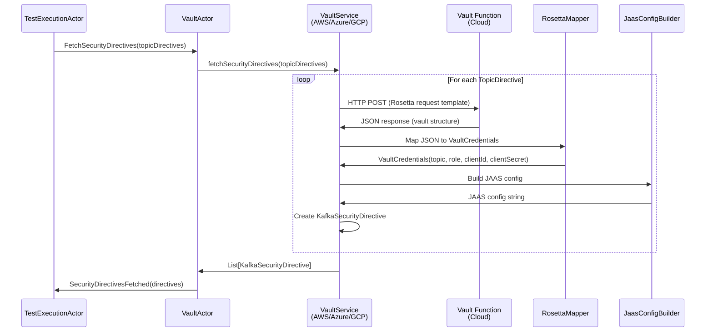

# 01.1 Vault Integration

**Last Updated:** 2025-11-26
**Status:** Active - Multi-cloud vault integration complete
**Component:** Vault Service Layer
**Related Documents:**
- [01 Security Overview](01-security-overview.md)
- [01.2 Kafka Authentication](01.2-kafka-authentication.md)
- [ADR-VAULT-001: Rosetta Mapping Pattern](../../adr/ADR-VAULT-001-rosetta-mapping-pattern.md)
- [ADR-VAULT-002: Cloud-Native Authentication](../../adr/ADR-VAULT-002-cloud-native-authentication.md)
- [04.1 Service Layer Architecture](../04%20Adapters/04.1-service-layer-architecture.md)

---

## Table of Contents

- [Overview](#overview)
- [Architecture](#architecture)
- [Cloud Provider Integrations](#cloud-provider-integrations)
- [Credential Mapping (Rosetta)](#credential-mapping-rosetta)
- [Local Testing with jimfs](#local-testing-with-jimfs)
- [Implementation Details](#implementation-details)
- [Error Handling](#error-handling)
- [Testing Strategy](#testing-strategy)

---

## Overview

The Vault Integration Layer provides a pluggable architecture for fetching Kafka OAuth credentials from enterprise vault implementations across AWS, Azure, and GCP. The system uses cloud-native IAM authentication to eliminate static secrets and employs the Rosetta mapping pattern to handle diverse vault JSON structures.

**Design Goals:**

1. **Multi-Cloud Support**: AWS, Azure, GCP with single abstraction
2. **Zero Static Secrets**: Cloud-native IAM for vault authentication
3. **Flexible Mapping**: User-configurable JSON-to-model transformation
4. **Local Development**: jimfs-based vault for testing
5. **Type Safety**: Compile-time guarantees through typed models

**Key Components:**

| Component | Purpose | Location |
|-----------|---------|----------|
| `ProbeVaultService` | Service trait (contract) | test-probe-core |
| `VaultCredentialsMapper` | Rosetta-based mapper | test-probe-services |
| `JaasConfigBuilder` | JAAS config constructor | test-probe-services |
| `AwsVaultService` | AWS Secrets Manager integration | test-probe-services |
| `AzureVaultService` | Azure Key Vault integration | test-probe-services |
| `GcpVaultService` | GCP Secret Manager integration | test-probe-services |
| `LocalVaultService` | jimfs-based mock vault | test-probe-services |

---

## Architecture

### High-Level Flow



---

### Rosetta Bidirectional Flow

The Rosetta pattern supports both **request building** and **response mapping**:


**Request Building Phase:**
- Substitutes variables from TopicDirective, metadata, and config
- Supports three variable patterns (config paths, metadata keys, directive fields)
- Validates security boundaries (config paths must use `request-params.*` namespace)

**Response Mapping Phase:**
- Extracts credentials from vault JSON using JSONPath
- Applies transformations (base64Decode, concat, etc.)
- Returns intermediate `VaultCredentials` model

**JAAS Construction Phase:**
- Framework-controlled (not user-configurable)
- Constructs OAuth JAAS config from VaultCredentials
- Ensures security-critical format is correct

**Reference:** [ADR-VAULT-001: Rosetta Mapping Pattern](../../adr/ADR-VAULT-001-rosetta-mapping-pattern.md)

---

## Cloud Provider Integrations

### AWS Secrets Manager

**Authentication:** AWS SDK Default Credentials Chain (IAM roles)

**Architecture:**
```scala
class AwsVaultService(
  lambdaClient: LambdaClient,
  rosettaConfig: RosettaConfig,
  config: Config
)(implicit ec: ExecutionContext) extends ProbeVaultService {

  def fetchSecurityDirectives(topicDirectives: List[TopicDirective]): Future[List[KafkaSecurityDirective]] = {
    val futures = topicDirectives.map { directive =>
      invokeVault(directive).flatMap { vaultResponse =>
        VaultCredentialsMapper
          .mapToVaultCredentials(vaultResponse, rosettaConfig)
          .map(creds => buildSecurityDirective(directive, creds))
      }
    }
    Future.sequence(futures)
  }

  private def invokeVault(directive: TopicDirective): Future[String] = {
    RequestBodyBuilder.build(directive, rosettaConfig, config) match {
      case Left(error) => Future.failed(error)
      case Right(payload) =>
        val request = InvokeRequest.builder()
          .functionName(lambdaArn)
          .payload(SdkBytes.fromUtf8String(payload))
          .build()

        Future {
          val response = lambdaClient.invoke(request)
          response.payload().asUtf8String()
        }
    }
  }
}
```

**Configuration:**
```hocon
vault {
  aws {
    lambda-arn = "arn:aws:lambda:us-east-1:123456789:function:kafka-credentials-vault"
    region = "us-east-1"
    # No explicit credentials - uses IAM role
  }
  rosetta-mapping-path = "classpath:rosetta/aws-vault-mapping.yaml"
}
```

**IAM Policy Required:**
```json
{
  "Version": "2012-10-17",
  "Statement": [{
    "Effect": "Allow",
    "Action": "lambda:InvokeFunction",
    "Resource": "arn:aws:lambda:*:*:function:kafka-credentials-vault"
  }]
}
```

**Deployment Options:**
- **EC2**: Attach IAM role to instance
- **EKS**: Use IRSA (IAM Roles for Service Accounts)
- **ECS**: Assign task role
- **Local Dev**: AWS CLI profile + credentials file

---

### Azure Key Vault

**Authentication:** Azure Function Keys (infrastructure-level)

**Architecture:**
```scala
class AzureVaultService(
  httpClient: HttpClient,
  functionUrl: String,
  functionKey: String,
  rosettaConfig: RosettaConfig,
  config: Config
)(implicit ec: ExecutionContext) extends ProbeVaultService {

  def fetchSecurityDirectives(topicDirectives: List[TopicDirective]): Future[List[KafkaSecurityDirective]] = {
    val futures = topicDirectives.map { directive =>
      invokeVault(directive).flatMap { vaultResponse =>
        VaultCredentialsMapper
          .mapToVaultCredentials(vaultResponse, rosettaConfig)
          .map(creds => buildSecurityDirective(directive, creds))
      }
    }
    Future.sequence(futures)
  }

  private def invokeVault(directive: TopicDirective): Future[String] = {
    RequestBodyBuilder.build(directive, rosettaConfig, config) match {
      case Left(error) => Future.failed(error)
      case Right(payload) =>
        httpClient.post(
          uri = functionUrl,
          jsonPayload = payload,
          headers = Map(
            "Content-Type" -> "application/json",
            "x-functions-key" -> functionKey  // Infrastructure credential
          )
        )
    }
  }
}
```

**Configuration:**
```hocon
vault {
  azure {
    function-url = "https://company-vault.azurewebsites.net/api/kafka-credentials"
    function-key = "${?AZURE_FUNCTION_KEY}"  # From environment variable
  }
  rosetta-mapping-path = "classpath:rosetta/azure-vault-mapping.yaml"
}
```

**Why Function Keys?**
- Managed by Azure infrastructure
- Rotatable via Azure Portal/CLI
- Scoped per function or host
- Transmitted over TLS
- Comparable security to Managed Identity for this use case

**Future Enhancement:**
- Optional Managed Identity support for Azure-hosted deployments (AKS, Container Apps)

---

### GCP Secret Manager

**Authentication:** Network isolation + IAM (no application-level auth)

**Architecture:**
```scala
class GcpVaultService(
  httpClient: HttpClient,
  functionUrl: String,
  rosettaConfig: RosettaConfig,
  config: Config
)(implicit ec: ExecutionContext) extends ProbeVaultService {

  def fetchSecurityDirectives(topicDirectives: List[TopicDirective]): Future[List[KafkaSecurityDirective]] = {
    val futures = topicDirectives.map { directive =>
      invokeVault(directive).flatMap { vaultResponse =>
        VaultCredentialsMapper
          .mapToVaultCredentials(vaultResponse, rosettaConfig)
          .map(creds => buildSecurityDirective(directive, creds))
      }
    }
    Future.sequence(futures)
  }

  private def invokeVault(directive: TopicDirective): Future[String] = {
    RequestBodyBuilder.build(directive, rosettaConfig, config) match {
      case Left(error) => Future.failed(error)
      case Right(payload) =>
        httpClient.post(
          uri = functionUrl,
          jsonPayload = payload,
          headers = Map("Content-Type" -> "application/json")
          // No Authorization header - network access IS the authorization
        )
    }
  }
}
```

**Configuration:**
```hocon
vault {
  gcp {
    function-url = "https://us-central1-project.cloudfunctions.net/kafka-credentials"
    # No authentication config - relies on network isolation + GCP IAM
  }
  rosetta-mapping-path = "classpath:rosetta/gcp-vault-mapping.yaml"
}
```

**Security Model:**
- Cloud Function deployed with `--ingress-settings=internal-only`
- IAM policy grants Test-Probe service account `roles/cloudfunctions.invoker`
- VPC-SC (VPC Service Controls) for enterprise deployments
- Network isolation provides security boundary

**Why No ID Tokens?**
- Requires service account key distribution (secret sprawl)
- Adds Google Auth Library dependency
- Token refresh logic complexity
- No security benefit over network isolation + IAM

**Reference:** [ADR-VAULT-002: Cloud-Native Authentication](../../adr/ADR-VAULT-002-cloud-native-authentication.md)

---

## Credential Mapping (Rosetta)

### Problem Statement

Enterprise vaults have different JSON response structures:

**AWS Secrets Manager:**
```json
{
  "kafka": {
    "topics": [{"name": "orders.events", "type": "producer"}],
    "credentials": {
      "role": "PRODUCER",
      "oauth": {
        "client_id": "kafka-producer-123",
        "client_secret": "base64encodedSecret=="
      }
    }
  }
}
```

**Azure Key Vault:**
```json
{
  "data": {
    "metadata": {"topic": "orders.events"},
    "credentials": {
      "producer": {
        "clientId": "kafka-producer-123",
        "clientSecret": "base64encodedSecret=="
      }
    }
  }
}
```

**Challenge:** How to map these diverse structures to `VaultCredentials` without hardcoding vault-specific logic?

---

### Solution: Rosetta Mapping Configuration

**User provides YAML mapping file:**

```yaml
# aws-vault-mapping.yaml
request-template:
  topic: "{{topic}}"
  role: "{{role}}"
  principal: "{{clientPrincipal}}"

mappings:
  - targetField: topic
    sourcePath: $.kafka.topics[0].name

  - targetField: role
    sourcePath: $.kafka.credentials.role
    transformations:
      - type: toUpper

  - targetField: clientId
    sourcePath: $.kafka.credentials.oauth.client_id

  - targetField: clientSecret
    sourcePath: $.kafka.credentials.oauth.client_secret
    transformations:
      - type: base64Decode
```

**Configuration Path:**
```hocon
vault.rosetta-mapping-path = "classpath:rosetta/aws-vault-mapping.yaml"
```

---

### Variable Substitution (Request Building)

**Three Variable Patterns:**

**1. Config Path:** `{{$^request-params.path}}`
- Resolves from `application.conf`
- Security validated: Must start with `request-params.` namespace
- Example: `{{$^request-params.vault-requests.team-a.client-app-id}}`

**2. Metadata Key:** `{{'key'}}`
- Resolves from `TopicDirective.metadata` Map (note single quotes)
- Populated from block storage YAML
- Example: `{{'blood-type'}}` → "O-negative"

**3. Directive Field:** `{{fieldName}}`
- Resolves from `TopicDirective` built-in fields (no quotes, no prefix)
- Valid fields: `topic`, `role`, `clientPrincipal`
- Example: `{{topic}}` → "orders.events"

**Security Validation:**
```scala
// RequestBodyBuilder validates config paths
val RequiredConfigPrefix = "request-params."
val SafeConfigPathRegex = """^request-params\.[a-zA-Z0-9._-]+$""".r

// Prevents access to sensitive config:
// ✅ Valid: {{$^request-params.vault-requests.oauth-id}}
// ❌ Invalid: {{$^database.password}}
// ❌ Invalid: {{$^vault.sensitive.key}}
```

---

### JSONPath + Transformations (Response Mapping)

**JSONPath Support:**
- Nested field access: `$.meta.requestId`
- Array wildcards: `$.users[*].email`
- Array indexing: `$.users[0].name`
- Optional chaining: `$.a?.b?.c` (return None if any field missing)

**Transformation Functions:**

| Transformation | Purpose | Example |
|---------------|---------|---------|
| `base64Decode` | Decode base64-encoded secrets | `YWJjMTIz` → `abc123` |
| `base64Encode` | Encode to base64 | `abc123` → `YWJjMTIz` |
| `concat` | Concatenate multiple fields | Combine prefix + secret |
| `prefix` | Add prefix to value | `oauth:` + value |
| `suffix` | Add suffix to value | value + `-prod` |
| `toUpper` | Convert to uppercase | `producer` → `PRODUCER` |
| `toLower` | Convert to lowercase | `PRODUCER` → `producer` |
| `default` | Provide default if missing | Empty → `default-value` |

**Transformation Chaining:**
```yaml
- targetField: clientSecret
  sourcePath: $.oauth.secret
  transformations:
    - type: base64Decode   # Decode first
    - type: prefix         # Then add prefix
      value: "oauth:"
```

---

### VaultCredentials Intermediate Model

**Why separate from KafkaSecurityDirective?**

```scala
// Intermediate model (vault-specific, private to vault package)
private[vault] case class VaultCredentials(
  topic: String,
  role: String,
  clientId: String,
  clientSecret: String
)

// Final model (includes constructed jaasConfig)
case class KafkaSecurityDirective(
  topic: String,
  role: String,
  securityProtocol: SecurityProtocol,
  jaasConfig: String  // Constructed by framework, not mapped
)
```

**Benefits:**
- Clear separation: mapping vs construction
- `jaasConfig` is constructed (not user-configurable)
- VaultCredentials is private to vault package
- Enforces that jaasConfig is always correctly formatted

---

### JAAS Config Construction

**Framework-Controlled:**

```scala
object JaasConfigBuilder {
  def build(
    clientId: String,
    clientSecret: String,
    tokenEndpoint: String,  // from application.conf
    scope: Option[String] = None
  ): String = {
    s"""org.apache.kafka.common.security.oauthbearer.OAuthBearerLoginModule required
       |oauth.client.id="$clientId"
       |oauth.client.secret="$clientSecret"
       |oauth.token.endpoint.uri="$tokenEndpoint"${scope.map(s => s""" oauth.scope="$s"""").getOrElse("")};""".stripMargin
  }
}
```

**Why Separate Builder?**
- JAAS format is security-critical (must be correct)
- Framework controls the template (not user-configurable)
- OAuth endpoint comes from framework config, not vault
- Easier to audit for security compliance
- Single point of change if JAAS format evolves

**Configuration Source:**
```hocon
kafka {
  oauth {
    token-endpoint-uri = "https://oauth.company.com/token"
    scope = "kafka.producer"  # Optional
  }
}
```

---

## Local Testing with jimfs

### LocalVaultService Architecture

**Purpose:** Mock vault for local development and testing

```scala
private[services] class LocalVaultService(implicit ec: ExecutionContext) extends ProbeVaultService {

  private var jimfsVault: FileSystem = _

  override def initialize(config: ServiceConfig, context: BuilderContext): Unit = {
    jimfsVault = Jimfs.newFileSystem(Configuration.unix())
    Files.createDirectories(jimfsVault.getPath("/vault"))
  }

  override def fetchSecurityDirectives(topicDirectives: List[TopicDirective]): Future[List[KafkaSecurityDirective]] = {
    Future.successful {
      topicDirectives.map { directive =>
        // Create mock credentials (no actual vault call)
        KafkaSecurityDirective(
          topic = directive.topic,
          role = directive.role,
          securityProtocol = SecurityProtocol.PLAINTEXT,  // Local test mode
          jaasConfig = ""  // No JAAS config for PLAINTEXT
        )
      }
    }
  }
}
```

**When Used:**
- Unit tests (no Kafka required)
- Component tests with Testcontainers (PLAINTEXT mode)
- Local development (no cloud vault setup)

**Limitations:**
- Does not test Rosetta mapping (no JSON response)
- Does not test cloud authentication
- Always returns PLAINTEXT directives

**For Full Integration Testing:**
- Use WireMock to mock cloud vault HTTP endpoints
- Provide real Rosetta mapping configuration
- Test request building and response mapping

---

## Implementation Details

### Service Trait (Contract)

```scala
// In test-probe-core/src/main/scala/io/distia/probe/core/builder/modules/package.scala
trait ProbeVaultService extends Feature with BuilderModule {
  /**
   * Fetch Kafka security directives from vault
   *
   * @param topicDirectives List of topic directives from block storage
   * @return List of Kafka security directives with OAuth credentials
   */
  def fetchSecurityDirectives(topicDirectives: List[TopicDirective]):
    scala.concurrent.Future[List[io.distia.probe.common.models.KafkaSecurityDirective]]
}
```

---

### VaultCredentialsMapper (Rosetta Integration)

```scala
// In test-probe-services/src/main/scala/io/distia/probe/services/vault/VaultCredentialsMapper.scala
object VaultCredentialsMapper {

  def mapToVaultCredentials(
    vaultResponse: String,
    rosettaConfig: RosettaConfig
  ): Either[VaultMappingException, VaultCredentials] = {
    parser.parse(vaultResponse) match {
      case Right(json) =>
        // Use RosettaMapper to extract fields
        RosettaMapper.mapFields(json, rosettaConfig.mappings) match {
          case Right(fields) =>
            Right(VaultCredentials(
              topic = fields("topic"),
              role = fields("role"),
              clientId = fields("clientId"),
              clientSecret = fields("clientSecret")
            ))
          case Left(errors) =>
            Left(VaultMappingException(s"Mapping failed: ${errors.mkString(", ")}"))
        }
      case Left(error) =>
        Left(VaultMappingException(s"Invalid JSON response: ${error.getMessage}"))
    }
  }
}
```

---

### Security Directive Construction

```scala
private def buildSecurityDirective(
  directive: TopicDirective,
  credentials: VaultCredentials
): KafkaSecurityDirective = {
  val jaasConfig = JaasConfigBuilder.build(
    clientId = credentials.clientId,
    clientSecret = credentials.clientSecret,
    tokenEndpoint = config.getString("kafka.oauth.token-endpoint-uri"),
    scope = config.getOptionalString("kafka.oauth.scope")
  )

  KafkaSecurityDirective(
    topic = directive.topic,
    role = directive.role,
    securityProtocol = SecurityProtocol.SASL_SSL,
    jaasConfig = jaasConfig
  )
}
```

---

## Error Handling

### Error Categories

| Error Type | Cause | Recovery |
|-----------|-------|----------|
| **Request Building Error** | Invalid template variables | Fail test initialization |
| **HTTP Error** | Vault function unavailable | Retry (future enhancement) |
| **Mapping Error** | Invalid vault JSON structure | Fail test initialization |
| **JAAS Construction Error** | Missing OAuth config | Fail test initialization |

---

### Error Accumulation

**RequestBodyBuilder accumulates all errors:**
```scala
// If template has 3 invalid variables, returns all 3 errors:
Left(VaultMappingException(
  """Request body building failed for topic 'orders.events':
     |  - Invalid config path: 'sensitive.password'
     |  - Metadata key 'missing-key' not found
     |  - Invalid directive field: 'invalidField'""".stripMargin
))
```

**Benefits:**
- Fix all issues at once (not one at a time)
- Better developer experience
- Comprehensive error diagnostics

---

### Logging Strategy

**What is Logged:**
```scala
logger.info(s"Vault invocation for test=$testId, topics=${topicDirectives.map(_.topic)}")
logger.info(s"Security directives fetched for ${directives.size} topics")
logger.error(s"Vault invocation failed for topic=${directive.topic}", ex)
```

**What is NOT Logged:**
- Client secrets
- OAuth tokens
- JAAS configs
- Vault response bodies (contains credentials)
- Metadata values (may contain sensitive data)

**Security Properties:**
- Rosetta mapper configured to not log extracted values
- Error messages sanitized (no credential leakage)
- Audit trail preserved (test ID, topic, timestamp)

---

## Testing Strategy

### Unit Tests (VaultCredentialsMapper)

**Test:** Mapping with transformations
```scala
"should map vault JSON with base64Decode transformation" in {
  val vaultJson = """
    {
      "kafka": {
        "oauth": {
          "client_id": "kafka-producer-123",
          "client_secret": "YWJjMTIz"
        }
      }
    }
  """

  val rosettaConfig = RosettaConfig(
    mappings = List(
      MappingRule("clientSecret", "$.kafka.oauth.client_secret", List(Base64Decode))
    )
  )

  val result = VaultCredentialsMapper.mapToVaultCredentials(vaultJson, rosettaConfig)
  result shouldBe Right(VaultCredentials(..., clientSecret = "abc123"))
}
```

---

### Integration Tests (WireMock)

**Test:** AWS vault invocation
```scala
"should invoke AWS Lambda and map credentials" in {
  // Stub AWS Lambda endpoint
  wireMockServer.stubFor(
    post(urlEqualTo("/2015-03-31/functions/vault/invocations"))
      .willReturn(
        aResponse()
          .withStatus(200)
          .withBody(awsVaultResponse)
      )
  )

  val directives = awsVaultService.fetchSecurityDirectives(topicDirectives).futureValue

  directives should have size 1
  directives.head.topic shouldBe "orders.events"
  directives.head.securityProtocol shouldBe SecurityProtocol.SASL_SSL
  directives.head.jaasConfig should include("kafka-producer-123")
}
```

---

### Component Tests (VaultActor + Service)

**Test:** End-to-end vault actor flow
```scala
"should fetch security directives via VaultActor" in {
  val vaultActor = testKit.spawn(VaultActor(vaultFunctions))
  val probe = testKit.createTestProbe[VaultActorProtocol.Response]()

  vaultActor ! VaultActorProtocol.FetchSecurityDirectives(
    topicDirectives = List(topicDirective),
    replyTo = probe.ref
  )

  val response = probe.expectMessageType[VaultActorProtocol.SecurityDirectivesFetched]
  response.directives should have size 1
  response.directives.head.jaasConfig should not be empty
}
```

---

## Related Documents

**Architecture Decisions:**
- [ADR-VAULT-001: Rosetta Mapping Pattern](../../adr/ADR-VAULT-001-rosetta-mapping-pattern.md)
- [ADR-VAULT-002: Cloud-Native Authentication](../../adr/ADR-VAULT-002-cloud-native-authentication.md)

**Implementation Guides:**
- [01 Security Overview](01-security-overview.md)
- [01.2 Kafka Authentication](01.2-kafka-authentication.md)
- [04.1 Service Layer Architecture](../04%20Adapters/04.1-service-layer-architecture.md)

**API Documentation:**
- [Rosetta Vault Mapping API](../../../api/rosetta-vault-mapping-api.md)
- [Topic Directive Model](../../../api/topic-directive-model.md)

---

**Last Updated:** 2025-11-26
**Status:** Active - Multi-cloud vault integration complete
