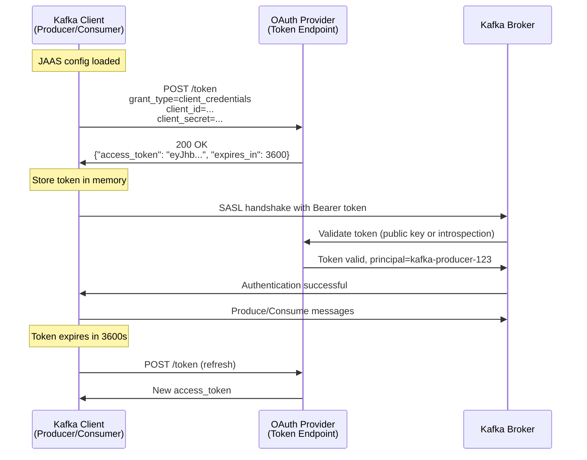
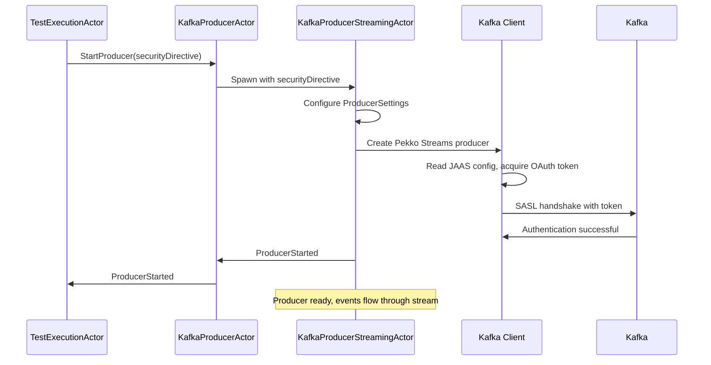
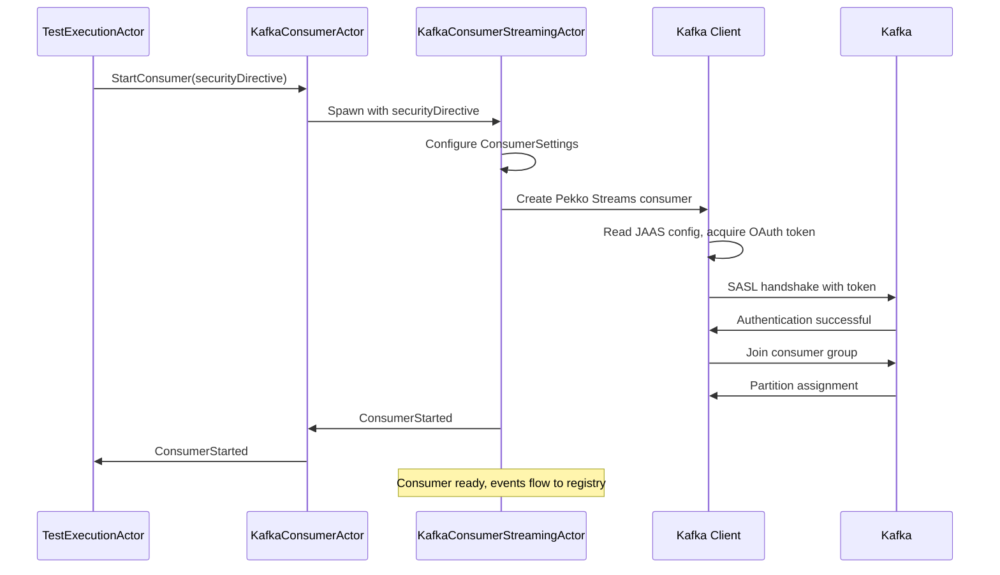

# 01.2 Kafka Authentication

**Last Updated:** 2025-11-26
**Status:** Active - SASL/OAuth authentication operational
**Component:** Kafka Security Integration
**Related Documents:**
- [01 Security Overview](01-security-overview.md)
- [01.1 Vault Integration](01.1-vault-integration.md)
- [10.1 Kafka Streaming Architecture](../10%20Kafka%20Streaming/10.1-kafka-streaming-architecture.md)
- [Confluent ACL Configuration Guide](../../../kafka/CONFLUENT-ACL-CONFIGURATION-GUIDE.md)

---

## Table of Contents

- [Overview](#overview)
- [SASL_SSL Configuration](#sasl_ssl-configuration)
- [JAAS Config Building](#jaas-config-building)
- [OAuth Token Acquisition](#oauth-token-acquisition)
- [Security Protocol Selection](#security-protocol-selection)
- [Producer Authentication](#producer-authentication)
- [Consumer Authentication](#consumer-authentication)
- [Local vs Production Modes](#local-vs-production-modes)
- [Troubleshooting](#troubleshooting)

---

## Overview

Test-Probe uses industry-standard OAuth 2.0 authentication for Kafka connections in production environments. The system dynamically constructs JAAS configuration from vault-provided credentials and configures Kafka clients with appropriate security protocols.

**Authentication Methods:**

| Environment | Security Protocol | SASL Mechanism | Transport |
|-------------|------------------|----------------|-----------|
| **Production** | SASL_SSL | OAUTHBEARER | TLS 1.2+ |
| **Local Tests** | PLAINTEXT | None | Unencrypted |

**Design Principles:**

1. **Framework-Controlled JAAS**: Users cannot edit security-critical configuration
2. **Automatic Token Management**: Kafka client handles OAuth token refresh
3. **Credential Isolation**: Each test fetches fresh credentials from vault
4. **Transport Security**: All production traffic encrypted with TLS

---

## SASL_SSL Configuration

### Protocol Components

**SASL_SSL = SASL Authentication + SSL/TLS Encryption**

```
┌─────────────────────────────────────────────────────────┐
│                    SASL_SSL Protocol                     │
│  ┌─────────────────────────────────────────────────┐   │
│  │ SASL Layer (Authentication)                     │   │
│  │ - Mechanism: OAUTHBEARER                        │   │
│  │ - Credentials: OAuth client_id + client_secret  │   │
│  │ - Token: JWT acquired from OAuth provider       │   │
│  └─────────────────────────────────────────────────┘   │
│                          ↓                              │
│  ┌─────────────────────────────────────────────────┐   │
│  │ SSL/TLS Layer (Encryption)                      │   │
│  │ - Protocol: TLS 1.2 or TLS 1.3                  │   │
│  │ - Cipher Suites: AES-GCM, ChaCha20-Poly1305     │   │
│  │ - Certificate Validation: Broker public cert    │   │
│  └─────────────────────────────────────────────────┘   │
└─────────────────────────────────────────────────────────┘
```

---

### Kafka Client Properties

**Producer Configuration:**
```scala
val producerSettings = ProducerSettings(actorSystem, keySerializer, valueSerializer)
  .withBootstrapServers(bootstrapServers)
  .withProperties(
    Map(
      "security.protocol" -> "SASL_SSL",
      "sasl.mechanism" -> "OAUTHBEARER",
      "sasl.jaas.config" -> jaasConfig,  // Constructed by framework
      "sasl.login.callback.handler.class" -> "org.apache.kafka.common.security.oauthbearer.secured.OAuthBearerLoginCallbackHandler",
      "sasl.oauthbearer.token.endpoint.url" -> tokenEndpoint
    )
  )
```

**Consumer Configuration:**
```scala
val consumerSettings = ConsumerSettings(actorSystem, keyDeserializer, valueDeserializer)
  .withBootstrapServers(bootstrapServers)
  .withGroupId(consumerGroupId)
  .withProperties(
    Map(
      "security.protocol" -> "SASL_SSL",
      "sasl.mechanism" -> "OAUTHBEARER",
      "sasl.jaas.config" -> jaasConfig,  // Constructed by framework
      "sasl.login.callback.handler.class" -> "org.apache.kafka.common.security.oauthbearer.secured.OAuthBearerLoginCallbackHandler",
      "sasl.oauthbearer.token.endpoint.url" -> tokenEndpoint
    )
  )
```

---

## JAAS Config Building

### JaasConfigBuilder Architecture

**Framework-Controlled Construction:**

```scala
// In test-probe-services/src/main/scala/io/distia/probe/services/vault/JaasConfigBuilder.scala
object JaasConfigBuilder {

  /**
   * Build Kafka JAAS configuration for OAuth authentication
   *
   * @param clientId OAuth client ID from vault
   * @param clientSecret OAuth client secret from vault
   * @param tokenEndpoint OAuth token endpoint URL from reference.conf
   * @param scope Optional OAuth scope
   * @return Complete JAAS configuration string
   */
  def build(
    clientId: String,
    clientSecret: String,
    tokenEndpoint: String,
    scope: Option[String] = None
  ): String = {
    val scopeConfig = scope.map(s => s""" oauth.scope="$s"""").getOrElse("")

    s"""org.apache.kafka.common.security.oauthbearer.OAuthBearerLoginModule required
       |oauth.client.id="$clientId"
       |oauth.client.secret="$clientSecret"
       |oauth.token.endpoint.uri="$tokenEndpoint"$scopeConfig;""".stripMargin
  }
}
```

**Why Framework-Controlled?**

| Aspect | Reason |
|--------|--------|
| **Security-Critical** | Incorrect JAAS format prevents Kafka connection |
| **Consistency** | All tests use same JAAS template |
| **Auditability** | Single point of change for compliance reviews |
| **Separation of Concerns** | Users configure vault mapping, framework handles security |

---

### Configuration Sources

**JAAS Config Components:**

```
┌──────────────────────────────────────────────────────────┐
│ JAAS Configuration Construction                          │
│                                                           │
│  client_id        ← VaultCredentials (from vault)        │
│  client_secret    ← VaultCredentials (from vault)        │
│  token_endpoint   ← reference.conf (framework config)    │
│  scope            ← reference.conf (optional)            │
│                                                           │
│  JaasConfigBuilder.build() → Complete JAAS config string │
└──────────────────────────────────────────────────────────┘
```

**Framework Configuration:**
```hocon
# reference.conf
kafka {
  oauth {
    token-endpoint-uri = "https://oauth.company.com/token"
    scope = "kafka.producer"  # Optional
  }
}
```

**Why Token Endpoint in Framework Config?**
- Same OAuth provider for all tests (not vault-specific)
- Allows environment-specific override (dev/staging/prod)
- Centralized OAuth provider configuration

---

### JAAS Config Example

**Complete JAAS Configuration:**
```scala
org.apache.kafka.common.security.oauthbearer.OAuthBearerLoginModule required
  oauth.client.id="kafka-producer-123"
  oauth.client.secret="base64encodedSecret=="
  oauth.token.endpoint.uri="https://oauth.company.com/token"
  oauth.scope="kafka.producer";
```

**Field Descriptions:**

| Field | Source | Purpose |
|-------|--------|---------|
| `oauth.client.id` | Vault | OAuth application identifier |
| `oauth.client.secret` | Vault | OAuth application secret |
| `oauth.token.endpoint.uri` | Config | OAuth token acquisition URL |
| `oauth.scope` | Config | Requested OAuth scopes (optional) |

---

## OAuth Token Acquisition

### Client Credentials Flow

**Standard OAuth 2.0 Flow:**



---

### Automatic Token Refresh

**Kafka Client Behavior:**

1. **Initial Token Acquisition:**
   - Client starts, reads JAAS config
   - POST request to token endpoint
   - Receives access token + expiration time

2. **Token Usage:**
   - Token included in SASL handshake
   - Broker validates token
   - Client begins producing/consuming

3. **Token Refresh:**
   - Client monitors token expiration
   - Refreshes token BEFORE expiration (typically 80% of TTL)
   - Seamless, no interruption to client operations

4. **Token Expiration Handling:**
   - If refresh fails, client retries
   - If token expires during operation, new SASL handshake
   - Backpressure prevents message loss

**Configuration:**
```scala
// Token refresh is automatic, controlled by Kafka client
"sasl.login.refresh.buffer.seconds" -> "300"  // Refresh 5 min before expiry
"sasl.login.refresh.min.period.seconds" -> "60"  // Min time between refreshes
```

---

### JWT Token Structure

**Typical OAuth Token:**
```json
{
  "header": {
    "alg": "RS256",
    "typ": "JWT"
  },
  "payload": {
    "sub": "kafka-producer-123",
    "iss": "https://oauth.company.com",
    "aud": "kafka-brokers",
    "exp": 1732626923,
    "iat": 1732623323,
    "scope": "kafka.producer"
  },
  "signature": "..."
}
```

**Claims:**
- `sub` (subject): Client principal (used for Kafka ACLs)
- `iss` (issuer): OAuth provider
- `aud` (audience): Kafka brokers
- `exp` (expiration): Token expiry time
- `scope`: Requested permissions

---

## Security Protocol Selection

### Protocol Decision Logic

**Flow:**
```scala
// In KafkaProducerStreamingActor / KafkaConsumerStreamingActor
val securityProtocol = directive.securityProtocol match {
  case SecurityProtocol.SASL_SSL =>
    // Production: OAuth + TLS
    configureProducerWithSaslSsl(directive)

  case SecurityProtocol.PLAINTEXT =>
    // Local tests: No auth, no encryption
    configureProducerPlaintext(directive)
}
```

**KafkaSecurityDirective Fields:**
```scala
case class KafkaSecurityDirective(
  topic: String,
  role: String,
  securityProtocol: SecurityProtocol,  // Enum: SASL_SSL or PLAINTEXT
  jaasConfig: String  // Empty for PLAINTEXT, OAuth config for SASL_SSL
)
```

---

### SASL_SSL Configuration

**When Used:**
- Production Kafka clusters
- Any environment requiring authentication/encryption

**Properties:**
```scala
Map(
  "security.protocol" -> "SASL_SSL",
  "sasl.mechanism" -> "OAUTHBEARER",
  "sasl.jaas.config" -> jaasConfig,  // From JaasConfigBuilder
  "sasl.login.callback.handler.class" -> "org.apache.kafka.common.security.oauthbearer.secured.OAuthBearerLoginCallbackHandler",
  "sasl.oauthbearer.token.endpoint.url" -> tokenEndpoint,
  "ssl.endpoint.identification.algorithm" -> "https",  // Hostname verification
  "ssl.truststore.location" -> truststorePath,  // Optional, for custom CA
  "ssl.truststore.password" -> truststorePassword  // Optional
)
```

---

### PLAINTEXT Configuration

**When Used:**
- Testcontainers Kafka instances
- Local development (no security required)

**Properties:**
```scala
Map(
  "security.protocol" -> "PLAINTEXT"
  // No SASL or SSL configuration
)
```

**Security Trade-off:**
- ✅ Faster test execution (no OAuth handshake)
- ✅ No vault dependency for local tests
- ⚠️ No encryption (acceptable for ephemeral containers)
- ⚠️ No authentication (acceptable for isolated tests)

---

## Producer Authentication

### KafkaProducerStreamingActor Flow



---

### Producer Settings Construction

```scala
// In KafkaProducerStreamingActor
def configureProducer(directive: KafkaSecurityDirective): ProducerSettings[String, Array[Byte]] = {
  val baseSettings = ProducerSettings(context.system, stringSerializer, byteArraySerializer)
    .withBootstrapServers(bootstrapServers)

  directive.securityProtocol match {
    case SecurityProtocol.SASL_SSL =>
      baseSettings.withProperties(
        Map(
          "security.protocol" -> "SASL_SSL",
          "sasl.mechanism" -> "OAUTHBEARER",
          "sasl.jaas.config" -> directive.jaasConfig,
          "sasl.login.callback.handler.class" -> "org.apache.kafka.common.security.oauthbearer.secured.OAuthBearerLoginCallbackHandler",
          "sasl.oauthbearer.token.endpoint.url" -> config.getString("kafka.oauth.token-endpoint-uri")
        )
      )

    case SecurityProtocol.PLAINTEXT =>
      baseSettings  // No additional security properties
  }
}
```

---

### Producer ACL Requirements

**Kafka ACLs (managed by platform team):**
```bash
# Allow test-probe-producer to write to orders.events topic
kafka-acls --add \
  --allow-principal User:kafka-producer-123 \
  --operation WRITE \
  --topic orders.events

# Allow test-probe-producer to describe topic metadata
kafka-acls --add \
  --allow-principal User:kafka-producer-123 \
  --operation DESCRIBE \
  --topic orders.events
```

**Schema Registry ACLs:**
```bash
# Allow producer to register schemas for orders.events
sr-acl-cli --add \
  --allow \
  --principal User:kafka-producer-123 \
  --operation SUBJECT_WRITE \
  --subject "orders.events-*"
```

**Reference:** [Confluent ACL Configuration Guide](../../../kafka/CONFLUENT-ACL-CONFIGURATION-GUIDE.md)

---

## Consumer Authentication

### KafkaConsumerStreamingActor Flow



---

### Consumer Settings Construction

```scala
// In KafkaConsumerStreamingActor
def configureConsumer(directive: KafkaSecurityDirective): ConsumerSettings[String, Array[Byte]] = {
  val baseSettings = ConsumerSettings(context.system, stringDeserializer, byteArrayDeserializer)
    .withBootstrapServers(bootstrapServers)
    .withGroupId(s"test-probe-${testId}")

  directive.securityProtocol match {
    case SecurityProtocol.SASL_SSL =>
      baseSettings.withProperties(
        Map(
          "security.protocol" -> "SASL_SSL",
          "sasl.mechanism" -> "OAUTHBEARER",
          "sasl.jaas.config" -> directive.jaasConfig,
          "sasl.login.callback.handler.class" -> "org.apache.kafka.common.security.oauthbearer.secured.OAuthBearerLoginCallbackHandler",
          "sasl.oauthbearer.token.endpoint.url" -> config.getString("kafka.oauth.token-endpoint-uri")
        )
      )

    case SecurityProtocol.PLAINTEXT =>
      baseSettings  // No additional security properties
  }
}
```

---

### Consumer ACL Requirements

**Kafka ACLs:**
```bash
# Allow test-probe-consumer to read from orders.events topic
kafka-acls --add \
  --allow-principal User:kafka-consumer-456 \
  --operation READ \
  --topic orders.events

# Allow test-probe-consumer to join consumer group
kafka-acls --add \
  --allow-principal User:kafka-consumer-456 \
  --operation READ \
  --group "test-probe-*"

# Allow test-probe-consumer to describe topic metadata
kafka-acls --add \
  --allow-principal User:kafka-consumer-456 \
  --operation DESCRIBE \
  --topic orders.events
```

**Schema Registry ACLs:**
```bash
# Allow consumer to read schemas for orders.events
sr-acl-cli --add \
  --allow \
  --principal User:kafka-consumer-456 \
  --operation SUBJECT_READ \
  --subject "orders.events-*"
```

---

## Local vs Production Modes

### Mode Comparison

| Aspect | Local (PLAINTEXT) | Production (SASL_SSL) |
|--------|-------------------|----------------------|
| **Authentication** | None | OAuth 2.0 |
| **Encryption** | None | TLS 1.2+ |
| **Credentials** | Not required | Vault-provided |
| **Kafka** | Testcontainers | Enterprise cluster |
| **Performance** | Faster (no handshake) | OAuth overhead (~100ms) |
| **Security** | None (test isolation) | Enterprise-grade |

---

### Mode Selection

**Automatic Based on Environment:**

```scala
// VaultService determines mode based on environment
LocalVaultService =>
  KafkaSecurityDirective(securityProtocol = PLAINTEXT, jaasConfig = "")

AwsVaultService/AzureVaultService/GcpVaultService =>
  KafkaSecurityDirective(securityProtocol = SASL_SSL, jaasConfig = <constructed>)
```

**Environment Variable Override (Optional):**
```hocon
kafka {
  force-plaintext = ${?KAFKA_FORCE_PLAINTEXT}  # For dev environments
}
```

---

## Troubleshooting

### Common Authentication Issues

**1. "Could not authenticate with OAuth Bearer token"**

**Cause:** Invalid JAAS config or OAuth credentials

**Debug Steps:**
```scala
// Check JAAS config (DO NOT LOG IN PRODUCTION)
logger.debug(s"JAAS config (masked): ${jaasConfig.take(50)}...")

// Verify token endpoint reachable
curl -X POST https://oauth.company.com/token \
  -d "grant_type=client_credentials" \
  -d "client_id=kafka-producer-123" \
  -d "client_secret=..."
```

**Solution:** Verify vault mapping extracts correct `clientId` and `clientSecret`

---

**2. "SSL handshake failed"**

**Cause:** Certificate validation failure or TLS version mismatch

**Debug Steps:**
```bash
# Check broker TLS configuration
openssl s_client -connect kafka-broker:9092 -showcerts

# Verify Java truststore contains broker CA
keytool -list -keystore $JAVA_HOME/lib/security/cacerts
```

**Solution:** Add broker CA certificate to truststore or configure custom truststore

---

**3. "Authorization failed for principal User:kafka-producer-123"**

**Cause:** Missing Kafka ACLs

**Debug Steps:**
```bash
# List ACLs for principal
kafka-acls --list --principal User:kafka-producer-123

# Check broker logs for authorization denials
grep "Authorization failed" /var/log/kafka/server.log
```

**Solution:** Platform team must add ACLs (see [Confluent ACL Guide](../../../kafka/CONFLUENT-ACL-CONFIGURATION-GUIDE.md))

---

**4. "Token expired during operation"**

**Cause:** OAuth token expired and refresh failed

**Debug Steps:**
```scala
// Check token refresh settings
"sasl.login.refresh.buffer.seconds" -> "300"  // Should be < token TTL
"sasl.login.refresh.min.period.seconds" -> "60"
```

**Solution:** Increase refresh buffer or check OAuth provider availability

---

## Related Documents

**Architecture:**
- [01 Security Overview](01-security-overview.md)
- [01.1 Vault Integration](01.1-vault-integration.md)
- [10.1 Kafka Streaming Architecture](../10%20Kafka%20Streaming/10.1-kafka-streaming-architecture.md)

**Configuration Guides:**
- [Confluent ACL Configuration Guide](../../../kafka/CONFLUENT-ACL-CONFIGURATION-GUIDE.md)
- [Topic Directive Model](../../../api/topic-directive-model.md)

**Implementation Files:**
- `JaasConfigBuilder.scala` - JAAS config construction
- `KafkaProducerStreamingActor.scala` - Producer authentication
- `KafkaConsumerStreamingActor.scala` - Consumer authentication
- `KafkaSecurityDirective.scala` - Security model

---

**Last Updated:** 2025-11-26
**Status:** Active - SASL/OAuth authentication operational
