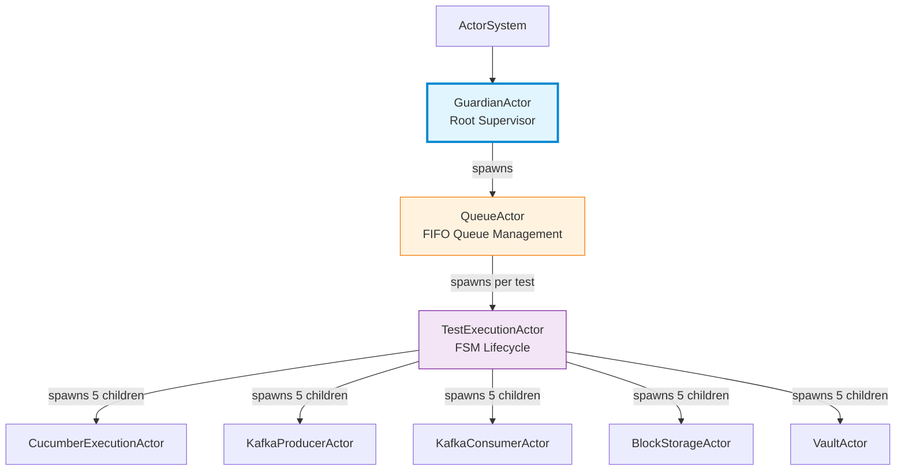
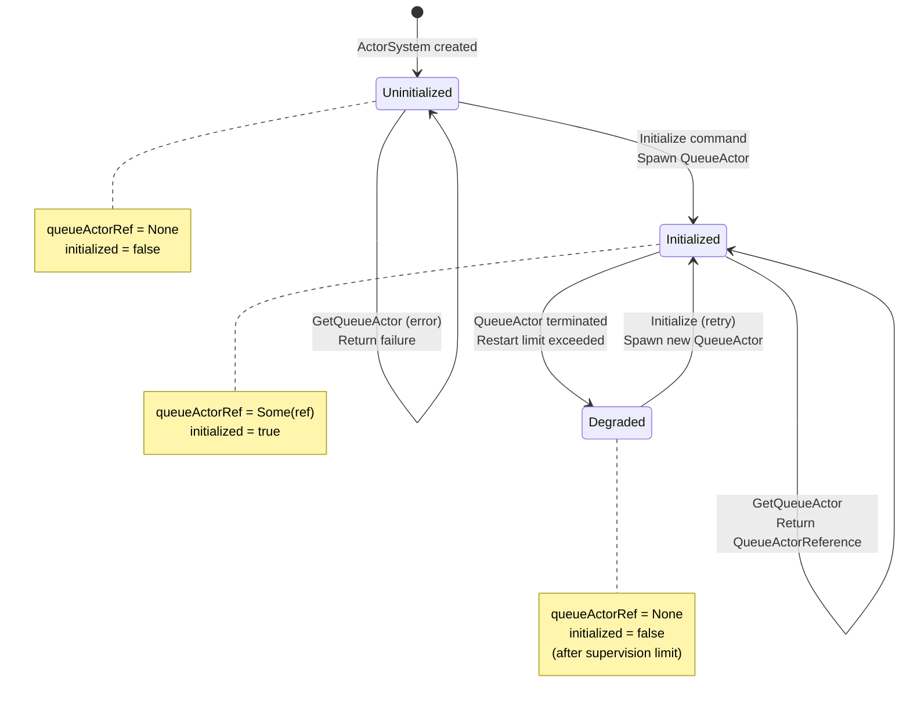
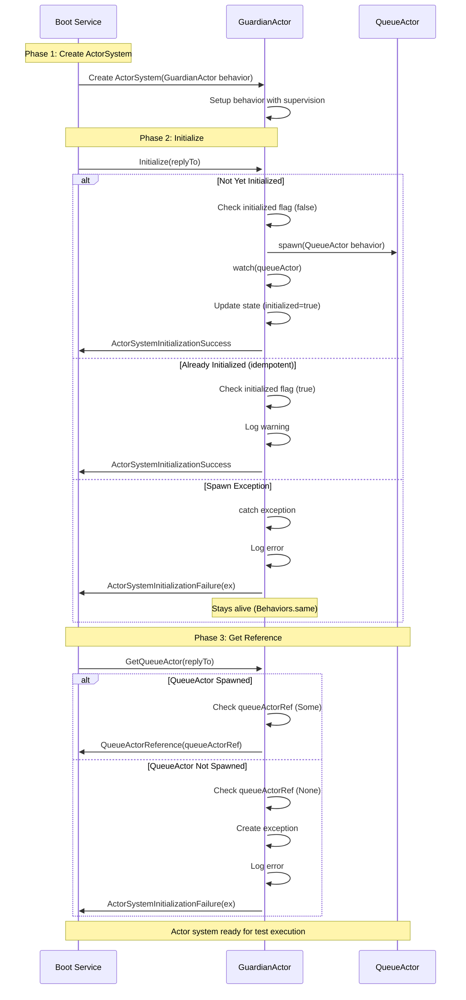
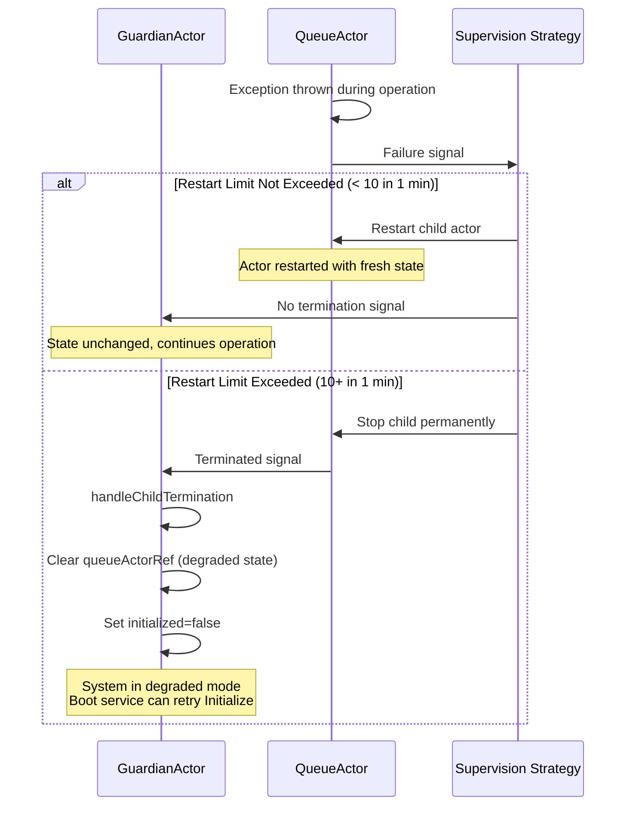
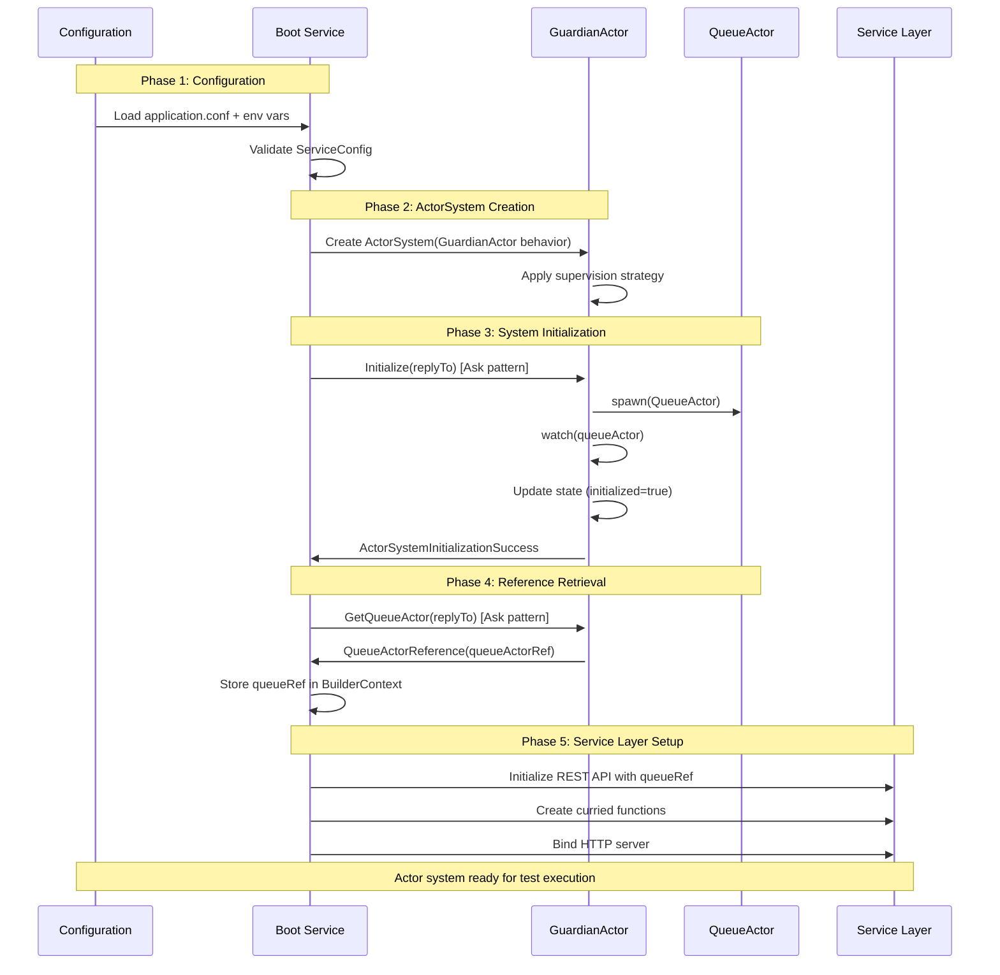

# GuardianActor - Root Supervisor & Error Kernel

**Last Updated:** 2025-10-14
**Status:** ✅ COMPLETE (Implementation + Tests)
**Component:** `test-probe-core/src/main/scala/io/distia/probe/core/actors/GuardianActor.scala`
**Test Coverage:** 90% (18 unit tests, 6 BDD scenarios)

---

## Table of Contents

1. [Overview](#overview)
2. [Responsibilities](#responsibilities)
3. [Architecture](#architecture)
4. [State Management](#state-management)
5. [Message Protocol](#message-protocol)
6. [Supervision Strategy](#supervision-strategy)
7. [Bootstrap Sequence](#bootstrap-sequence)
8. [Implementation Details](#implementation-details)
9. [Testing](#testing)
10. [Related Documentation](#related-documentation)

---

## Overview

The **GuardianActor** is the root supervisor actor for the Test-Probe actor system, implementing the **Error Kernel Pattern**. It serves as the most reliable component in the actor hierarchy with minimal logic and maximum reliability.

### Design Philosophy

- **Error Kernel Pattern**: Minimal logic reduces failure modes, all complexity delegated to children
- **Fail-Fast Initialization**: Bootstrap failures reported immediately to boot service
- **Tell-Only Communication**: Pure message passing, no ask/pipe patterns within actor system
- **Configuration-Driven**: Supervision limits from ServiceConfig
- **Idempotent Operations**: Safe to retry Initialize without side effects

### Position in Actor Hierarchy

```
ActorSystem (Akka Typed)
  └── GuardianActor (root supervisor) ← Root of all actors
      └── QueueActor (manages test queue, spawns TestExecutionActors)
          └── TestExecutionActor (FSM, one per test)
              ├── CucumberExecutionActor
              ├── KafkaProducerActor
              ├── KafkaConsumerActor
              ├── BlockStorageActor
              └── VaultActor
```

**Key Insight:** GuardianActor is the **first actor** spawned when the ActorSystem is created. It bootstraps the entire actor hierarchy.

---

## Responsibilities

### Primary Responsibilities

1. **System Initialization**: Spawn QueueActor on Initialize command
2. **Reference Management**: Provide QueueActor reference to boot service via GetQueueActor
3. **Supervision**: Restart QueueActor on failure (10 restarts per minute limit from config)
4. **Error Reporting**: Notify boot service of initialization failures with explicit responses
5. **Lifecycle Management**: Watch QueueActor and handle termination signals

### Non-Responsibilities

GuardianActor intentionally does **not** handle:

- Business logic (delegated to QueueActor and below)
- External I/O (no Kafka, S3, Vault interactions)
- Complex state management (only 2 state fields)
- Ask/Pipe patterns (pure tell-only)
- Test lifecycle management (QueueActor responsibility)

---

## Architecture

### Error Kernel Pattern

The **Error Kernel** pattern means:

- GuardianActor is the **most reliable** component (minimal logic, minimal failures)
- All complexity pushed to child actors (QueueActor, TestExecutionActor, child actors)
- Failures isolated to children, never propagate to root
- System remains alive even if QueueActor crashes repeatedly (up to supervision limits)

### Actor Hierarchy Diagram



---

## State Management

### GuardianState

GuardianActor maintains minimal state with only 2 fields:

```scala
private case class GuardianState(
  queueActorRef: Option[ActorRef[QueueCommands.QueueCommand]],
  initialized: Boolean
)

private val InitialState: GuardianState = GuardianState(
  queueActorRef = None,
  initialized = false
)
```

### State Fields

| Field | Type | Purpose | Lifecycle |
|-------|------|---------|-----------|
| `queueActorRef` | `Option[ActorRef[QueueCommand]]` | Reference to spawned QueueActor | None until Initialize, cleared on termination |
| `initialized` | `Boolean` | Tracks whether Initialize has been called | false initially, true after first Initialize |

**Key Insight:** The `initialized` flag makes Initialize **idempotent** - multiple calls do not spawn duplicate QueueActors.

### State Transitions



### State Transition Table

| Event | Current State | New State | Action |
|-------|---------------|-----------|--------|
| Initialize | Uninitialized | Initialized | Spawn QueueActor, store ref, respond Success |
| Initialize | Initialized | Initialized (unchanged) | Log warning, respond Success (idempotent) |
| GetQueueActor | Initialized | Initialized (unchanged) | Respond QueueActorReference |
| GetQueueActor | Uninitialized | Uninitialized (unchanged) | Respond ActorSystemInitializationFailure |
| QueueActor crash (within limits) | Initialized | Initialized (unchanged) | Supervision restarts child automatically |
| QueueActor crash (limit exceeded) | Initialized | Degraded | Clear queueActorRef, log fatal error |

---

## Message Protocol

### Commands (Ingress)

GuardianActor handles 2 command types from the boot service:

```scala
object GuardianCommands {
  sealed trait GuardianCommand

  case class Initialize(replyTo: ActorRef[ServiceResponse]) extends GuardianCommand
  case class GetQueueActor(replyTo: ActorRef[ServiceResponse]) extends GuardianCommand
}
```

#### 1. Initialize

**Purpose:** Bootstrap actor system by spawning QueueActor

**Parameters:**
- `replyTo: ActorRef[ServiceResponse]` - Where to send initialization result

**Behavior:**
1. Check if already initialized (idempotency check)
2. If initialized: Log warning, respond with ActorSystemInitializationSuccess
3. If not initialized:
   - Spawn QueueActor using factory (if provided) or default behavior
   - Watch QueueActor for termination signals
   - Update state (queueActorRef=Some(ref), initialized=true)
   - Respond with ActorSystemInitializationSuccess
4. On exception: Log error, respond with ActorSystemInitializationFailure, stay alive

**Responses:**
- `ActorSystemInitializationSuccess` - QueueActor spawned successfully
- `ActorSystemInitializationFailure(exception)` - Spawn failed (contains exception details)

**Example Usage:**
```scala
guardianActor ! Initialize(serviceProbe.ref)
// serviceProbe receives ActorSystemInitializationSuccess
```

#### 2. GetQueueActor

**Purpose:** Retrieve QueueActor reference for boot service

**Parameters:**
- `replyTo: ActorRef[ServiceResponse]` - Where to send QueueActor reference

**Behavior:**
1. Check if queueActorRef is defined
2. If defined: Respond with QueueActorReference(queueActorRef)
3. If not defined: Create IllegalStateException, log error, respond with ActorSystemInitializationFailure

**Responses:**
- `QueueActorReference(queueActorRef)` - QueueActor reference provided (contains valid ActorRef)
- `ActorSystemInitializationFailure(exception)` - Not initialized yet (call Initialize first)

**Example Usage:**
```scala
guardianActor ! GetQueueActor(serviceProbe.ref)
// serviceProbe receives QueueActorReference(queueActorRef)
```

### Responses (Egress)

```scala
sealed trait ServiceResponse

case object ActorSystemInitializationSuccess extends ServiceResponse
case class ActorSystemInitializationFailure(exception: Throwable) extends ServiceResponse
case class QueueActorReference(queueActorRef: ActorRef[QueueCommand]) extends ServiceResponse
```

**Design Principle:** All responses are explicit, typed messages. No exceptions thrown to caller.

### Message Flow Sequence



---

## Supervision Strategy

### Strategy Configuration

Supervision strategy configured via `reference.conf`:

```hocon
test-probe {
  supervision {
    # Maximum number of restarts within time range
    max-restarts = 10

    # Time range for restart limit
    restart-time-range = 1 minute
  }
}
```

### Supervision Behavior

```scala
Behaviors.supervise {
  receiveBehavior(InitialState, serviceConfig, queueActorFactory)
}.onFailure[Exception](
  SupervisorStrategy.restart
    .withLimit(maxNrOfRetries = 10, withinTimeRange = 1.minute)
    .withLoggingEnabled(true)
)
```

**Restart Strategy:**
- **Default**: Restart child actor on failure
- **Limit**: Maximum 10 restarts within 1 minute
- **After limit exceeded**: Stop child permanently, send Terminated signal to GuardianActor

### Supervision Flow



### Child Termination Handling

GuardianActor watches QueueActor for unexpected termination:

```scala
// During QueueActor spawn
context.watch(queueActor)

// Termination signal handler
Behaviors.receiveSignal {
  case (context, Terminated(actorRef)) =>
    if (state.queueActorRef.contains(actorRef)) {
      context.log.error(
        "QueueActor terminated unexpectedly - supervision will restart or stop based on limits"
      )

      // Enter degraded state (queueActorRef cleared)
      val newState = state.copy(
        queueActorRef = None,
        initialized = false
      )

      receiveBehavior(newState, serviceConfig, queueActorFactory)
    } else {
      // Unknown actor terminated (should not happen)
      context.log.warn(s"Unknown actor terminated: $actorRef")
      Behaviors.same
    }
}
```

---

## Bootstrap Sequence

### Complete Boot Sequence



### Step-by-Step Breakdown

#### 1. Boot Service Creates GuardianActor

```scala
// Boot service spawns actor system with GuardianActor as root
val guardianBehavior: Behavior[GuardianCommand] = GuardianActor(serviceConfig)

val system: ActorSystem[GuardianCommand] = ActorSystem(
  guardianBehavior,
  "test-probe-actor-system"
)
```

#### 2. Boot Service Sends Initialize

```scala
implicit val timeout: Timeout = Timeout.create(serviceConfig.initializationTimeout)
implicit val scheduler: Scheduler = system.scheduler

val initResult: Future[ServiceResponse] = system.ask[ServiceResponse](Initialize(_))

initResult.onComplete {
  case Success(ActorSystemInitializationSuccess) =>
    log.info("Actor system initialized successfully")

  case Success(ActorSystemInitializationFailure(exception)) =>
    log.error("Actor system initialization failed", exception)
    throw FatalBootException(exception)

  case Failure(exception) =>
    log.error("Actor system initialization timeout", exception)
    throw FatalBootException(exception)
}
```

#### 3. GuardianActor Spawns QueueActor

```scala
// Inside GuardianActor Initialize handler
val queueActorBehavior: Behavior[QueueCommand] = queueActorFactory match {
  case Some(factory) => factory(serviceConfig)
  case None => QueueActor(serviceConfig)
}

val queueActor: ActorRef[QueueCommand] = context.spawn(
  queueActorBehavior,
  "queue-actor"
)

context.watch(queueActor)  // Monitor for unexpected termination

val newState: GuardianState = GuardianState(
  queueActorRef = Some(queueActor),
  initialized = true
)

replyTo ! ActorSystemInitializationSuccess
```

#### 4. Boot Service Requests QueueActor Reference

```scala
val queueRefResult: Future[ServiceResponse] = system.ask[ServiceResponse](GetQueueActor(_))

queueRefResult.onComplete {
  case Success(QueueActorReference(queueRef)) =>
    log.info("QueueActor reference retrieved successfully")
    // Store queueRef in ServiceContext for REST API

  case Success(ActorSystemInitializationFailure(exception)) =>
    log.error("Failed to get QueueActor reference", exception)
    throw FatalBootException(exception)

  case Failure(exception) =>
    log.error("QueueActor reference retrieval timeout", exception)
    throw FatalBootException(exception)
}
```

---

## Implementation Details

### File Location

**Implementation:** `test-probe-core/src/main/scala/io/distia/probe/core/actors/GuardianActor.scala`

**Lines of Code:** 266 lines (including comprehensive inline documentation)

### Code Structure

```scala
package io.distia.probe
package core
package actors

import akka.actor.typed.scaladsl.Behaviors
import akka.actor.typed.{ActorRef, Behavior, SupervisorStrategy, Terminated}
import scala.concurrent.duration._

private[core] object GuardianActor {

  // State definition (8 lines)
  private case class GuardianState(
    queueActorRef: Option[ActorRef[QueueCommands.QueueCommand]],
    initialized: Boolean
  )

  // Factory method with optional injection (lines 75-93)
  type QueueActorFactory = (ServiceConfig) => Behavior[QueueCommands.QueueCommand]

  def apply(
    serviceConfig: ServiceConfig,
    queueActorFactory: Option[QueueActorFactory] = None
  ): Behavior[GuardianCommands.GuardianCommand]

  // Main receive behavior (lines 103-120)
  def receiveBehavior(
    state: GuardianState,
    serviceConfig: ServiceConfig,
    queueActorFactory: Option[QueueActorFactory]
  ): Behavior[GuardianCommands.GuardianCommand]

  // Handler methods (lines 135-264)
  def handleInitialize(...)
  def handleGetQueueActor(...)
  def handleChildTermination(...)
}
```

### Key Implementation Patterns

#### 1. Factory Injection Pattern (Testing Support)

```scala
type QueueActorFactory = (ServiceConfig) => Behavior[QueueCommands.QueueCommand]

def apply(
  serviceConfig: ServiceConfig,
  queueActorFactory: Option[QueueActorFactory] = None
): Behavior[GuardianCommands.GuardianCommand]
```

**Purpose:** Allow test code to inject mock QueueActor behavior

**Usage:**
- **Production:** `queueActorFactory = None` → spawns real QueueActor
- **Testing:** `queueActorFactory = Some(factory)` → spawns mock behavior

**Test Example:**
```scala
val mockFactory: Option[GuardianActor.QueueActorFactory] = Some { (_: ServiceConfig) =>
  Behaviors.receiveMessage { msg =>
    queueProbe.ref ! msg
    Behaviors.same
  }
}

val guardian: ActorRef[GuardianCommand] = testKit.spawn(
  GuardianActor(serviceConfig, mockFactory)
)
```

**Benefit:** Enables isolated testing without spawning real QueueActor.

**Related ADR:** [ADR 004: Factory Injection for Child Actors](../adr/004-factory-injection-for-child-actors.md)

#### 2. Idempotency Check

```scala
// Early return with Behaviors.same (no state change) when already initialized
if (state.initialized) {
  context.log.warn("GuardianActor already initialized - ignoring duplicate Initialize command")
  replyTo ! ActorSystemInitializationSuccess
  return Behaviors.same
}
```

**Pattern:** Early return prevents duplicate QueueActor spawning.

**Benefit:** Safe to retry Initialize without breaking actor system.

#### 3. Exception Handling with Explicit Responses

```scala
try {
  // Spawn QueueActor
  val queueActor: ActorRef[QueueCommand] = context.spawn(queueActorBehavior, "queue-actor")
  context.watch(queueActor)

  replyTo ! ActorSystemInitializationSuccess
  receiveBehavior(newState, serviceConfig, queueActorFactory)

} catch {
  case ex: Exception =>
    context.log.error("Error during GuardianActor initialization", ex)
    replyTo ! ActorSystemInitializationFailure(ex)
    Behaviors.same  // Stay alive to allow retry
}
```

**Pattern:** Catch all exceptions, respond with failure, but stay alive (boot service decides retry/fail).

**Benefit:** Caller receives typed response instead of exception crash.

**Related ADR:** [ADR 005: Error Kernel Pattern](../adr/005-error-kernel-pattern.md)

#### 4. Tell-Only Communication

**Pattern:** All messages use tell (`!`), no ask or pipe within actor system

```scala
replyTo ! ActorSystemInitializationSuccess  // Tell
```

**Not Used:**
```scala
// ❌ Ask pattern NOT used in GuardianActor
context.ask(queueActor)(ref => SomeQuery(ref)) { ... }
```

**Benefit:** Pure actor model, no blocking, simpler error handling.

#### 5. Child Watching

```scala
val queueActor: ActorRef[QueueCommand] = context.spawn(queueActorBehavior, "queue-actor")
context.watch(queueActor)  // ← Watch for termination
```

**Purpose:** Receive `Terminated` signal when child dies (handled in `receiveSignal`).

**Benefit:** GuardianActor can react to unexpected child termination and enter degraded state.

### Dependencies

```scala
import akka.actor.typed.scaladsl.Behaviors
import akka.actor.typed.{ActorRef, Behavior, SupervisorStrategy, Terminated}
import scala.concurrent.duration._

import models.GuardianCommands
import models.GuardianCommands._
import models.QueueCommands
import models._
import config.ServiceConfig
```

**Key Dependencies:**
- **Akka Typed:** ActorRef, Behavior, Behaviors, SupervisorStrategy, Terminated
- **ServiceConfig:** Configuration for supervision limits and timeouts
- **GuardianCommands:** Message protocol (Initialize, GetQueueActor)
- **QueueCommands:** Message protocol for QueueActor (spawned child)
- **ServiceResponse:** Response types (Success, Failure, Reference)

---

## Testing

### Unit Test Coverage

**File:** `test-probe-core/src/test/scala/io/distia/probe/core/actors/GuardianActorSpec.scala`

**Coverage:** 18 tests, 90% line coverage, 100% passing

**Test Categories:**

#### 1. Initialization Tests (7 tests)

- `spawn QueueActor on Initialize command` - Verifies factory called and QueueActor spawned
- `respond with ActorSystemInitializationSuccess after initialization` - Success response verification
- `handle duplicate Initialize gracefully (idempotent)` - Idempotency behavior
- `not spawn duplicate QueueActor on duplicate Initialize` - No duplicate spawn verification
- `catch and respond with failure when exception occurs during spawn` - Exception handling
- `remain functional after spawn failure (Behaviors.same)` - Actor stays alive after error
- `update state after successful initialization (verifiable via GetQueueActor)` - State transition verification

#### 2. GetQueueActor Tests (5 tests)

- `provide QueueActor reference after initialization` - Happy path reference retrieval
- `provide same QueueActor reference on multiple GetQueueActor calls` - Reference stability
- `respond with ActorSystemInitializationFailure when called before Initialize` - Error handling
- `remain functional after GetQueueActor before Initialize error` - Error recovery
- `preserve state on GetQueueActor calls (Behaviors.same)` - State preservation

#### 3. Factory Injection Tests (2 tests)

- `accept optional QueueActorFactory for testing` - Mock factory injection
- `use default QueueActor when no factory provided` - Default behavior

#### 4. Performance Tests (2 tests)

- `respond to Initialize within expected timeout` - 1 second performance requirement
- `respond to GetQueueActor within expected timeout` - 100 milliseconds performance requirement

#### 5. Integration Tests (2 tests)

- `complete full initialization and reference retrieval workflow` - End-to-end workflow
- `handle error-recovery-success workflow` - Error recovery workflow

**Testing Pattern:** All tests use ActorTestKit with TestProbe for message verification

**Example Test:**
```scala
"GuardianActor initialization" should {
  "spawn QueueActor on Initialize command" in {
    val serviceProbe: TestProbe[ServiceResponse] = testKit.createTestProbe[ServiceResponse]()
    var spawnCalled: Boolean = false

    // Mock factory that tracks spawn calls
    val factory: Option[GuardianActor.QueueActorFactory] = Some { (_: ServiceConfig) =>
      spawnCalled = true
      QueueActor(serviceConfig)
    }

    val guardian: ActorRef[GuardianCommand] = testKit.spawn(
      GuardianActor(serviceConfig, factory)
    )

    guardian ! Initialize(serviceProbe.ref)
    serviceProbe.expectMessage(3.seconds, ActorSystemInitializationSuccess)

    // Verify factory was called (QueueActor spawned)
    spawnCalled shouldBe true
  }
}
```

### BDD Component Tests

**File:** `test-probe-core/src/test/resources/features/component/actor-lifecycle/guardian-actor.feature`

**Coverage:** 6 active scenarios (5 deferred for production hardening)

**Active Scenarios:**

1. ✅ **Initialize GuardianActor successfully and spawn QueueActor**
   - Tags: @Critical @Initialization
   - Verifies: Spawn behavior, success response, state transition

2. ✅ **Retrieve QueueActor reference after initialization**
   - Tags: @Critical @GetQueueActor
   - Verifies: Reference retrieval, valid ActorRef

3. ✅ **Initialize GuardianActor multiple times (idempotent)**
   - Tags: @Critical @Idempotency
   - Verifies: No duplicate spawn, warning logged

4. ✅ **GetQueueActor called before Initialize**
   - Tags: @Edge @ErrorHandling
   - Verifies: Error response, error message content

5. ✅ **Initialize responds within expected timeout**
   - Tags: @Performance @ResponseTime
   - Verifies: 1 second response time

6. ✅ **GetQueueActor responds within expected timeout**
   - Tags: @Performance @ResponseTime
   - Verifies: 100 millisecond response time

**Deferred Scenarios** (require advanced testing infrastructure):

1. ⏸️ Initialization fails due to configuration error
2. ⏸️ QueueActor throws exception and is restarted by supervision
3. ⏸️ QueueActor exceeds restart limit (10 restarts per minute)
4. ⏸️ QueueActor throws ValidationException and is resumed (not restarted)
5. ⏸️ System shutdown coordinates graceful termination

**Deferral Rationale:** These scenarios require exception injection, supervision testing infrastructure, and graceful shutdown coordination - features needed for production hardening but not MVP.

### Step Definitions

**File:** `test-probe-core/src/test/scala/io/distia/probe/core/glue/steps/GuardianActorSteps.scala`

**Coverage:** 448 lines, 30+ step definitions

**Key Steps:**

**Given Steps:**
- `GuardianActor is initialized` - Spawns GuardianActor with mock factory, sends Initialize

**When Steps:**
- `the boot service sends {string} to GuardianActor` - Sends Initialize or GetQueueActor
- `the boot service sends {string} to GuardianActor a second time` - Tests idempotency

**Then Steps:**
- `GuardianActor should spawn a QueueActor child` - Verifies queueActorProbe exists
- `GuardianActor should respond {string}` - Verifies response type
- `GuardianActor should respond {string} with valid queueActorRef` - Verifies reference
- `the error message should contain {string}` - Verifies error message content
- `GuardianActor should respond within {int} second/milliseconds` - Performance verification

---

## Related Documentation

### Architecture Decision Records

- [ADR 005: Error Kernel Pattern](../adr/005-error-kernel-pattern.md) - Design rationale for GuardianActor as Error Kernel
- [ADR 004: Factory Injection for Child Actors](../adr/004-factory-injection-for-child-actors.md) - Testing pattern used by GuardianActor

### Blueprint Documentation

- [08.1.1 QueueActor Blueprint](../08%20Test%20Flow/08.1%20Queuing%20Tests/08.1.1-queue-actor.md) - GuardianActor's child actor
- [05.1 TestExecutionActor FSM](../05%20State%20Machine/05.1-test-execution-actor-fsm.md) - QueueActor's child actor

### Implementation Files

- **Actor:** `test-probe-core/src/main/scala/io/distia/probe/core/actors/GuardianActor.scala` (266 lines)
- **Commands:** `test-probe-core/src/main/scala/io/distia/probe/core/models/ActorCommands.scala`
- **Unit Tests:** `test-probe-core/src/test/scala/io/distia/probe/core/actors/GuardianActorSpec.scala` (474 lines)
- **BDD Feature:** `test-probe-core/src/test/resources/features/component/actor-lifecycle/guardian-actor.feature`
- **Step Definitions:** `test-probe-core/src/test/scala/io/distia/probe/core/glue/steps/GuardianActorSteps.scala` (448 lines)

### Working Documents (Historical)

- `working/GuardianActorImplementationPlan.md` - Original implementation plan
- `working/GuardianActorUnderstanding.md` - Implementation analysis
- `working/guardianActorDefinition.md` - Original definition and requirements

### Boot Service Integration

- **DefaultActorSystem:** `test-probe-core/src/main/scala/io/distia/probe/core/builder/modules/DefaultActorSystem.scala`
- **BuilderContext:** `test-probe-core/src/main/scala/io/distia/probe/core/builder/BuilderContext.scala`

### Project Guides

- **CLAUDE.md:** Project overview, development guidelines, testing standards
- **Architecture INDEX:** [docs/architecture/INDEX.md](../INDEX.md)

---

## Document History

- **2025-10-14:** Initial blueprint created after GuardianActor completion (266 lines, 18 tests, 90% coverage)
- **2025-10-14:** Added comprehensive documentation: overview, architecture, state management, message protocol, supervision, bootstrap sequence, implementation details, testing
- **2025-10-14:** Added Mermaid diagrams: actor hierarchy, state transitions, message flow, supervision flow, bootstrap sequence