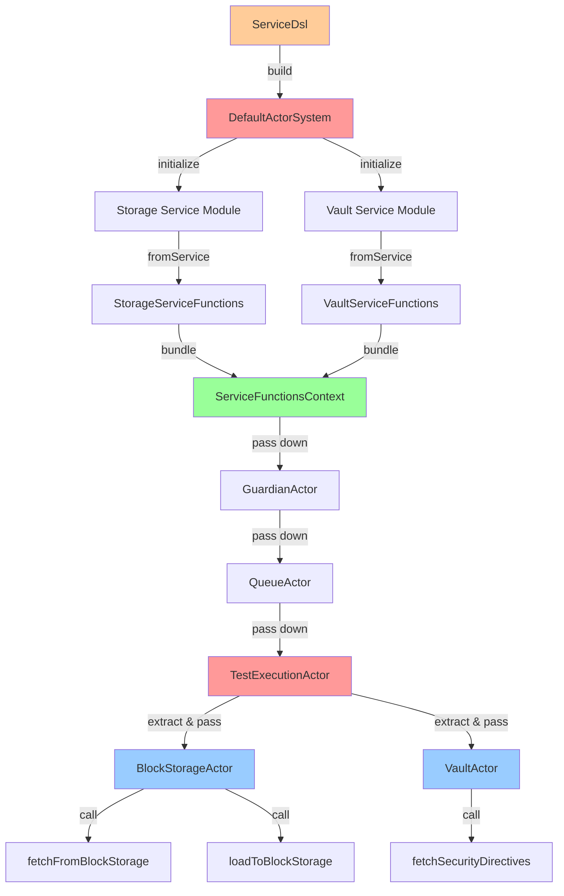
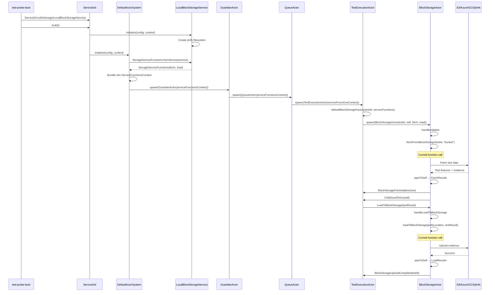

# 04.1 Service Layer Architecture

**Last Updated:** 2025-10-20
**Status:** Active - Block Storage and Vault services complete
**Component:** Service Layer Integration
**Related Documents:**
- [05.3 Child Actors Integration](../05%20State%20Machine/05.3-child-actors-integration.md)
- [ADR-STORAGE-001: Block Storage Abstraction Pattern](../../adr/ADR-STORAGE-001-block-storage-abstraction.md)
- [ADR-STORAGE-002: Function Passing vs Service Objects](../../adr/ADR-STORAGE-002-function-passing-pattern.md)
- [ADR-STORAGE-003: jimfsLocation State Management](../../adr/ADR-STORAGE-003-jimfs-state-management.md)
- [ADR-STORAGE-004: Option Resolution Strategy](../../adr/ADR-STORAGE-004-option-resolution-strategy.md)

---

## Table of Contents

- [Overview](#overview)
- [Architecture Pattern](#architecture-pattern)
- [Service Function Currying](#service-function-currying)
- [Block Storage Services](#block-storage-services)
- [Vault Services](#vault-services)
- [Integration Flow](#integration-flow)
- [Testing Strategy](#testing-strategy)
- [Future Services](#future-services)

---

## Overview

The service layer provides business logic implementations for external integrations (block storage, vault, Kafka, etc.). Service modules are initialized during the ServiceDSL build phase, and curried functions are extracted and passed to actors via ServiceFunctionsContext.

**Design Goals:**
1. **Separation of Concerns**: Service layer (business logic) vs Actor layer (orchestration)
2. **Function Composition**: Curried functions prevent signature churn when adding new service methods
3. **Testability**: Functions are testable in isolation without actor dependencies
4. **Multi-Implementation Support**: Pluggable backends (local jimfs, AWS S3, Azure Blob, GCS)
5. **Type Safety**: Compile-time guarantees through phantom type builder pattern

**Implementation Status:**
- **Block Storage**: COMPLETE (jimfs + 3 cloud skeletons)
- **Vault**: COMPLETE (jimfs-based spike)
- **Kafka**: Streaming layer complete (supervisor + streaming actors)
- **Cucumber**: Future phase

---

## Architecture Pattern

### Service Module → Curried Functions → Actor Consumption



### Pattern Components

**1. Service Trait (Contract)**
```scala
// In test-probe-core/src/main/scala/io/distia/probe/core/builder/modules/package.scala
trait ProbeStorageService extends Feature with BuilderModule {
  /**
   * Fetch test data from block storage to jimfs
   * @param testId UUID of the test
   * @param bucket Bucket/container name (concrete String, NOT Option)
   * @return BlockStorageDirective with jimfs location and topic directives
   */
  def fetchFromBlockStorage(testId: java.util.UUID, bucket: String):
    scala.concurrent.Future[io.distia.probe.common.models.BlockStorageDirective]

  /**
   * Upload test evidence from jimfs to block storage
   * @param jimfsLocation Location from BlockStorageDirective (stored in actor state after fetch)
   * @param testResult Test execution result with evidence metadata
   * @return Unit on success
   */
  def loadToBlockStorage(jimfsLocation: String, testResult: io.distia.probe.core.models.TestExecutionResult):
    scala.concurrent.Future[Unit]
}
```

**2. Service Implementation (Business Logic)**
```scala
// In test-probe-services/src/main/scala/io/distia/probe/services/builder/modules/LocalBlockStorageService.scala
private[services] class LocalBlockStorageService(implicit ec: ExecutionContext)
  extends ProbeStorageService {

  private var jimfsStorage: FileSystem = _

  override def initialize(config: ServiceConfig, context: BuilderContext): Unit = {
    jimfsStorage = Jimfs.newFileSystem(Configuration.unix())
    // Create storage root directories
    Files.createDirectories(jimfsStorage.getPath("/jimfs"))
    Files.createDirectories(jimfsStorage.getPath("/storage"))
  }

  override def fetchFromBlockStorage(testId: UUID, bucket: String): Future[BlockStorageDirective] = {
    Future.successful {
      val jimfsLocation = s"/jimfs/test-$testId"
      val testDir = jimfsStorage.getPath(jimfsLocation)

      // Create jimfs directory structure
      Files.createDirectories(testDir)
      Files.createDirectories(testDir.resolve("features"))
      Files.createDirectories(testDir.resolve("evidence"))

      // Simulate topic directive extraction from feature files
      val topicDirectives = List(
        TopicDirective("test-events", "producer", s"test-client-$testId", List(("eventType", "TestEvent"))),
        TopicDirective("test-results", "consumer", s"test-client-$testId", List(("resultType", "TestResult")))
      )

      BlockStorageDirective(jimfsLocation, topicDirectives)
    }
  }

  override def loadToBlockStorage(jimfsLocation: String, testResult: TestExecutionResult): Future[Unit] = {
    Future.successful {
      val evidenceDir = jimfsStorage.getPath(s"$jimfsLocation/evidence")

      if (Files.exists(evidenceDir)) {
        val testId = jimfsLocation.stripPrefix("/jimfs/test-")
        val storageDestination = jimfsStorage.getPath(s"/storage/default-bucket/tests/$testId/evidence")

        Files.createDirectories(storageDestination)

        // Copy all evidence files from jimfs to storage
        Files.list(evidenceDir).iterator().asScala.foreach { evidenceFile =>
          val destination = storageDestination.resolve(evidenceFile.getFileName.toString)
          Files.copy(evidenceFile, destination, StandardCopyOption.REPLACE_EXISTING)
        }
      }
      ()
    }
  }
}
```

**3. Function Bundle (No Signature Churn)**
```scala
// In test-probe-core/src/main/scala/io/distia/probe/core/builder/StorageServiceFunctions.scala
case class StorageServiceFunctions(
  fetchFromBlockStorage: (UUID, String) => Future[BlockStorageDirective],
  loadToBlockStorage: (String, TestExecutionResult) => Future[Unit]
)

object StorageServiceFunctions {
  /**
   * Extract curried functions from ProbeStorageService module
   */
  def fromService(service: ProbeStorageService): StorageServiceFunctions =
    StorageServiceFunctions(
      fetchFromBlockStorage = service.fetchFromBlockStorage,
      loadToBlockStorage = service.loadToBlockStorage
    )
}
```

**4. Context Bundling (All Services Together)**
```scala
// In test-probe-core/src/main/scala/io/distia/probe/core/models/ServiceFunctionsContext.scala
case class ServiceFunctionsContext(
  vault: VaultServiceFunctions,
  storage: StorageServiceFunctions
)
```

**5. Actor Consumption (Curried Functions)**
```scala
// In test-probe-core/src/main/scala/io/distia/probe/core/actors/BlockStorageActor.scala
def apply(
  testId: UUID,
  parentTea: ActorRef[TestExecutionCommand],
  fetchFromBlockStorage: (UUID, String) => Future[BlockStorageDirective],  // Curried function
  loadToBlockStorage: (String, TestExecutionResult) => Future[Unit]  // Curried function
): Behavior[BlockStorageCommand] = {
  Behaviors.setup { context =>
    // No service object dependency - just call the function
    import context.executionContext
    val fetchFuture = fetchFromBlockStorage(testId, "my-bucket")
    // ...
  }
}
```

### Benefits of This Pattern

1. **No Signature Churn**: Adding new service methods doesn't change actor signatures
   - New methods added to service trait
   - New functions added to function bundle
   - ServiceFunctionsContext unchanged (existing field updated)
   - Actor constructors unchanged

2. **Actors Don't Depend on Service Implementations**
   - Actors receive function references, not service objects
   - Service module can be swapped without touching actor code
   - Clear interface contract (function signature)

3. **Testability in Isolation**
   - Service functions can be tested independently
   - Actors can be tested with stubbed functions
   - No need to mock entire service objects

4. **Follows Functional Programming Principles**
   - Functions as first-class values
   - Composition over inheritance
   - Immutable data flow

5. **Type Safety**
   - Compiler enforces correct function signatures
   - No runtime type errors from service misuse
   - Phantom type builder ensures all services present

---

## Service Function Currying

### Currying Flow

**Step 1: Service DSL Build**
```scala
// In application code (test-probe-boot)
val probe = ServiceDsl
  .withConfig(DefaultConfig)
  .withActorSystem(DefaultActorSystem)
  .withVault(LocalVaultService)
  .withStorage(LocalBlockStorageService)  // Service module
  .withInterface(DefaultRestInterface)
  .build()
```

**Step 2: DefaultActorSystem Initialize**
```scala
// In test-probe-core/src/main/scala/io/distia/probe/core/builder/modules/DefaultActorSystem.scala
override def initialize(config: ServiceConfig, context: BuilderContext): Unit = {
  // Extract service modules from context
  val vaultService = context.getModule[ProbeVaultService]("vault")
  val storageService = context.getModule[ProbeStorageService]("storage")

  // Extract curried functions
  val vaultServiceFunctions = VaultServiceFunctions.fromService(vaultService)
  val storageServiceFunctions = StorageServiceFunctions.fromService(storageService)

  // Bundle into context
  val serviceFunctionsContext = ServiceFunctionsContext(vaultServiceFunctions, storageServiceFunctions)

  // Pass to actor system
  val guardianActor = system.spawn(
    GuardianActor(serviceFunctionsContext),
    "guardian"
  )

  // Store reference in context
  context.setActorSystem(guardianActor)
}
```

**Step 3: Actor Hierarchy Propagation**
```scala
// GuardianActor → QueueActor → TestExecutionActor (serviceFunctionsContext passed down)

// In TestExecutionActor.scala - Factory Resolution
val resolvedBlockStorageFactory = blockStorageFactory.getOrElse(
  defaultBlockStorageFactory(testId, serviceFunctions)
)

def defaultBlockStorageFactory(testId: UUID, serviceFunctions: ServiceFunctionsContext): BlockStorageFactory = { ctx =>
  ctx.spawn(
    Behaviors.supervise(
      BlockStorageActor(
        testId,
        ctx.self,
        serviceFunctions.storage.fetchFromBlockStorage,  // Extract curried function
        serviceFunctions.storage.loadToBlockStorage      // Extract curried function
      )
    ).onFailure[Exception](SupervisorStrategy.restart),
    s"block-storage-$testId"
  )
}
```

**Step 4: Actor Consumption**
```scala
// In BlockStorageActor.scala
def handleInitialize(
  testId: UUID,
  bucket: Option[String],
  parentTea: ActorRef[TestExecutionCommand],
  fetchFromBlockStorage: (UUID, String) => Future[BlockStorageDirective],  // Curried function
  loadToBlockStorage: (String, TestExecutionResult) => Future[Unit],  // Curried function
  context: ActorContext[BlockStorageCommand]
): Behavior[BlockStorageCommand] = {
  val resolvedBucket: String = bucket.getOrElse("default-bucket")

  import context.executionContext
  val fetchFuture: Future[BlockStorageDirective] = fetchFromBlockStorage(testId, resolvedBucket)

  // pipeToSelf maps Future → FetchResults message
  context.pipeToSelf(fetchFuture) {
    case Success(directive) => FetchResults(Right(directive))
    case Failure(ex) => FetchResults(Left(ex))
  }

  // ...
}
```

### Why Currying Over Service Objects?

**Option A: Pass Service Object (NOT USED)**
```scala
// REJECTED: Actor depends on service implementation
def apply(
  testId: UUID,
  parentTea: ActorRef[TestExecutionCommand],
  storageService: ProbeStorageService  // Direct dependency
): Behavior[BlockStorageCommand]
```

**Problems:**
- Actor depends on service module lifecycle
- Adding new service methods changes actor signature
- Harder to test (need to mock entire service object)
- Couples actor layer to service layer implementation

**Option B: Pass Curried Functions (CHOSEN)**
```scala
// CHOSEN: Actor receives function references
def apply(
  testId: UUID,
  parentTea: ActorRef[TestExecutionCommand],
  fetchFromBlockStorage: (UUID, String) => Future[BlockStorageDirective],
  loadToBlockStorage: (String, TestExecutionResult) => Future[Unit]
): Behavior[BlockStorageCommand]
```

**Benefits:**
- Actor independent of service implementation
- Adding new service methods → add new function to bundle (no actor changes)
- Easy to test (stub function with `(_, _) => Future.successful(...)`)
- Clear interface contract (function signature)
- Follows functional programming principles

---

## Block Storage Services

### Service Implementations

#### LocalBlockStorageService (COMPLETE)

**File**: `test-probe-services/src/main/scala/io/distia/probe/services/builder/modules/LocalBlockStorageService.scala` (240 lines)

**Purpose**: jimfs-based in-memory storage for testing and spike development

**Implementation**: Full (no TODOs)

**Dependencies**: Google jimfs

**Configuration**:
```hocon
probe.storage {
  backend = "local"
  local {
    filesystem-name = "probe-storage"
  }
}
```

**Fetch Flow**:
1. Create jimfs directory at `/jimfs/test-{testId}/`
2. Create subdirectories: `features/`, `evidence/`
3. Return BlockStorageDirective with jimfs location and mock topic directives

**Load Flow**:
1. Read evidence files from `/jimfs/test-{testId}/evidence/`
2. Copy to storage destination: `/storage/{bucket}/tests/{testId}/evidence/`

**jimfs Directory Structure**:
```
/jimfs/test-{testId}/
├── features/          # Test feature files (fetched from storage)
└── evidence/          # Test execution evidence (loaded to storage)

/storage/{bucket}/tests/{testId}/
└── evidence/          # Evidence uploaded to block storage
```

---

#### AwsBlockStorageService (SKELETON)

**File**: `test-probe-services/src/main/scala/io/distia/probe/services/builder/modules/AwsBlockStorageService.scala` (330 lines)

**Purpose**: S3-based block storage for production

**Implementation**: Skeleton with comprehensive TODOs

**Dependencies**: AWS SDK v2 (S3AsyncClient) - to be added

**Configuration**:
```hocon
probe.storage {
  backend = "aws"
  aws {
    region = "us-east-1"
    region = ${?AWS_REGION}

    credentials {
      access-key-id = ${?AWS_ACCESS_KEY_ID}
      secret-access-key = ${?AWS_SECRET_ACCESS_KEY}
    }

    s3 {
      multipart-threshold = 5242880  # 5MB
      max-retries = 3
      retry-backoff = 1s
    }
  }
}
```

**Future Implementation TODOs**:
1. AWS SDK v2 integration (S3AsyncClient with credentials provider)
2. Multipart upload for files > 5MB
3. S3 presigned URLs for secure browser downloads
4. Retry logic with exponential backoff
5. S3 event notifications (SQS/SNS) for async processing
6. Cross-region replication for disaster recovery

---

#### AzureBlockStorageService (SKELETON)

**File**: `test-probe-services/src/main/scala/io/distia/probe/services/builder/modules/AzureBlockStorageService.scala` (330 lines)

**Purpose**: Azure Blob Storage for production

**Implementation**: Skeleton with comprehensive TODOs

**Dependencies**: Azure SDK (BlobServiceAsyncClient) - to be added

**Configuration**:
```hocon
probe.storage {
  backend = "azure"
  azure {
    account-name = ${?AZURE_STORAGE_ACCOUNT}
    account-key = ${?AZURE_STORAGE_KEY}

    blob {
      sas-expiry = 1h
      snapshot-enabled = true
    }
  }
}
```

**Future Implementation TODOs**:
1. Azure SDK integration (BlobServiceAsyncClient)
2. SAS token generation for secure access
3. Blob snapshots for versioning
4. Azure Event Grid integration for notifications
5. Geo-redundant storage (GRS) configuration

---

#### GcpBlockStorageService (SKELETON)

**File**: `test-probe-services/src/main/scala/io/distia/probe/services/builder/modules/GcpBlockStorageService.scala` (340 lines)

**Purpose**: Google Cloud Storage for production

**Implementation**: Skeleton with comprehensive TODOs

**Dependencies**: GCS SDK (StorageOptions) - to be added

**Configuration**:
```hocon
probe.storage {
  backend = "gcp"
  gcp {
    project-id = ${?GCP_PROJECT_ID}
    credentials-file = ${?GOOGLE_APPLICATION_CREDENTIALS}

    gcs {
      resumable-upload-threshold = 10485760  # 10MB
      lifecycle {
        auto-delete-days = 90
      }
    }
  }
}
```

**Future Implementation TODOs**:
1. GCS SDK integration (StorageOptions with service account)
2. Resumable uploads for large files
3. Pub/Sub notifications for async processing
4. Object lifecycle management (auto-delete old tests)
5. Multi-regional storage for global access

---

## Vault Services

### VaultService Implementation (COMPLETE)

**File**: `test-probe-services/src/main/scala/io/distia/probe/services/builder/modules/LocalVaultService.scala`

**Purpose**: jimfs-based vault for testing

**Implementation**: Full (spike phase complete)

**Pattern**: Same as LocalBlockStorageService - curried function extraction

**Future**: AWS Lambda-based vault (AwsVaultService skeleton)

---

## Integration Flow

### Complete Integration Sequence



---

## Testing Strategy

### Service Layer Testing

**Unit Tests (70%)**:
- Test each service implementation independently
- Mock external dependencies (S3, Vault, Kafka)
- Verify business logic correctness

**Component Tests (20%)**:
- Test service integration with actors
- Use ServiceFunctionsTestHelper for stubbed functions
- Verify async operation handling (pipeToSelf)

**Integration Tests (10%)**:
- End-to-end tests with real services (Testcontainers)
- Verify error handling and retry logic
- Performance and scalability testing

### ServiceFunctionsTestHelper

**Location**: `test-probe-core/src/test/scala/io/distia/probe/core/helpers/ServiceFunctionsTestHelper.scala`

**Purpose**: Reusable stubs for actor unit tests

**Example Usage**:
```scala
// Stub ServiceFunctionsContext
def stubServiceFunctionsContext: ServiceFunctionsContext = {
  val stubVault = VaultServiceFunctions(
    fetchSecurityDirectives = _ => Future.successful(List.empty)
  )

  val stubStorage = StorageServiceFunctions(
    fetchFromBlockStorage = (testId, _) => Future.successful(
      BlockStorageDirective(
        jimfsLocation = s"/jimfs/stub-$testId",
        topicDirectives = List.empty
      )
    ),
    loadToBlockStorage = (_, _) => Future.successful(())
  )

  ServiceFunctionsContext(stubVault, stubStorage)
}

// Custom storage function for testing specific behaviors
def customStorageFunction(
  fetchFn: (UUID, String) => Future[BlockStorageDirective],
  loadFn: (String, TestExecutionResult) => Future[Unit] = (_, _) => Future.successful(())
): ServiceFunctionsContext = {
  val stubVault = VaultServiceFunctions(
    fetchSecurityDirectives = _ => Future.successful(List.empty)
  )

  val customStorage = StorageServiceFunctions(
    fetchFromBlockStorage = fetchFn,
    loadToBlockStorage = loadFn
  )

  ServiceFunctionsContext(stubVault, customStorage)
}
```

---

## Future Services

### Planned Service Integrations

#### KafkaService
- **Purpose**: Configure Kafka producers/consumers with credentials
- **Implementation**: Leverage existing Kafka Streaming layer
- **Pattern**: Same curried function approach
- **Status**: Streaming actors complete, service wrapper pending

#### CucumberService
- **Purpose**: Execute Cucumber scenarios with DSL access
- **Implementation**: Cucumber JVM + Scala DSL integration
- **Pattern**: Same curried function approach
- **Status**: Planning phase

---

## Related Documentation

**Implementation Files**:
- Service Trait: `test-probe-core/src/main/scala/io/distia/probe/core/builder/modules/package.scala`
- Function Bundles: `test-probe-core/src/main/scala/io/distia/probe/core/builder/*ServiceFunctions.scala`
- Service Implementations: `test-probe-services/src/main/scala/io/distia/probe/services/builder/modules/*Service.scala`
- Test Helpers: `test-probe-core/src/test/scala/io/distia/probe/core/helpers/ServiceFunctionsTestHelper.scala`

**Architecture Documentation**:
- [05.3 Child Actors Integration](../05%20State%20Machine/05.3-child-actors-integration.md) - BlockStorageActor implementation details
- [10.1 Kafka Streaming Architecture](../10%20Kafka%20Streaming/10.1-kafka-streaming-architecture.md) - Kafka service integration

**ADRs**:
- [ADR-STORAGE-001: Block Storage Abstraction Pattern](../../adr/ADR-STORAGE-001-block-storage-abstraction.md)
- [ADR-STORAGE-002: Function Passing vs Service Objects](../../adr/ADR-STORAGE-002-function-passing-pattern.md)
- [ADR-STORAGE-003: jimfsLocation State Management](../../adr/ADR-STORAGE-003-jimfs-state-management.md)
- [ADR-STORAGE-004: Option Resolution Strategy](../../adr/ADR-STORAGE-004-option-resolution-strategy.md)

**Working Documents**:
- Implementation Summary: `working/storage/STORAGE-IMPLEMENTATION-SUMMARY.md`
- Architecture Changes: `working/storage/ARCHITECTURE-CHANGES.md`
- File Changes Reference: `working/storage/FILE-CHANGES-REFERENCE.md`

---

## Document History

- 2025-10-20: Initial service layer architecture blueprint created
- 2025-10-20: Documented curried function pattern and ServiceFunctionsContext
- 2025-10-20: Added all 4 block storage service implementations
- 2025-10-20: Documented integration flow and testing strategy
- 2025-10-20: Cross-referenced child actors, ADRs, and working documents
