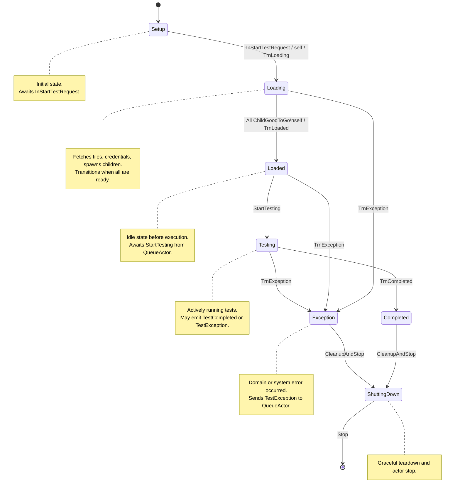
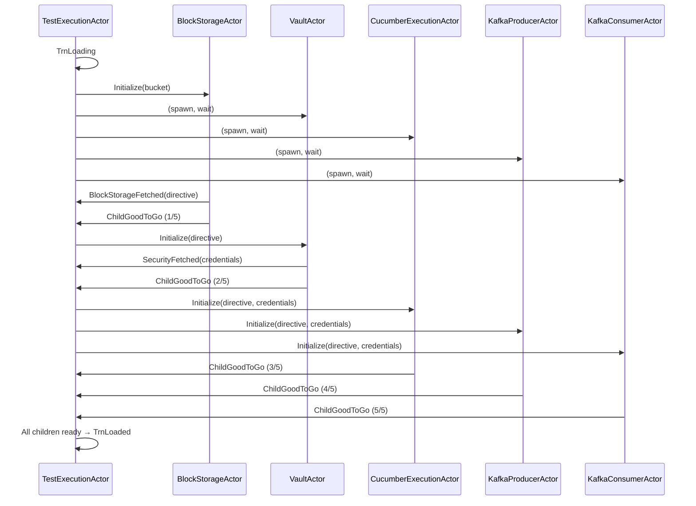

# TestExecutionActor Finite State Machine

**Last Updated:** 2025-10-14
**Status:** Implemented - FSM and all 5 child actors complete
**Component:** `test-probe-core/src/main/scala/io/distia/probe/core/actors/TestExecutionActor.scala`
**Related Documents:**
- [05.2 TestExecutionActor Error Handling](./05.2-test-execution-actor-error-handling.md)
- [05.3 Child Actors Integration](./05.3-child-actors-integration.md)

## Table of Contents

- [Overview](#overview)
- [State Machine Design](#state-machine-design)
  - [States](#states)
  - [State Transition Diagram](#state-transition-diagram)
  - [State Transition Table](#state-transition-table)
- [Data Model](#data-model)
- [Message Protocol](#message-protocol)
  - [External Messages](#external-messages)
  - [Internal Transition Messages](#internal-transition-messages)
  - [Child Actor Messages](#child-actor-messages)
- [State Behaviors](#state-behaviors)
  - [Setup State](#setup-state)
  - [Loading State](#loading-state)
  - [Loaded State](#loaded-state)
  - [Testing State](#testing-state)
  - [Completed State](#completed-state)
  - [Exception State](#exception-state)
  - [ShuttingDown State](#shuttingdown-state)
- [Child Actor Orchestration](#child-actor-orchestration)
- [Poison Pill Timer Pattern](#poison-pill-timer-pattern)
- [Factory Injection Pattern](#factory-injection-pattern)
- [Design Patterns](#design-patterns)
- [Testing Strategy](#testing-strategy)
- [References](#references)

---

## Overview

The **TestExecutionActor** is a typed Akka FSM responsible for orchestrating the complete lifecycle of a single test execution within the Probe Core subsystem. It serves as the stateful coordinator between the QueueActor (parent) and multiple child actors that handle specialized concerns like storage, credentials, Kafka messaging, and test execution.

**Key Responsibilities:**
- Enforce deterministic state transitions through a well-defined FSM
- Coordinate initialization and orchestration of 5 child actors
- Handle domain exceptions and error propagation
- Report lifecycle events back to QueueActor
- Implement timeout-based cleanup via poison pill timers
- Support cancellation at specific lifecycle stages

**Design Philosophy:**
- **Message-driven architecture:** All state transitions triggered by messages
- **Pure FSM transitions:** No mixed pre/post-transition logic
- **Error kernel pattern:** Children can throw; FSM catches and handles
- **Queue-controlled ordering:** No message stashing; QueueActor enforces valid sequences
- **Testability:** Factory injection enables child actor mocking

---

## State Machine Design

### States

The TestExecutionActor FSM progresses through 7 distinct states:

| State | Description | Expected Duration | Poison Pill Timer |
|-------|-------------|-------------------|-------------------|
| **Setup** | Actor initialized, test registered, awaiting start command | Short (seconds) | Yes (60s default) |
| **Loading** | Fetching files, credentials, spawning and initializing child actors | Medium (10-30s) | Yes (60s default) |
| **Loaded** | All dependencies ready, queued for test execution | Variable (queue-dependent) | No (bad UX) |
| **Testing** | Active test run in progress, Cucumber executing scenarios | Variable (test-dependent) | No (bad UX) |
| **Completed** | Test finished successfully, evidence uploaded | Short (seconds) | Yes (60s default) |
| **Exception** | Domain or system exception occurred, cleanup initiated | Short (seconds) | Yes (60s default) |
| **ShuttingDown** | FSM finalizing cleanup and termination | Immediate | No (terminal) |

### State Transition Diagram



### State Transition Table

| From State | Event | Next State | Actions | QueueActor Notification |
|------------|-------|------------|---------|------------------------|
| Setup | `InInitializeTestRequest` | Setup | Store test metadata, schedule timer | `TestInitialized` |
| Setup | `InStartTestRequest` | Loading | Send `TrnLoading` to self | None (deferred) |
| Loading | `TrnLoading` | Loading | Spawn 5 children, start sequential init | `TestLoading` |
| Loading | All `ChildGoodToGo` (5x) | Loaded | Send `TrnLoaded` to self | None (deferred) |
| Loaded | `TrnLoaded` | Loaded | Cancel timer | `TestLoaded` |
| Loaded | `StartTesting` | Testing | Send `TrnTesting`, start Cucumber | `TestStarted` |
| Testing | `TestComplete` | Testing | Upload evidence to BlockStorage | None |
| Testing | `BlockStorageUploadComplete` | Completed | Send `TrnComplete`, record endTime | None (deferred) |
| Completed | `TrnComplete` | Completed | Schedule timer | `TestCompleted` |
| Any (Loading/Loaded/Testing) | `TrnException` | Exception | Cancel timers, log error | `TestException` |
| Exception | `TrnException` | Exception | Schedule timer | None (already sent) |
| Setup/Loading/Loaded | `InCancelRequest` | ShuttingDown | Send `TrnShutdown` | `TestStopping` |
| Testing/Completed/Exception | `InCancelRequest` | Same | Reject cancellation | None |
| Any | `TrnPoisonPill` | ShuttingDown | Timer expired | `TestStopping` |
| ShuttingDown | `TrnShutdown` | [*] | Stop all children, terminate actor | None (already sent) |
| Any | `GetStatus` | Same | Return current state | None |

---

## Data Model

The FSM accumulates context through the `TestExecutionData` sealed trait:

```scala
sealed trait TestExecutionData

object TestExecutionData {
  case object Uninitialized extends TestExecutionData

  case class TestData(
    replyTo: ActorRef[ServiceResponse],
    testId: UUID,
    bucket: Option[String] = None,
    testType: String,
    executor: Option[ActorRef[CucumberExecutionCommand]] = None,
    producer: Option[ActorRef[KafkaProducerCommand]] = None,
    consumer: Option[ActorRef[KafkaConsumerCommand]] = None,
    blockStorage: Option[ActorRef[BlockStorageCommand]] = None,
    vault: Option[ActorRef[VaultCommand]] = None,
    blockStorageDirective: Option[BlockStorageDirective] = None,
    securityDirectives: List[SecurityDirective],
    testResult: TestExecutionResult,
    startTime: Option[Instant] = None,
    endTime: Option[Instant] = None,
    success: Option[Boolean] = None,
    error: Option[ProbeExceptions] = None
  ) extends TestExecutionData
}
```

**Key Fields:**
- **replyTo:** ActorRef for responding to service requests (HTTP layer)
- **testId:** Unique identifier for this test execution
- **bucket:** S3/GCS/Azure bucket containing test artifacts
- **testType:** Test category (functional, regression, performance, etc.)
- **Child actor references:** All 5 child actors spawned during Loading
- **blockStorageDirective:** Files fetched from block storage
- **securityDirectives:** Credentials fetched from Vault
- **testResult:** Cucumber execution results
- **Timestamps:** startTime (when Testing begins), endTime (when Completed/Exception)
- **success:** Boolean indicating final outcome
- **error:** Domain exception if any occurred

---

## Message Protocol

### External Messages

Commands sent from outside the actor (typically from QueueActor or HTTP layer):

```scala
// Lifecycle commands
InInitializeTestRequest(testId: UUID, replyTo: ActorRef[ServiceResponse])
InStartTestRequest(testId: UUID, bucket: String, testType: Option[String], replyTo: ActorRef[ServiceResponse])
StartTesting(testId: UUID)
InCancelRequest(testId: UUID, replyTo: ActorRef[ServiceResponse])

// Query command
GetStatus(testId: UUID, replyTo: ActorRef[ServiceResponse])
```

**See:** `test-probe-core/src/main/scala/io/distia/probe/core/models/ActorCommands.scala:TestExecutionCommands`

### Internal Transition Messages

Self-messages that drive state transitions (FSM-pure continuation pattern):

```scala
// State transition triggers
TrnSetup
TrnLoading
TrnLoaded
TrnTesting
TrnComplete
TrnException(exception: ProbeExceptions)
TrnPoisonPill
TrnShutdown
```

**Design Pattern:** All side effects for a state transition occur inside the handler for the `Trn*` message. This ensures ordering and prevents race conditions.

**Example:**
```scala
case InStartTestRequest(testId, bucket, testType, replyTo) =>
  // Acknowledge request
  replyTo ! StartTestResponse(testId, accepted = true, ...)
  // Defer state transition logic to TrnLoading
  context.self ! TrnLoading
  // Transition to Loading behavior
  loadingBehavior(...)
```

### Child Actor Messages

Messages received from child actors during initialization and execution:

```scala
// Child initialization
ChildGoodToGo(testId: UUID, child: ActorRef[_])

// Data fetching
BlockStorageFetched(testId: UUID, directive: BlockStorageDirective)
SecurityFetched(testId: UUID, directives: List[SecurityDirective])

// Test execution
TestComplete(testId: UUID, result: TestExecutionResult)
BlockStorageUploadComplete(testId: UUID)

// Child shutdown
ChildShutdownComplete(child: ActorRef[_])
```

---

## State Behaviors

### Setup State

**Purpose:** Initial state after actor creation. Test is registered but not yet started.

**Entry Actions:**
- Schedule poison pill timer (60s default)
- Send `InitializeTestResponse` to service
- Notify QueueActor with `TestInitialized`

**Accepted Messages:**
- `InStartTestRequest` → Transition to Loading
- `InCancelRequest` → Allowed, transition to ShuttingDown
- `GetStatus` → Return current state
- `TrnPoisonPill` → Timer expired, transition to ShuttingDown

**Implementation:** `TestExecutionActor.scala:135-232`

**BDD Scenarios:**
- `test-execution-actor-fsm.feature:14-26` (Initialize request)
- `test-execution-actor-fsm.feature:93-102` (Cancel in Setup)
- `test-execution-actor-fsm.feature:213-222` (GetStatus in Setup)
- `test-execution-actor-fsm.feature:337-348` (Timer expiry in Setup)

### Loading State

**Purpose:** Asynchronous loading of dependencies and child actor initialization.

**Entry Actions:**
- Cancel previous timer, schedule new poison pill timer
- Spawn 5 child actors using factory pattern
- Watch all children for termination
- Initialize BlockStorageActor first (sequential dependency chain)
- Send `StartTestResponse` to service
- Notify QueueActor with `TestLoading`

**Sequential Initialization Chain:**
1. BlockStorageActor → `BlockStorageFetched` → Initialize VaultActor
2. VaultActor → `SecurityFetched` → Initialize Cucumber, Producer, Consumer
3. All 5 actors → `ChildGoodToGo` → When count reaches 5, transition to Loaded

**Accepted Messages:**
- `TrnLoading` → Execute child spawning and initialization
- `BlockStorageFetched` → Store directive, trigger VaultActor initialization
- `SecurityFetched` → Store directives, trigger Cucumber/Producer/Consumer initialization
- `ChildGoodToGo` → Increment count, check if all 5 ready
- `InCancelRequest` → Allowed, transition to ShuttingDown
- `GetStatus` → Return current state
- `TrnException` → Transition to Exception state
- `TrnPoisonPill` → Timer expired, transition to ShuttingDown

**Implementation:** `TestExecutionActor.scala:238-348`

**BDD Scenarios:**
- `test-execution-actor-fsm.feature:29-42` (Start request and loading)
- `test-execution-actor-fsm.feature:45-60` (Exception in Loading)
- `test-execution-actor-fsm.feature:104-117` (Cancel in Loading)
- `test-execution-actor-fsm.feature:224-237` (GetStatus in Loading)
- `test-execution-actor-fsm.feature:350-366` (Timer expiry in Loading)

### Loaded State

**Purpose:** All dependencies ready, test queued for execution by QueueActor.

**Entry Actions:**
- Cancel poison pill timer (NO timer in Loaded state - bad UX for large queues)
- Notify QueueActor with `TestLoaded`

**Design Decision:** Loaded state has NO poison pill timer because tests may sit in queue for extended periods. Timing out tests that are legitimately waiting for queue processing would be poor user experience.

**Accepted Messages:**
- `TrnLoaded` → Execute entry actions
- `StartTesting` → Transition to Testing
- `InCancelRequest` → Allowed, transition to ShuttingDown
- `GetStatus` → Return current state
- `TrnException` → Transition to Exception state

**Implementation:** `TestExecutionActor.scala:355-397`

**BDD Scenarios:**
- `test-execution-actor-fsm.feature:119-139` (Cancel in Loaded)
- `test-execution-actor-fsm.feature:239-259` (GetStatus in Loaded)

### Testing State

**Purpose:** Active test execution via CucumberExecutionActor.

**Entry Actions:**
- NO poison pill timer (bad UX - tests may run long)
- Record `startTime = Instant.now()`
- Send `StartTest` to CucumberExecutionActor
- Notify QueueActor with `TestStarted`

**Test Completion Flow:**
1. Cucumber completes → `TestComplete(result)` → Store result
2. Send `LoadToBlockStorage(result)` to BlockStorageActor
3. BlockStorageActor uploads evidence → `BlockStorageUploadComplete`
4. Transition to Completed

**Design Decision:** Testing state has NO poison pill timer because test duration is highly variable and user-controlled. Timing out long-running tests would be incorrect behavior.

**Accepted Messages:**
- `TrnTesting` → Execute entry actions
- `TestComplete` → Store result, trigger evidence upload
- `BlockStorageUploadComplete` → Set endTime, success=true, transition to Completed
- `InCancelRequest` → Rejected (cannot cancel mid-test)
- `GetStatus` → Return current state
- `TrnException` → Set success=false, transition to Exception state

**Implementation:** `TestExecutionActor.scala:404-470`

**BDD Scenarios:**
- `test-execution-actor-fsm.feature:62-90` (Exception in Testing)
- `test-execution-actor-fsm.feature:141-164` (Cancel rejected in Testing)
- `test-execution-actor-fsm.feature:261-284` (GetStatus in Testing)

### Completed State

**Purpose:** Test finished successfully, evidence uploaded, awaiting cleanup.

**Entry Actions:**
- Schedule poison pill timer (60s default)
- Notify QueueActor with `TestCompleted`

**Accepted Messages:**
- `TrnComplete` → Execute entry actions
- `InCancelRequest` → Rejected (test already completed)
- `GetStatus` → Return current state
- `TrnPoisonPill` → Timer expired, transition to ShuttingDown
- `TrnException` → Late exception, transition to Exception state

**Implementation:** `TestExecutionActor.scala:476-519`

**BDD Scenarios:**
- `test-execution-actor-fsm.feature:166-193` (Cancel rejected in Completed)
- `test-execution-actor-fsm.feature:286-313` (GetStatus in Completed)
- `test-execution-actor-fsm.feature:368-401` (Timer expiry in Completed)
- `test-execution-actor-fsm.feature:426-453` (Ignore invalid messages in Completed)

### Exception State

**Purpose:** Domain or system exception occurred, cleanup and error reporting.

**Entry Actions:**
- Cancel all timers, schedule new poison pill timer
- Store exception in TestData
- Notify QueueActor with `TestException(testId, exception)`

**Accepted Messages:**
- `TrnException` → Execute entry actions
- `InCancelRequest` → Rejected (cleanup in progress)
- `GetStatus` → Return current state with error details
- `TrnPoisonPill` → Timer expired, transition to ShuttingDown

**Implementation:** `TestExecutionActor.scala:525-569`

**BDD Scenarios:**
- `test-execution-actor-fsm.feature:195-210` (Cancel rejected in Exception)
- `test-execution-actor-fsm.feature:316-334` (GetStatus in Exception)
- `test-execution-actor-fsm.feature:403-422` (Timer expiry in Exception)
- `test-execution-actor-fsm.feature:455-471` (Ignore invalid messages in Exception)

### ShuttingDown State

**Purpose:** Terminal state for graceful shutdown and actor termination.

**Entry Actions:**
- Notify QueueActor with `TestStopping` (allows QueueActor to remove FSM reference)
- Send Stop commands to all child actors (fire-and-forget)
- Immediately terminate actor

**Design Decision:** Fire-and-forget shutdown instead of coordinated shutdown. The actor stops immediately after telling children to stop, without waiting for `ChildShutdownComplete` responses. This is intentional because:
1. Child actors are incomplete/stub implementations that may not respond
2. Coordinated shutdown adds complexity without reliability benefits in this context
3. Akka supervision will clean up child actors when parent terminates

**Accepted Messages:**
- `TrnShutdown` → Execute shutdown sequence, return `Behaviors.stopped`
- `TrnPoisonPill` → Immediate stop
- Other messages → Logged and ignored

**Implementation:** `TestExecutionActor.scala:583-612`

---

## Child Actor Orchestration

The TestExecutionActor supervises 5 child actors, each with specialized responsibilities.

**Implementation Status**: ✅ **ALL 5 CHILD ACTORS COMPLETE**
- 1,106 lines of code across 5 actors (BlockStorageActor service integration complete: 340 lines)
- 64 unit tests, 52 BDD scenarios (BlockStorageActor: 20 tests)
- Parent reference pattern implemented (Akka Typed)
- Security compliance for actors handling credentials
- Service layer integration complete: BlockStorageActor (jimfs + 3 cloud skeletons), VaultActor
- Kafka/Cucumber service integration: Future phase

**See Also:** [05.3 Child Actors Integration](./05.3-child-actors-integration.md) for complete child actor documentation

| Child Actor | Responsibility | Initialization Dependency | Initialize Message |
|-------------|----------------|---------------------------|-------------------|
| **BlockStorageActor** | Fetch test files from S3/GCS/Azure (stub) | None | `Initialize(bucket)` |
| **VaultActor** | Fetch credentials from Vault (stub) | BlockStorageDirective | `Initialize(directive)` |
| **CucumberExecutionActor** | Execute Cucumber tests (stub) | Both directives | `Initialize(blockDirective, securityDirectives)` |
| **KafkaProducerActor** | Publish test events to Kafka (stub) | Both directives | `Initialize(blockDirective, securityDirectives)` |
| **KafkaConsumerActor** | Consume test-specific messages (stub) | Both directives | `Initialize(blockDirective, securityDirectives)` |

**Initialization Sequence:**



**Supervision Strategy:**
- Children supervised with `SupervisorStrategy.restart` on `Exception`
- FSM uses `SupervisorStrategy.resume` on `Throwable` to handle domain exceptions
- Domain exceptions bubble up and are caught by FSM supervision
- FSM translates exceptions into `TrnException` self-message

**See Also:** [05.2-test-execution-actor-error-handling.md](./05.2-test-execution-actor-error-handling.md)

---

## Poison Pill Timer Pattern

Each transient state uses a configurable timeout to prevent orphaned actors:

| State | Timer Active | Default Timeout | Configuration Key |
|-------|--------------|-----------------|-------------------|
| Setup | Yes | 60 seconds | `service.timeouts.setupStateTimeout` |
| Loading | Yes | 60 seconds | `service.timeouts.loadingStateTimeout` |
| Loaded | **No** | N/A | N/A (bad UX) |
| Testing | **No** | N/A | N/A (bad UX) |
| Completed | Yes | 60 seconds | `service.timeouts.completedStateTimeout` |
| Exception | Yes | 60 seconds | `service.timeouts.exceptionStateTimeout` |

**Timer Lifecycle:**
1. **On state entry:** `timers.cancel("poison-pill")` then `timers.startSingleTimer("poison-pill", TrnPoisonPill, timeout)`
2. **On state exit:** Previous timer automatically canceled on next state's entry
3. **On timer expiry:** Actor receives `TrnPoisonPill` message
4. **On TrnPoisonPill:** Transition to ShuttingDown, notify QueueActor with `TestStopping`

**Design Rationale:**
- **Loaded/Testing states excluded:** User experience consideration - tests may legitimately wait in queue or run for extended periods
- **All other states timed:** Short-lived states should not hang indefinitely
- **Configurable timeouts:** Production vs test environments have different needs

**Implementation:** Timer management in each state behavior (`timers.cancel` + `timers.startSingleTimer`)

**BDD Scenarios:** All timer expiry scenarios (`@TimerExpiry` tag) test 2-second timeouts with 3-second wait

---

## Factory Injection Pattern

TestExecutionActor uses **constructor-based dependency injection** for child actor factories, enabling comprehensive testing with mocks.

**Factory Type Signatures:**
```scala
type BlockStorageFactory = ActorContext[TestExecutionCommand] => ActorRef[BlockStorageCommand]
type VaultFactory = ActorContext[TestExecutionCommand] => ActorRef[VaultCommand]
type CucumberFactory = ActorContext[TestExecutionCommand] => ActorRef[CucumberExecutionCommand]
type KafkaProducerFactory = ActorContext[TestExecutionCommand] => ActorRef[KafkaProducerCommand]
type KafkaConsumerFactory = ActorContext[TestExecutionCommand] => ActorRef[KafkaConsumerCommand]
```

**Production Usage:**
```scala
TestExecutionActor(
  testId = UUID.randomUUID(),
  queueActor = queueRef,
  serviceConfig = config
  // Factories omitted → use defaults
)
```

**Test Usage with Mocks:**
```scala
TestExecutionActor(
  testId = testId,
  queueActor = queueProbe.ref,
  serviceConfig = config,
  blockStorageFactory = Some(ctx => blockStorageProbe.ref),
  vaultFactory = Some(ctx => vaultProbe.ref),
  cucumberFactory = Some(ctx => cucumberProbe.ref),
  producerFactory = Some(ctx => producerProbe.ref),
  consumerFactory = Some(ctx => consumerProbe.ref)
)
```

**Default Factories (with Parent Reference Pattern):**
```scala
private def defaultBlockStorageFactory(testId: UUID): BlockStorageFactory = { ctx =>
  ctx.spawn(
    Behaviors.supervise(BlockStorageActor(testId, ctx.self))  // Pass parent reference
      .onFailure[Exception](SupervisorStrategy.restart),
    s"block-storage-$testId"
  )
}
```

**Note:** All child actors implement the Akka Typed parent reference pattern:
```scala
// Child actor signature
def apply(testId: UUID, parentTea: ActorRef[TestExecutionCommand]): Behavior[Command]

// Enables child-to-parent messaging without context.parent (Akka Typed pattern)
```

**Benefits:**
- Enables unit testing with TestProbes
- Maintains production simplicity (no DI framework required)
- Supports both real actors and mocks with single API
- Type-safe at compile time

**See Also:** ADR for factory injection pattern (to be created)

---

## Design Patterns

### 1. Finite State Machine (FSM) Pattern

**Implementation:** Akka Typed FSM using behavior-based state transitions

**Benefits:**
- Explicit state modeling prevents invalid transitions
- Each state is a separate behavior function
- Compile-time verification of message handling

**References:**
- Akka Typed FSM: https://doc.akka.io/docs/akka/current/typed/fsm.html

### 2. Self-Message Continuation Pattern

**Problem:** Mixing side effects with state transitions causes race conditions

**Solution:** Defer all state transition logic to `Trn*` self-messages

**Example:**
```scala
// Don't do this (side effects mixed with transition):
case InStartTestRequest(...) =>
  spawnChildren() // Side effect
  testingBehavior(...)

// Do this (pure transition, deferred side effects):
case InStartTestRequest(...) =>
  context.self ! TrnLoading  // Defer to next message
  loadingBehavior(...)

case TrnLoading =>
  spawnChildren()  // Side effects in dedicated handler
  Behaviors.same
```

**Benefits:**
- Guarantees message ordering
- Separates transition logic from side effects
- Simplifies testing and reasoning

### 3. Error Kernel Pattern

**Problem:** How to handle child actor failures without crashing parent?

**Solution:** Let children throw, FSM catches via supervision and translates to domain messages

**Implementation:**
```scala
Behaviors.supervise {
  // FSM behaviors
}.onFailure[Throwable](SupervisorStrategy.resume)
```

Children throw → Supervision catches → FSM sends `TrnException` to self → Exception state

**Benefits:**
- Clear error boundaries
- Domain exceptions become first-class messages
- Testable exception handling

**See Also:** [05.2-test-execution-actor-error-handling.md](./05.2-test-execution-actor-error-handling.md)

### 4. Factory Pattern

**Problem:** How to test actor creation without complex DI frameworks?

**Solution:** Optional factory functions for child actor creation

**See:** [Factory Injection Pattern](#factory-injection-pattern) section above

### 5. Message-Driven Architecture

**Problem:** How to avoid blocking operations and maintain actor responsiveness?

**Solution:** All operations are message-driven, no futures/asks/blocking calls

**Benefits:**
- Maintains actor single-threaded guarantee
- Predictable message ordering
- Simplified concurrency model

---

## Testing Strategy

### Unit Tests (ScalaTest + Akka TestKit)

**File:** `test-probe-core/src/test/scala/io/distia/probe/core/actors/TestExecutionActorSpec.scala` (planned)

**Approach:** Use `BehaviorTestKit` or `ActorTestKit` with TestProbes for child actors

**Coverage:**
- State transition correctness
- Message protocol validation
- Timer behavior
- Exception handling

### Component Tests (Cucumber BDD)

**File:** `test-probe-core/src/test/resources/features/component/actor-lifecycle/test-execution-actor-fsm.feature`

**Scenarios:** 471 lines covering:
- All state transitions (Setup → Loading → Loaded → Testing → Completed/Exception)
- Exception handling in Loading, Loaded, Testing states
- Cancellation behavior (allowed in Setup/Loading/Loaded, rejected in Testing/Completed/Exception)
- GetStatus in all states
- Timer expiry in Setup, Loading, Completed, Exception states
- Invalid message handling in Completed, Exception states

**Step Definitions:** `test-probe-core/src/test/scala/io/distia/probe/core/glue/steps/TestExecutionActorSteps.scala`

**World Object:** `ActorWorld` provides test context and TestProbes for all actors

### Integration Tests

**File:** `test-probe-core/src/test/scala/io/distia/probe/core/integration/TestExecutionActorIntegrationSpec.scala` (planned)

**Approach:** Real child actors with Testcontainers for Kafka, Vault, S3

**Coverage:**
- End-to-end test execution
- Real Kafka integration
- Real storage integration
- Real credential fetching

---

## References

**Implementation Files:**
- TestExecutionActor: `test-probe-core/src/main/scala/io/distia/probe/core/actors/TestExecutionActor.scala`
- States and Data: `test-probe-core/src/main/scala/io/distia/probe/core/actors/TestExecutionActorStatesData.scala`
- Commands: `test-probe-core/src/main/scala/io/distia/probe/core/models/ActorCommands.scala`

**Test Files:**
- BDD Feature: `test-probe-core/src/test/resources/features/component/actor-lifecycle/test-execution-actor-fsm.feature`
- Step Definitions: `test-probe-core/src/test/scala/io/distia/probe/core/glue/steps/TestExecutionActorSteps.scala`
- Test Fixtures: `test-probe-core/src/test/scala/io/distia/probe/core/fixtures/TestExecutionActorFixtures.scala`

**Architecture Documentation:**
- Child Actors Integration: [05.3-child-actors-integration.md](./05.3-child-actors-integration.md)
- Error Handling: [05.2-test-execution-actor-error-handling.md](./05.2-test-execution-actor-error-handling.md)
- QueueActor Blueprint: [../../08 Test Flow/08.1 Queuing Tests/08.1.1-queue-actor.md](../../08%20Test%20Flow/08.1%20Queuing%20Tests/08.1.1-queue-actor.md)
- QueueActor Message Routing: [../../08 Test Flow/08.1 Queuing Tests/08.1.2-queue-actor-message-routing.md](../../08%20Test%20Flow/08.1%20Queuing%20Tests/08.1.2-queue-actor-message-routing.md)

**Design Documents:**
- FSM Requirements: `working/TestExecutionActorFSMRequirements.md`
- Implementation Prompts: `working/TestExecutionSpecificPrompts.md`

**External References:**
- Akka Typed FSM: https://doc.akka.io/docs/akka/current/typed/fsm.html
- Akka Supervision: https://doc.akka.io/docs/akka/current/typed/fault-tolerance.html
- Error Kernel Pattern: https://www.erlang.org/doc/design_principles/des_princ.html#supervision-trees

---

**Document History:**
- 2025-10-14: Updated with child actors completion status and parent reference pattern
- 2025-10-14: Added link to 05.3 Child Actors Integration blueprint
- 2025-10-13: Initial creation from working directory consolidation
