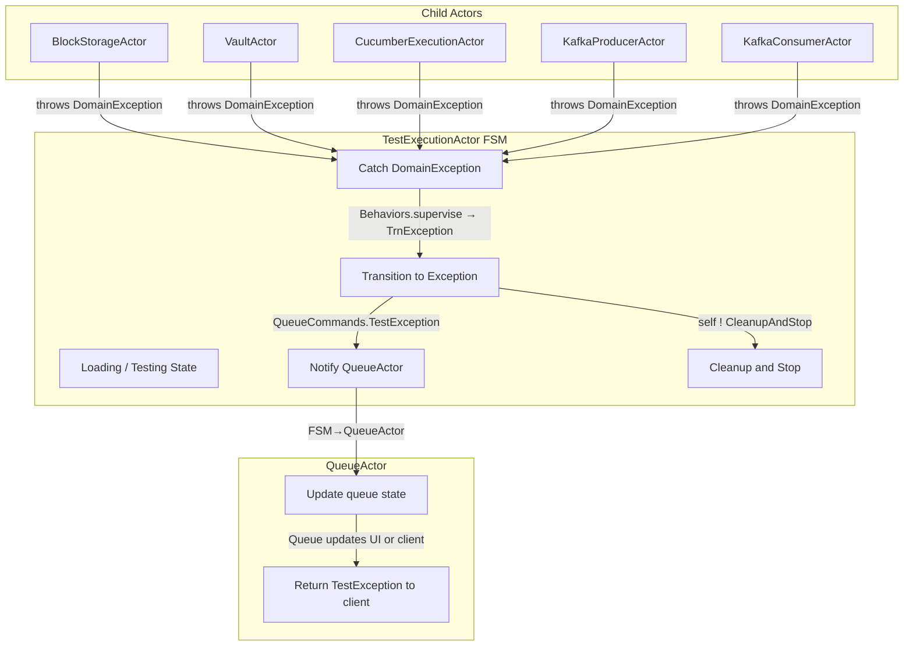
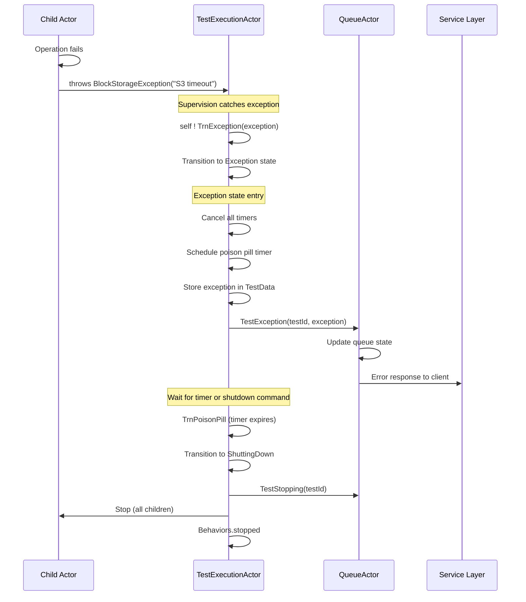

# TestExecutionActor Error Handling and Recovery

**Last Updated:** 2025-10-13
**Status:** Implemented
**Component:** `test-probe-core/src/main/scala/com/company/probe/core/actors/TestExecutionActor.scala`

## Table of Contents

- [Overview](#overview)
- [Error Handling Philosophy](#error-handling-philosophy)
- [Exception Hierarchy](#exception-hierarchy)
- [Supervision Strategy](#supervision-strategy)
- [Error Propagation Flow](#error-propagation-flow)
- [State-Specific Error Handling](#state-specific-error-handling)
  - [Loading State Failures](#loading-state-failures)
  - [Loaded State Failures](#loaded-state-failures)
  - [Testing State Failures](#testing-state-failures)
  - [Completed State Failures](#completed-state-failures)
- [Recovery Mechanisms](#recovery-mechanisms)
- [Error Reporting](#error-reporting)
- [Testing Error Scenarios](#testing-error-scenarios)
- [Design Patterns](#design-patterns)
- [References](#references)

---

## Overview

The TestExecutionActor implements a comprehensive error handling strategy based on the **Error Kernel Pattern** from Erlang/OTP. This approach treats errors as first-class domain events that flow through the FSM like any other message, enabling deterministic error handling and recovery.

**Key Principles:**
1. **Let children fail:** Child actors throw domain exceptions directly
2. **Supervise and catch:** FSM supervision catches exceptions and translates to messages
3. **Error as message:** Exceptions become `TrnException` self-messages
4. **State-aware handling:** Each state handles exceptions appropriately
5. **Report upstream:** QueueActor notified of exceptions for queue management
6. **Graceful degradation:** Cleanup and shutdown on unrecoverable errors

---

## Error Handling Philosophy

### Let It Crash (Controlled)

The TestExecutionActor follows the Erlang philosophy of "let it crash" but in a controlled manner:

1. **Child actors are allowed to throw exceptions** when encountering errors
2. **FSM catches exceptions via supervision** and prevents cascade failures
3. **Exceptions are translated into domain messages** (`TrnException`)
4. **FSM transitions to Exception state** for cleanup and reporting
5. **QueueActor is notified** to update queue state and handle client communication

This approach provides:
- **Clear error boundaries:** Child failures don't crash parent
- **Testable error handling:** Exceptions are messages that can be verified
- **Deterministic behavior:** Same exception always causes same state transition
- **Audit trail:** All exceptions logged and reported

### No Retry Logic in FSM

The TestExecutionActor does NOT implement retry logic for several reasons:

1. **Single-use actor:** Each test execution gets a fresh actor instance
2. **State contamination:** Failed state cannot be safely reset
3. **Queue responsibility:** Retries handled by QueueActor based on business logic
4. **User visibility:** Failures should be visible to users, not silently retried

**Design Decision:** If a test fails, the FSM transitions to Exception state, reports to QueueActor, and shuts down. The QueueActor decides whether to retry (spawn new FSM) based on configuration.

---

## Exception Hierarchy

The Probe Core defines a sealed trait hierarchy for domain exceptions:

```scala
sealed trait ProbeExceptions extends Exception

// Block Storage errors
case class BlockStorageException(message: String, cause: Throwable = null)
  extends Exception(message, cause) with ProbeExceptions

// Vault errors
case class VaultException(message: String, cause: Throwable = null)
  extends Exception(message, cause) with ProbeExceptions

// Cucumber execution errors
case class CucumberExecutionException(message: String, cause: Throwable = null)
  extends Exception(message, cause) with ProbeExceptions

// Kafka errors
case class KafkaProducerException(message: String, cause: Throwable = null)
  extends Exception(message, cause) with ProbeExceptions

case class KafkaConsumerException(message: String, cause: Throwable = null)
  extends Exception(message, cause) with ProbeExceptions

// Configuration errors
case class ConfigurationException(message: String, cause: Throwable = null)
  extends Exception(message, cause) with ProbeExceptions
```

**See:** `test-probe-core/src/main/scala/com/company/probe/core/models/ProbeExceptions.scala`

**Exception Categories:**

| Category | Recoverable | Retry Strategy | Examples |
|----------|-------------|----------------|----------|
| **Infrastructure** | Maybe | External retry | S3 timeout, Vault connection failure |
| **Configuration** | No | Fix config | Invalid bucket, missing credentials |
| **Test Definition** | No | Fix test | Invalid feature file, bad Gherkin |
| **Test Failure** | N/A | Rerun test | Cucumber scenario failed |
| **System** | No | Alert | Out of memory, actor crash |

**Important:** Test failures (Cucumber scenarios that fail) are NOT exceptions. They are normal test results captured in `TestExecutionResult.passed = false`.

---

## Supervision Strategy

### FSM-Level Supervision

The TestExecutionActor itself is supervised to resume on any exception:

```scala
Behaviors.supervise {
  // All FSM behaviors
}.onFailure[Throwable](SupervisorStrategy.resume)
```

**Effect:** When any `Throwable` is thrown within FSM code:
1. Supervision catches the exception
2. Actor sends `TrnException(exception)` to itself
3. Actor resumes processing with `TrnException` message
4. FSM transitions to Exception state

### Child Actor Supervision

Each child actor is spawned with restart supervision:

```scala
private def defaultBlockStorageFactory(testId: UUID): BlockStorageFactory = { ctx =>
  ctx.spawn(
    Behaviors.supervise(BlockStorageActor(testId))
      .onFailure[Exception](SupervisorStrategy.restart),
    s"block-storage-$testId"
  )
}
```

**Effect:** When child actor throws exception:
1. Child's supervision restarts the child actor
2. Exception propagates to parent (TestExecutionActor)
3. Parent's supervision catches and translates to `TrnException`
4. Parent transitions to Exception state

**Design Rationale:**
- **Child restart:** Allows transient failures to be recovered automatically
- **Parent resume:** Prevents parent crash, converts to domain message
- **Fail-fast propagation:** Unrecoverable errors still reach Exception state

---

## Error Propagation Flow

### Normal Exception Flow



### Exception Handling Sequence



---

## State-Specific Error Handling

### Loading State Failures

**Common Errors:**
- BlockStorage: S3/GCS/Azure connection failure, file not found, access denied
- Vault: Connection timeout, authentication failure, secret not found
- Configuration: Invalid test type, malformed directives

**Handling:**
```scala
case TrnException(exception) =>
  context.log.error(s"Exception in Loading state: ${exception.getMessage}", exception)
  context.self ! TrnException(exception)
  exceptionBehavior(testId, queueActor, timers, data, exception, serviceConfig, context)
```

**State Transition:** Loading → Exception

**QueueActor Notification:** `TestException(testId, exception)`

**User Impact:** Test never starts, user sees error immediately

**BDD Test:** `test-execution-actor-fsm.feature:45-60`

**Example Error Messages:**
- "Failed to fetch test files from s3://test-bucket/test-123"
- "Vault authentication failed: Invalid token"
- "BlockStorageDirective validation failed: Missing required field 'featureFile'"

### Loaded State Failures

**Common Errors:**
- Rare: Configuration changes between Loading and Testing
- Child actor crash after initialization

**Handling:**
```scala
case TrnException(exception) =>
  context.log.error(s"Exception in Loaded state: ${exception.getMessage}", exception)
  context.self ! TrnException(exception)
  exceptionBehavior(testId, queueActor, timers, data, exception, serviceConfig, context)
```

**State Transition:** Loaded → Exception

**QueueActor Notification:** `TestException(testId, exception)`

**User Impact:** Test was queued but failed before starting

**Note:** Loaded state exceptions are rare because all initialization completed in Loading state.

### Testing State Failures

**Common Errors:**
- Cucumber: Feature file parsing error, step definition not found, test timeout
- BlockStorage: Evidence upload failure (network, storage full, permissions)
- Kafka: Producer/consumer connection loss during test

**Handling:**
```scala
case TrnException(exception) =>
  context.log.error(s"Exception in Testing state: ${exception.getMessage}", exception)
  val updatedData = data.copy(
    endTime = Some(Instant.now()),
    success = Some(false)
  )
  context.self ! TrnException(exception)
  exceptionBehavior(testId, queueActor, timers, updatedData, exception, serviceConfig, context)
```

**State Transition:** Testing → Exception

**QueueActor Notification:** `TestException(testId, exception)`

**User Impact:** Test started but did not complete successfully

**Important Distinction:**
- **Test failure:** Cucumber scenario fails → `TestComplete(result.passed = false)` → Completed state
- **Test exception:** Cucumber cannot execute → `CucumberExecutionException` → Exception state

**BDD Test:** `test-execution-actor-fsm.feature:62-90`

**Example Error Messages:**
- "Cucumber execution failed: Step definition not found for 'Given the system is ready'"
- "Evidence upload failed: S3 PutObject operation timed out"
- "Kafka producer disconnected during test execution"

### Completed State Failures

**Common Errors:**
- Very rare: Late-arriving exceptions from cleanup operations
- Child actor termination failures

**Handling:**
```scala
case TrnException(exception) =>
  context.log.error(s"Exception in Completed state: ${exception.getMessage}", exception)
  context.self ! TrnException(exception)
  exceptionBehavior(testId, queueActor, timers, data, exception, serviceConfig, context)
```

**State Transition:** Completed → Exception

**QueueActor Notification:** `TestException(testId, exception)` (overwrites previous `TestCompleted`)

**User Impact:** Test completed successfully but cleanup failed

**Note:** This is a rare edge case. The test result is already recorded, but the exception is still reported for monitoring.

---

## Recovery Mechanisms

### No In-FSM Recovery

The TestExecutionActor does NOT implement recovery mechanisms for several reasons:

1. **Stateful contamination:** Once a state fails, it cannot be safely reset
2. **Single-use design:** Each test execution is independent
3. **Clear error boundary:** Failures should be explicit, not hidden by retries
4. **Queue-level control:** Retry logic belongs in QueueActor

**Design Decision:** When an exception occurs, the FSM transitions to Exception state, reports the error, and shuts down cleanly. No attempt is made to retry the operation.

### QueueActor-Level Recovery

The QueueActor (parent) decides whether to retry based on:

1. **Exception type:** Infrastructure errors may be retried, configuration errors should not
2. **Retry count:** Maximum retry attempts per test
3. **Retry delay:** Exponential backoff between attempts
4. **User configuration:** Per-test or global retry settings

**Example Retry Strategy:**
```
Test fails with BlockStorageException("S3 timeout")
  → QueueActor checks retry count (0/3)
  → Wait 5 seconds (exponential backoff)
  → Spawn new TestExecutionActor for retry
  → If retry succeeds → Report success
  → If 3 retries fail → Report final failure
```

**See:** QueueActor documentation for retry implementation details (planned)

### Circuit Breaker Pattern (Future Enhancement)

For repeated failures of the same type (e.g., Vault always timing out), a circuit breaker could:

1. **Closed (normal):** All operations allowed
2. **Open (failing):** New tests immediately fail with "Service unavailable"
3. **Half-open (testing):** Single test allowed to check if service recovered

**Status:** Not currently implemented, planned for future enhancement

---

## Error Reporting

### To QueueActor

```scala
queueActor ! QueueCommands.TestException(testId, exception)
```

**QueueActor Responsibilities:**
1. Update queue state (remove or mark as failed)
2. Decide on retry strategy
3. Update metrics (failure count, error types)
4. Notify monitoring/alerting systems

### To Service Layer

```scala
// GetStatus returns error details
TestStatusResponse(
  testId = testId,
  state = "Exception",
  bucket = Some("test-bucket"),
  testType = Some("functional"),
  startTime = Some("2025-10-13T10:30:00Z"),
  endTime = None,
  success = Some(false),
  error = Some("BlockStorageException: Failed to fetch files from S3")
)
```

**HTTP API Response:**
```json
{
  "testId": "123e4567-e89b-12d3-a456-426614174000",
  "state": "Exception",
  "bucket": "test-bucket",
  "testType": "functional",
  "startTime": "2025-10-13T10:30:00Z",
  "endTime": null,
  "success": false,
  "error": "BlockStorageException: Failed to fetch files from S3"
}
```

### Logging

All exceptions are logged with structured logging:

```scala
context.log.error(
  s"Exception occurred in Loading state for test $testId: ${exception.getMessage}",
  exception
)
```

**Log Levels:**
- **ERROR:** All domain exceptions (BlockStorageException, VaultException, etc.)
- **WARN:** Unexpected messages in states, late-arriving messages
- **INFO:** Normal state transitions, successful operations
- **DEBUG:** GetStatus requests, detailed state information

**Log Aggregation:** Logs should be aggregated in a centralized system (e.g., ELK, Splunk) for monitoring and alerting.

---

## Testing Error Scenarios

### BDD Scenarios

**File:** `test-probe-core/src/test/resources/features/component/actor-lifecycle/test-execution-actor-fsm.feature`

**Exception Handling Tests:**

1. **Loading State Exception** (Lines 45-60)
   - Manually inject `TrnException` after `TrnLoading`
   - Verify transition to Exception state
   - Verify `TestException` sent to QueueActor

2. **Testing State Exception** (Lines 62-90)
   - Manually inject `TrnException` after `TrnTesting`
   - Verify transition to Exception state
   - Verify `TestException` sent to QueueActor

**Step Definitions:**
```scala
When("""the TestExecutionActor receives {string}""") { (transitionMessage: String) =>
  transitionMessage match {
    case "TrnException" =>
      val genericException = BlockStorageException("Manual test exception")
      world.sendMessage(TestExecutionCommands.TrnException(genericException))
  }
}
```

### Unit Tests (Planned)

**File:** `test-probe-core/src/test/scala/com/company/probe/core/actors/TestExecutionActorSpec.scala`

**Test Cases:**
1. Child actor throws exception → FSM catches → Transitions to Exception state
2. Multiple exceptions from different children → All handled
3. Exception in each state → Correct cleanup behavior
4. GetStatus after exception → Returns error details
5. Timer still works in Exception state → Shutdown after timeout

### Integration Tests (Planned)

**File:** `test-probe-core/src/test/scala/com/company/probe/core/integration/TestExecutionActorIntegrationSpec.scala`

**Test Cases:**
1. Real S3 connection failure → BlockStorageException → Exception state
2. Real Vault authentication failure → VaultException → Exception state
3. Real Kafka connection failure → KafkaProducerException → Exception state
4. Testcontainers crash during test → Appropriate exception → Cleanup

---

## Design Patterns

### 1. Error Kernel Pattern

**Origin:** Erlang/OTP supervision trees

**Implementation:**
- TestExecutionActor is the "error kernel" (supervisor)
- Child actors are "workers" that can fail
- Errors are isolated to child actors
- Parent catches, logs, and handles errors gracefully

**Benefits:**
- Fault isolation: Child failure doesn't crash parent
- Error visibility: All exceptions logged and reported
- Graceful degradation: System continues despite failures

**References:**
- Erlang Design Principles: https://www.erlang.org/doc/design_principles/des_princ.html#supervision-trees
- Akka Supervision: https://doc.akka.io/docs/akka/current/typed/fault-tolerance.html

### 2. Exception as Message Pattern

**Problem:** Exceptions disrupt normal control flow and are hard to test

**Solution:** Translate exceptions into domain messages (`TrnException`)

**Benefits:**
- Exceptions become first-class domain events
- State machine can handle exceptions deterministically
- Testing becomes straightforward (send message, verify state change)

**Implementation:**
```scala
Behaviors.supervise {
  // FSM behaviors
}.onFailure[Throwable] { exception =>
  SupervisorStrategy.resume.andThen { _ =>
    context.self ! TrnException(exception)
  }
}
```

### 3. Fail-Fast Principle

**Problem:** Hiding errors or retrying indefinitely causes confusion

**Solution:** Detect errors early, report immediately, fail explicitly

**Benefits:**
- Users see failures quickly
- No hidden retries or silent failures
- Clear audit trail of what went wrong

**Implementation:**
- Child actors validate inputs and throw on error
- FSM transitions to Exception state immediately
- QueueActor notified immediately
- HTTP API returns error details immediately

---

## References

**Implementation Files:**
- TestExecutionActor: `test-probe-core/src/main/scala/com/company/probe/core/actors/TestExecutionActor.scala`
- Exceptions: `test-probe-core/src/main/scala/com/company/probe/core/models/ProbeExceptions.scala`
- Commands: `test-probe-core/src/main/scala/com/company/probe/core/models/ActorCommands.scala`

**Test Files:**
- BDD Feature: `test-probe-core/src/test/resources/features/component/actor-lifecycle/test-execution-actor-fsm.feature`
- Step Definitions: `test-probe-core/src/test/scala/com/company/probe/core/glue/steps/TestExecutionActorSteps.scala`

**Architecture Documentation:**
- FSM Overview: [05.1-test-execution-actor-fsm.md](./05.1-test-execution-actor-fsm.md)
- QueueActor Blueprint: [../../08 Test Flow/08.1 Queuing Tests/08.1.1-queue-actor.md](../../08%20Test%20Flow/08.1%20Queuing%20Tests/08.1.1-queue-actor.md)
- QueueActor Message Routing: [../../08 Test Flow/08.1 Queuing Tests/08.1.2-queue-actor-message-routing.md](../../08%20Test%20Flow/08.1%20Queuing%20Tests/08.1.2-queue-actor-message-routing.md)

**Design Documents:**
- FSM Requirements: `working/TestExecutionActorFSMRequirements.md` (Section 7: Error Handling)
- Error Flow Diagram: `working/TestExecutionActor-ErrorPropogationRecoveryFlow.mermaid`

**External References:**
- Akka Supervision: https://doc.akka.io/docs/akka/current/typed/fault-tolerance.html
- Error Kernel Pattern: https://www.erlang.org/doc/design_principles/des_princ.html#supervision-trees
- Fail-Fast Principle: https://en.wikipedia.org/wiki/Fail-fast

---

**Document History:**
- 2025-10-13: Initial creation from working directory consolidation
