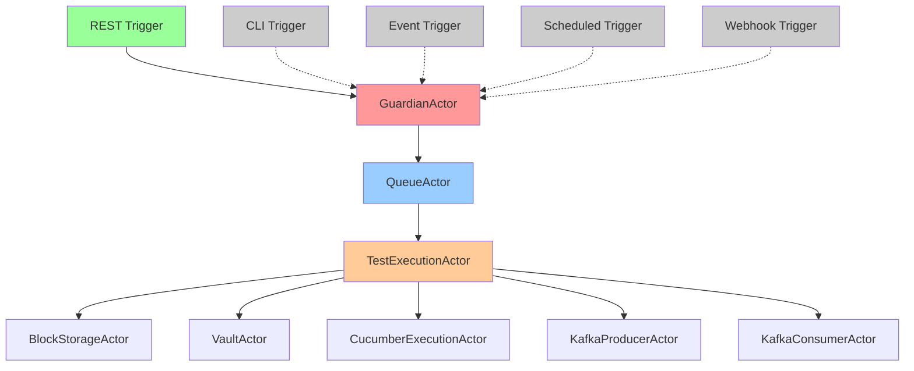
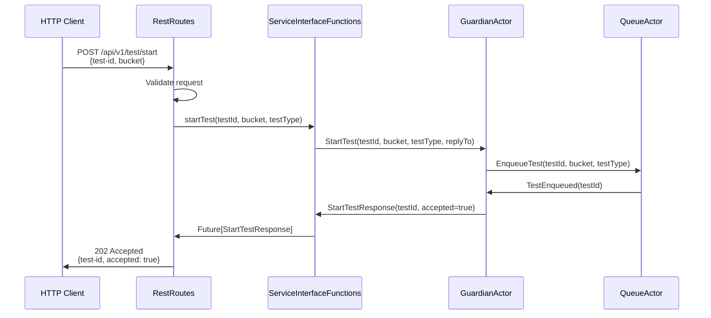

# 06 Triggers Overview

**Last Updated:** 2025-11-26
**Status:** Active - REST API triggers operational, future triggers planned
**Component:** Test Execution Triggers
**Related Documents:**
- [06.1 REST API Triggers](06.1-rest-api-triggers.md)
- [03.1 REST API Architecture](../03%20APIs/03.1%20REST%20API/03.1-rest-api-architecture.md)
- [05.1 TestExecutionActor FSM](../05%20State%20Machine/05.1-test-execution-actor-fsm.md)

---

## Table of Contents

- [Overview](#overview)
- [Trigger Types](#trigger-types)
- [Trigger Architecture](#trigger-architecture)
- [REST API Triggers (Current)](#rest-api-triggers-current)
- [Future Trigger Types](#future-trigger-types)
- [Trigger Design Patterns](#trigger-design-patterns)
- [Related Documents](#related-documents)

---

## Overview

Triggers are mechanisms that initiate test execution in the Test-Probe framework. The system is designed with a pluggable trigger architecture that supports multiple trigger types while maintaining a unified test execution flow through the actor system.

**Design Goals:**

1. **Pluggable Architecture**: Add new trigger types without modifying core logic
2. **Unified Execution**: All triggers route to same actor system (GuardianActor)
3. **Protocol Agnostic**: Core actors don't know about HTTP, CLI, or events
4. **Asynchronous**: Triggers initiate tests, responses delivered via callbacks
5. **Resilient**: Failed triggers don't affect running tests

**Current Status:**

| Trigger Type | Status | Implementation |
|-------------|--------|----------------|
| REST API | ✅ Complete | Apache Pekko HTTP 1.1.0 |
| CLI | ⏳ Planned | Phase 6 |
| Event-Driven | ⏳ Planned | Phase 7 |
| Scheduled | ⏳ Planned | Phase 7 |
| Webhook | ⏳ Planned | Phase 8 |

---

## Trigger Types

### 1. REST API Triggers (Operational)

**Purpose:** HTTP-based test execution for CI/CD pipelines and manual invocation

**Method:** POST `/api/v1/test/start`

**Payload:**
```json
{
  "test-id": "abc-123",
  "block-storage-path": "s3://test-bucket/tests/abc-123",
  "test-type": "smoke"
}
```

**Response:**
```json
{
  "test-id": "abc-123",
  "accepted": true,
  "test-type": "smoke",
  "message": "Test queued for execution"
}
```

**Use Cases:**
- CI/CD pipeline test execution
- Developer manual testing
- Integration with external test orchestration systems

**Reference:** [06.1 REST API Triggers](06.1-rest-api-triggers.md)

---

### 2. CLI Triggers (Planned)

**Purpose:** Command-line interface for local development and scripting

**Method:** `test-probe run --test-id abc-123 --bucket s3://test-bucket`

**Example:**
```bash
# Run single test
test-probe run --test-id abc-123 --bucket s3://test-bucket

# Run with tag filter
test-probe run --test-id abc-123 --bucket s3://test-bucket --tags @smoke

# Watch mode
test-probe run --test-id abc-123 --bucket s3://test-bucket --watch
```

**Use Cases:**
- Local development testing
- Shell scripts and automation
- Debugging specific test scenarios

**Implementation:**
- Scala CLI (scala-cli) or Graal Native Image
- Same actor system as REST API
- Output to stdout/stderr (not HTTP responses)

---

### 3. Event-Driven Triggers (Planned)

**Purpose:** Reactive test execution based on external events

**Event Sources:**
- Kafka topic (e.g., `test-requests`)
- AWS EventBridge
- Azure Event Grid
- GCP Pub/Sub

**Example Flow:**
```
Deployment Pipeline → Kafka "test-requests" topic → Test-Probe Subscriber → Execute Test
```

**Event Payload:**
```json
{
  "eventType": "TestRequested",
  "testId": "abc-123",
  "blockStoragePath": "s3://test-bucket/tests/abc-123",
  "triggeredBy": "deployment-pipeline",
  "correlationId": "deploy-123"
}
```

**Use Cases:**
- Post-deployment validation
- Continuous testing in production
- Event-driven architecture validation

---

### 4. Scheduled Triggers (Planned)

**Purpose:** Time-based recurring test execution

**Scheduler Options:**
- Quartz Scheduler (JVM-based)
- Kubernetes CronJob (containerized)
- Cloud provider schedulers (AWS EventBridge, Azure Logic Apps, GCP Cloud Scheduler)

**Example:**
```yaml
# Kubernetes CronJob
apiVersion: batch/v1
kind: CronJob
metadata:
  name: test-probe-hourly
spec:
  schedule: "0 * * * *"  # Every hour
  jobTemplate:
    spec:
      template:
        spec:
          containers:
          - name: test-probe
            image: test-probe:latest
            args:
            - "run"
            - "--test-id=smoke-tests"
            - "--bucket=s3://test-bucket"
```

**Use Cases:**
- Continuous validation (hourly/daily smoke tests)
- Performance baseline monitoring
- Regression testing schedules

---

### 5. Webhook Triggers (Planned)

**Purpose:** External system callbacks trigger test execution

**Method:** POST `/api/v1/webhooks/github` (or /gitlab, /jenkins, etc.)

**Example (GitHub Deployment Event):**
```json
{
  "action": "created",
  "deployment": {
    "id": 123456,
    "environment": "production",
    "ref": "v2.3.0"
  },
  "repository": {
    "full_name": "company/service"
  }
}
```

**Flow:**
```
GitHub deployment event → Webhook endpoint → Parse event → Lookup test config → Execute test
```

**Use Cases:**
- GitHub/GitLab deployment validation
- Jenkins/CircleCI post-build testing
- External system integration points

---

## Trigger Architecture

### Unified Flow

All triggers follow the same execution path regardless of trigger type:



**Key Points:**
- Triggers are **adapters** (hexagonal architecture)
- Core actors are **protocol-agnostic**
- Triggers convert external protocols → actor messages
- Actor system provides **unified execution flow**

---

### Adapter Pattern

**Interface Layer (Trigger):**
```scala
trait TestTrigger {
  /**
   * Initiate test execution
   * @param request Protocol-specific request
   * @return Future with trigger-specific response
   */
  def trigger(request: TriggerRequest): Future[TriggerResponse]
}
```

**Implementation (REST API):**
```scala
class RestTrigger(guardian: ActorRef[GuardianActorProtocol.Command]) extends TestTrigger {
  override def trigger(request: TriggerRequest): Future[TriggerResponse] = {
    // Convert HTTP request → Actor message
    val startCommand = GuardianActorProtocol.StartTest(
      testId = request.testId,
      bucket = request.bucket,
      testType = request.testType,
      replyTo = replyProbe.ref
    )

    // Send to actor system
    guardian ! startCommand

    // Wait for response
    replyProbe.receiveMessage()
  }
}
```

**Implementation (CLI - Future):**
```scala
class CliTrigger(guardian: ActorRef[GuardianActorProtocol.Command]) extends TestTrigger {
  override def trigger(request: TriggerRequest): Future[TriggerResponse] = {
    // Convert CLI args → Actor message
    val startCommand = GuardianActorProtocol.StartTest(
      testId = request.testId,
      bucket = request.bucket,
      testType = request.testType,
      replyTo = replyProbe.ref
    )

    // Send to actor system (same flow as REST!)
    guardian ! startCommand

    // Wait for response, print to stdout
    replyProbe.receiveMessage()
  }
}
```

---

### Protocol Conversion

**Trigger Responsibilities:**

| Responsibility | REST API | CLI | Event-Driven |
|---------------|----------|-----|--------------|
| **Input Parsing** | JSON → Scala objects | Args → Scala objects | JSON → Scala objects |
| **Validation** | HTTP 400 errors | Exit code 1 + stderr | Dead letter queue |
| **Actor Message** | GuardianActor.StartTest | GuardianActor.StartTest | GuardianActor.StartTest |
| **Response Format** | HTTP 202 + JSON | Stdout + exit code | Event acknowledgment |
| **Error Handling** | HTTP 503/504 | Exit code 2 + stderr | Retry + DLQ |

**Common Actor Message:**
```scala
// All triggers construct this message
case class StartTest(
  testId: UUID,
  bucket: String,
  testType: Option[String],
  replyTo: ActorRef[Response]
) extends GuardianActorProtocol.Command
```

---

## REST API Triggers (Current)

### Request Flow



---

### Endpoints

| Endpoint | Method | Purpose | Status |
|----------|--------|---------|--------|
| `/api/v1/health` | GET | Health check | ✅ Complete |
| `/api/v1/test/initialize` | POST | Initialize test ID | ✅ Complete |
| `/api/v1/test/start` | POST | Start test execution | ✅ Complete |
| `/api/v1/test/{testId}/status` | GET | Query test status | ✅ Complete |
| `/api/v1/test/{testId}/cancel` | POST | Cancel running test | ✅ Complete |
| `/api/v1/queue` | GET | Query queue status | ✅ Complete |

**Reference:** [06.1 REST API Triggers](06.1-rest-api-triggers.md)

---

## Future Trigger Types

### CLI Trigger Design (Planned)

**Command Structure:**
```bash
test-probe <command> [options]

Commands:
  run         Execute a test
  status      Check test status
  cancel      Cancel a running test
  list        List available tests
  watch       Monitor test execution

Options:
  --test-id       Test ID (UUID)
  --bucket        Block storage bucket/path
  --test-type     Optional test type filter
  --tags          Tag filter (e.g., @smoke, @regression)
  --verbose       Verbose output
  --json          Output in JSON format
```

**Example Usage:**
```bash
# Run test and wait for completion
test-probe run --test-id abc-123 --bucket s3://test-bucket

# Run with tag filter
test-probe run --test-id abc-123 --bucket s3://test-bucket --tags @smoke

# Check status
test-probe status --test-id abc-123

# Watch execution
test-probe watch --test-id abc-123
```

**Implementation Approach:**
- Scala CLI or Graal Native Image for fast startup
- Reuse same actor system as REST API
- Output to stdout/stderr instead of HTTP responses
- Exit codes: 0 (success), 1 (validation error), 2 (execution error)

---

### Event-Driven Trigger Design (Planned)

**Architecture:**
```
┌────────────────────────────────────────────────────┐
│ Event Source (Kafka, EventBridge, Pub/Sub)        │
└────────────────────────────────────────────────────┘
                        ↓
┌────────────────────────────────────────────────────┐
│ Event Subscriber Actor (Pekko Streams)            │
│ - Consume events from topic/queue                  │
│ - Parse event payload                              │
│ - Map to StartTest command                         │
└────────────────────────────────────────────────────┘
                        ↓
┌────────────────────────────────────────────────────┐
│ GuardianActor → QueueActor → TestExecutionActor   │
│ (Same flow as REST API!)                          │
└────────────────────────────────────────────────────┘
                        ↓
┌────────────────────────────────────────────────────┐
│ Event Publisher (Optional)                         │
│ - Publish test result to topic/queue              │
│ - Enable downstream processing                     │
└────────────────────────────────────────────────────┘
```

**Event Schema:**
```json
{
  "eventType": "TestRequested",
  "eventId": "evt-123",
  "timestamp": "2025-11-26T10:15:23Z",
  "source": "deployment-pipeline",
  "data": {
    "testId": "abc-123",
    "blockStoragePath": "s3://test-bucket/tests/abc-123",
    "testType": "smoke",
    "triggeredBy": "deploy-v2.3.0",
    "correlationId": "deploy-123"
  }
}
```

---

### Scheduled Trigger Design (Planned)

**Kubernetes CronJob Approach:**

```yaml
apiVersion: batch/v1
kind: CronJob
metadata:
  name: test-probe-smoke-tests
spec:
  schedule: "0 * * * *"  # Every hour
  jobTemplate:
    spec:
      template:
        spec:
          restartPolicy: OnFailure
          containers:
          - name: test-probe-cli
            image: test-probe:latest
            command:
            - "/bin/test-probe"
            - "run"
            - "--test-id=$(TEST_ID)"
            - "--bucket=s3://test-bucket/smoke-tests"
            - "--tags=@smoke"
            env:
            - name: TEST_ID
              valueFrom:
                fieldRef:
                  fieldPath: metadata.uid
```

**Benefits:**
- Leverage Kubernetes infrastructure
- No additional scheduler dependency
- Standard monitoring/alerting via K8s
- Simple restart policy

**Alternative (Quartz Scheduler):**
- In-process scheduling
- Dynamic schedule updates
- Persistent job storage
- Suitable for standalone deployments

---

## Trigger Design Patterns

### Pattern 1: Synchronous Trigger → Async Execution

**Challenge:** HTTP/CLI clients expect quick response, but test execution is long-running

**Solution:** Accept-and-queue pattern

```scala
// Trigger accepts request immediately
POST /api/v1/test/start → 202 Accepted (< 1 second)

// Test executes asynchronously in actor system
TestExecutionActor runs for 5-10 minutes

// Client polls for status
GET /api/v1/test/{testId}/status → {status: "running"}
```

---

### Pattern 2: Protocol Agnostic Core

**Challenge:** Different triggers use different protocols

**Solution:** Adapter pattern with unified actor messages

```scala
// REST API converts HTTP → Actor message
RestTrigger → GuardianActor.StartTest(...)

// CLI converts args → Same actor message
CliTrigger → GuardianActor.StartTest(...)

// Event subscriber converts event → Same actor message
EventTrigger → GuardianActor.StartTest(...)

// Core actors don't know about HTTP/CLI/Events!
```

---

### Pattern 3: Error Isolation

**Challenge:** Failed trigger shouldn't affect running tests

**Solution:** Circuit breaker + supervisor strategy

```scala
// Circuit breaker fails fast when actor system unhealthy
CircuitBreaker.withCircuitBreaker {
  guardian.ask(StartTest(...))
}

// Supervisor restarts failed trigger actors
supervisorStrategy = SupervisorStrategy.restart
```

---

## Related Documents

**Implementation Guides:**
- [06.1 REST API Triggers](06.1-rest-api-triggers.md)
- [03.1 REST API Architecture](../03%20APIs/03.1%20REST%20API/03.1-rest-api-architecture.md)

**Actor Architecture:**
- [05.1 TestExecutionActor FSM](../05%20State%20Machine/05.1-test-execution-actor-fsm.md)
- [02.1 GuardianActor](../02%20Booting/02.1-guardian-actor.md)
- [08.1.1 QueueActor](../08%20Test%20Flow/08.1%20Queuing%20Tests/08.1.1-queue-actor.md)

**Product Requirements:**
- [Product Requirements Document](../../../product/PRODUCT-REQUIREMENTS-DOCUMENT.md)

---

**Last Updated:** 2025-11-26
**Status:** Active - REST API triggers operational, future triggers planned
