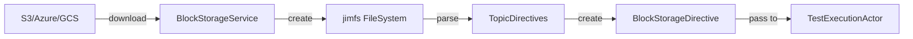
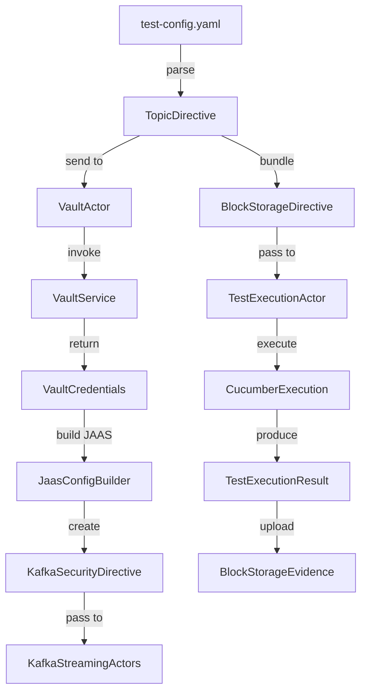

# 07.1 Probe Testing Models

**Last Updated:** 2025-11-26
**Status:** Active - Core testing models complete
**Component:** Probe Domain Models
**Related Documents:**
- [07 Models Overview](07-models-overview.md)
- [07.2 Event Models](07.2-event-models.md)
- [Topic Directive Model](../../../api/topic-directive-model.md)

---

## Table of Contents

- [Overview](#overview)
- [TopicDirective](#topicdirective)
- [BlockStorageDirective](#blockstoragedirective)
- [KafkaSecurityDirective](#kafkasecuritydirective)
- [TestExecutionResult](#testexecutionresult)
- [Model Relationships](#model-relationships)

---

## Overview

Probe testing models represent the core domain concepts for configuring and executing event-driven architecture tests. These models are immutable case classes that flow through the actor system from test initialization to completion.

**Model Lifecycle:**

```
BlockStorage YAML → TopicDirective → VaultService → KafkaSecurityDirective
                                                          ↓
                                              KafkaStreamingActors
                                                          ↓
                                              Test Execution
                                                          ↓
                                              TestExecutionResult
```

---

## TopicDirective

**Purpose:** Kafka topic configuration for a single test execution

**Definition:**
```scala
package io.distia.probe.common.models

case class EventFilter(
  eventType: String,
  payloadVersion: String
)

case class TopicDirective(
  topic: String,
  role: String,
  clientPrincipal: String,
  eventFilters: List[EventFilter],
  metadata: Map[String, String] = Map.empty,
  bootstrapServers: Option[String] = None
)
```

**Field Descriptions:**

| Field | Type | Required | Description |
|-------|------|----------|-------------|
| `topic` | String | Yes | Kafka topic name (e.g., "orders.events") |
| `role` | String | Yes | Producer/Consumer role ("PRODUCER" or "CONSUMER") |
| `clientPrincipal` | String | Yes | Authentication principal for vault lookup |
| `eventFilters` | List[EventFilter] | Yes | Event filtering criteria (empty list = accept all) |
| `metadata` | Map[String, String] | No | Custom key-value pairs for vault templating |
| `bootstrapServers` | Option[String] | No | Optional per-topic Kafka bootstrap servers |

**Example:**
```scala
val producerDirective = TopicDirective(
  topic = "orders.events",
  role = "PRODUCER",
  clientPrincipal = "order-service-producer",
  eventFilters = List.empty,
  metadata = Map(
    "service" -> "order-service",
    "version" -> "2.1.0",
    "test-run-id" -> "run-123"
  ),
  bootstrapServers = None  // Use default from config
)

val consumerDirective = TopicDirective(
  topic = "payments.events",
  role = "CONSUMER",
  clientPrincipal = "payment-listener",
  eventFilters = List(
    EventFilter("PaymentProcessed", "v2.0"),
    EventFilter("PaymentFailed", "v2.0")
  ),
  metadata = Map("correlation-id" -> "order-payment-flow"),
  bootstrapServers = Some("kafka-region2.company.com:9092")  // Multi-cluster
)
```

**Validation:**
```scala
require(topic.nonEmpty, "Topic name cannot be empty")
require(
  role == "PRODUCER" || role == "CONSUMER",
  s"Role must be PRODUCER or CONSUMER, got: $role"
)
require(clientPrincipal.nonEmpty, "Client principal cannot be empty")
```

**Reference:** [Topic Directive Model](../../../api/topic-directive-model.md)

---

## BlockStorageDirective

**Purpose:** Encapsulates all information about test data location and configuration

**Definition:**
```scala
package io.distia.probe.common.models

case class BlockStorageDirective(
  jimfsLocation: String,
  evidenceDir: String,
  topicDirectives: List[TopicDirective],
  bucket: String,
  userGluePackages: List[String] = List.empty,
  tags: List[String] = List.empty
)
```

**Field Descriptions:**

| Field | Type | Required | Description |
|-------|------|----------|-------------|
| `jimfsLocation` | String | Yes | jimfs path where test data is downloaded (e.g., "/testId/features/") |
| `evidenceDir` | String | Yes | jimfs path for test evidence output (e.g., "/testId/evidence/") |
| `topicDirectives` | List[TopicDirective] | Yes | Kafka topic configurations |
| `bucket` | String | Yes | Block storage bucket/container name |
| `userGluePackages` | List[String] | No | User-provided Cucumber glue packages |
| `tags` | List[String] | No | Cucumber tag filters (e.g., "@smoke", "@regression") |

**Example:**
```scala
val directive = BlockStorageDirective(
  jimfsLocation = "/abc-123/features",
  evidenceDir = "/abc-123/evidence",
  topicDirectives = List(
    TopicDirective("orders.events", "PRODUCER", "order-service", ...),
    TopicDirective("payments.events", "CONSUMER", "payment-service", ...)
  ),
  bucket = "s3://test-bucket/tests/abc-123",
  userGluePackages = List("com.company.tests.glue"),
  tags = List("@smoke", "@orders")
)
```

**Flow:**



---

## KafkaSecurityDirective

**Purpose:** Complete Kafka authentication configuration for a topic

**Definition:**
```scala
package io.distia.probe.common.models

enum SecurityProtocol:
  case PLAINTEXT
  case SASL_SSL

case class KafkaSecurityDirective(
  topic: String,
  role: String,
  securityProtocol: SecurityProtocol,
  jaasConfig: String
)
```

**Field Descriptions:**

| Field | Type | Required | Description |
|-------|------|----------|-------------|
| `topic` | String | Yes | Kafka topic name (from TopicDirective) |
| `role` | String | Yes | Producer/Consumer role (from TopicDirective) |
| `securityProtocol` | SecurityProtocol | Yes | PLAINTEXT or SASL_SSL |
| `jaasConfig` | String | Yes | Complete JAAS configuration (empty for PLAINTEXT) |

**Example (Production - SASL_SSL):**
```scala
val prodDirective = KafkaSecurityDirective(
  topic = "orders.events",
  role = "PRODUCER",
  securityProtocol = SecurityProtocol.SASL_SSL,
  jaasConfig = """org.apache.kafka.common.security.oauthbearer.OAuthBearerLoginModule required
     |oauth.client.id="kafka-producer-123"
     |oauth.client.secret="base64encodedSecret=="
     |oauth.token.endpoint.uri="https://oauth.company.com/token"
     |oauth.scope="kafka.producer";""".stripMargin
)
```

**Example (Local - PLAINTEXT):**
```scala
val localDirective = KafkaSecurityDirective(
  topic = "orders.events",
  role = "PRODUCER",
  securityProtocol = SecurityProtocol.PLAINTEXT,
  jaasConfig = ""  // No authentication
)
```

**Construction:**

```scala
// VaultService flow
TopicDirective → VaultService → VaultCredentials → JaasConfigBuilder → KafkaSecurityDirective
```

**Security Properties:**
- `jaasConfig` contains sensitive OAuth credentials
- Never logged or persisted to disk
- Stored in TestExecutionActor state (in-memory only)
- Cleared after test completion

---

## TestExecutionResult

**Purpose:** Represents test execution outcome and evidence metadata

**Definition:**
```scala
package io.distia.probe.core.models

import java.time.Instant
import java.util.UUID

case class TestExecutionResult(
  testId: UUID,
  status: String,
  scenariosPassed: Int,
  scenariosFailed: Int,
  startTime: Instant,
  endTime: Instant,
  evidencePath: String
)
```

**Field Descriptions:**

| Field | Type | Description |
|-------|------|-------------|
| `testId` | UUID | Unique test identifier |
| `status` | String | "PASSED", "FAILED", or "CANCELLED" |
| `scenariosPassed` | Int | Number of passing scenarios |
| `scenariosFailed` | Int | Number of failing scenarios |
| `startTime` | Instant | Test start timestamp |
| `endTime` | Instant | Test completion timestamp |
| `evidencePath` | String | jimfs path to evidence directory |

**Example:**
```scala
val result = TestExecutionResult(
  testId = UUID.fromString("abc-123"),
  status = "PASSED",
  scenariosPassed = 15,
  scenariosFailed = 0,
  startTime = Instant.parse("2025-11-26T10:15:23Z"),
  endTime = Instant.parse("2025-11-26T10:20:45Z"),
  evidencePath = "/abc-123/evidence"
)
```

**Status Values:**

| Status | Meaning |
|--------|---------|
| `PASSED` | All scenarios passed |
| `FAILED` | One or more scenarios failed |
| `CANCELLED` | Test cancelled by user |

**Evidence Directory Structure:**
```
/abc-123/evidence/
├── cucumber-report.json      # Cucumber execution report
├── cucumber-report.html      # Human-readable HTML report
├── events-produced.json      # All events sent to Kafka
├── events-consumed.json      # All events received from Kafka
└── logs/
    ├── test-execution.log    # Test execution logs
    └── kafka-client.log      # Kafka client logs
```

---

## Model Relationships

### Directive Flow



---

### State Transitions

**TestExecutionActor State:**

```scala
case class TestExecutionData(
  testId: UUID,
  bucket: String,
  blockStorageDirective: Option[BlockStorageDirective] = None,
  securityDirectives: List[KafkaSecurityDirective] = List.empty,
  testResult: Option[TestExecutionResult] = None
)
```

**State Evolution:**

```
1. Idle → blockStorageDirective = None
2. FetchingBlockStorage → blockStorageDirective = Some(directive)
3. FetchingVaultCredentials → securityDirectives = List(...)
4. ExecutingTest → (running Cucumber)
5. Completed → testResult = Some(result)
```

---

### Immutability Example

**Actor State Update:**

```scala
// Current state
val currentData = TestExecutionData(
  testId = UUID.fromString("abc-123"),
  bucket = "s3://test-bucket",
  blockStorageDirective = None,
  securityDirectives = List.empty,
  testResult = None
)

// Update after block storage fetch
val updatedData = currentData.copy(
  blockStorageDirective = Some(fetchedDirective)
)

// currentData unchanged (immutable)
// updatedData has new blockStorageDirective
```

---

## Related Documents

**Model References:**
- [07 Models Overview](07-models-overview.md)
- [07.2 Event Models](07.2-event-models.md)
- [Topic Directive Model](../../../api/topic-directive-model.md)

**Architecture:**
- [05.1 TestExecutionActor FSM](../05%20State%20Machine/05.1-test-execution-actor-fsm.md)
- [04.1 Service Layer Architecture](../04%20Adapters/04.1-service-layer-architecture.md)
- [01.1 Vault Integration](../01%20Security/01.1-vault-integration.md)

**Implementation Files:**
- `test-probe-common/src/main/scala/com/company/probe/common/models/TopicDirective.scala`
- `test-probe-common/src/main/scala/com/company/probe/common/models/BlockStorageDirective.scala`
- `test-probe-common/src/main/scala/com/company/probe/common/models/KafkaSecurityDirective.scala`
- `test-probe-core/src/main/scala/com/company/probe/core/models/TestExecutionResult.scala`

---

**Last Updated:** 2025-11-26
**Status:** Active - Core testing models complete
