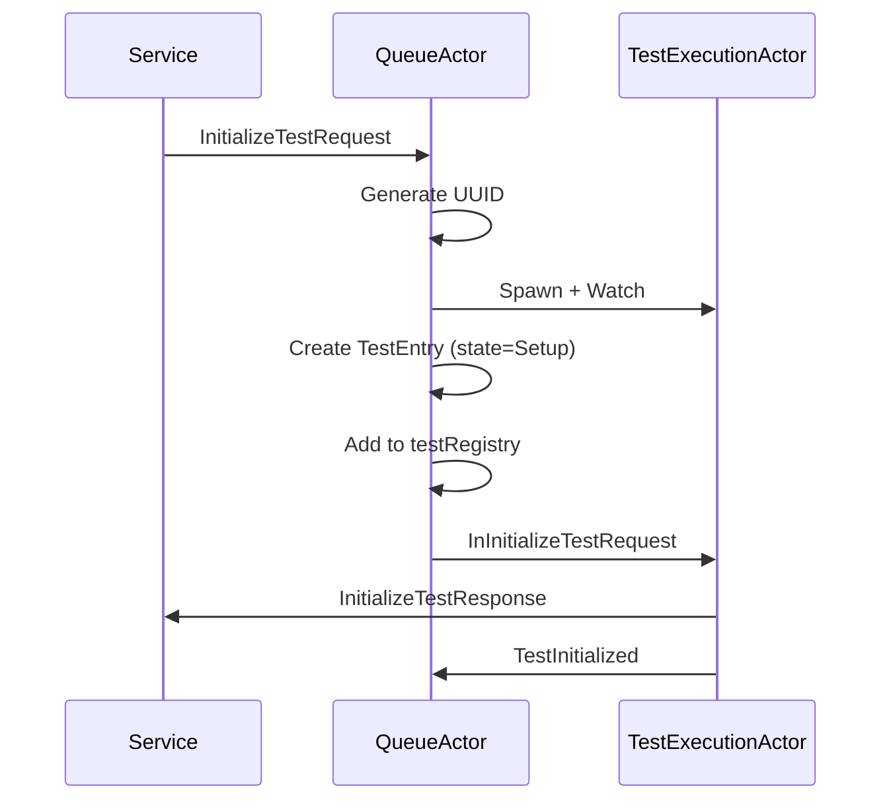
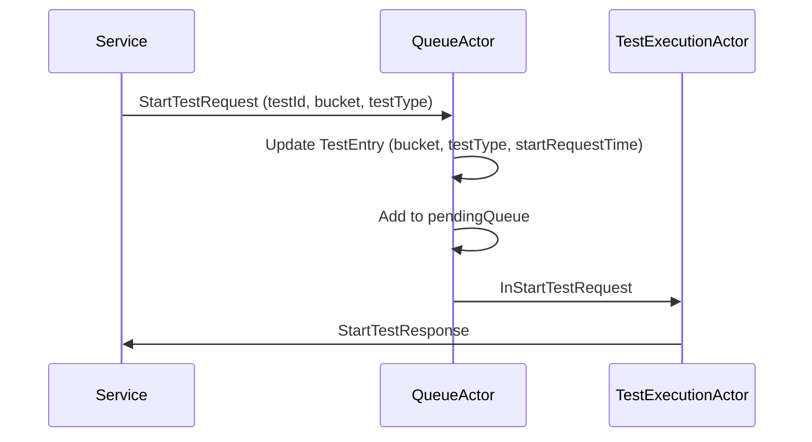
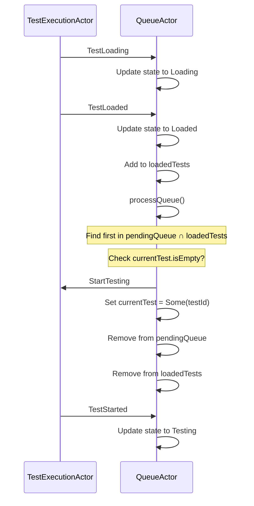
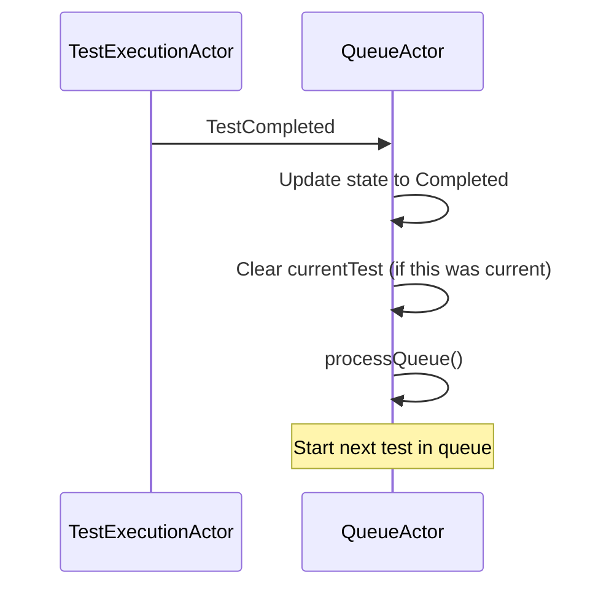
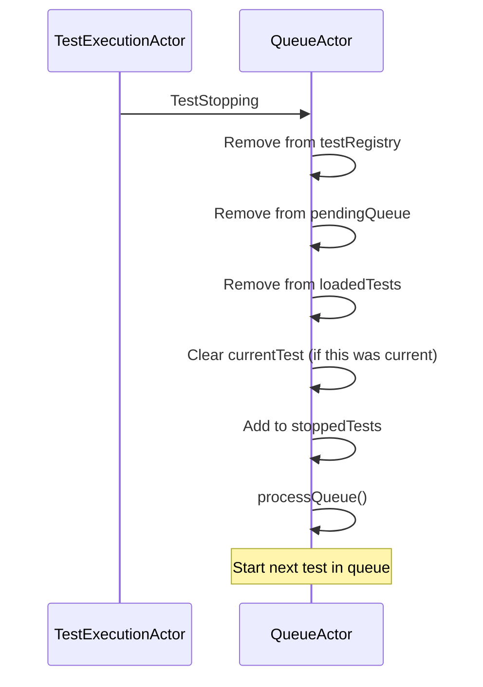
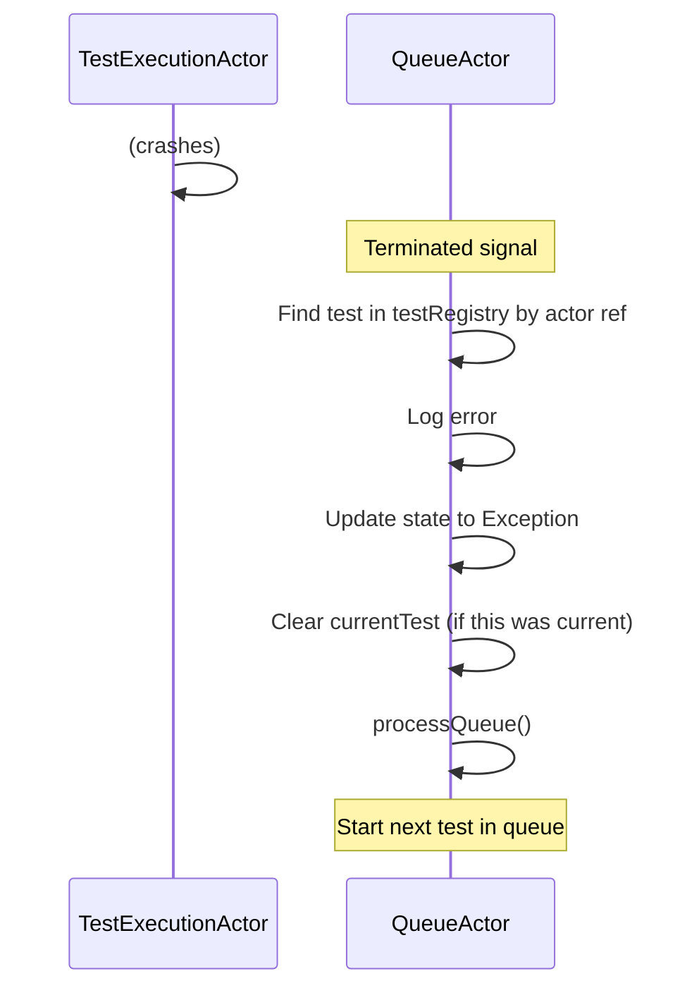

# QueueActor - Test Queue Management and Orchestration

**Last Updated:** 2025-10-14
**Status:** Implemented
**Component:** `test-probe-core/src/main/scala/com/company/probe/core/actors/QueueActor.scala`

## Table of Contents

- [Overview](#overview)
- [Architecture Position](#architecture-position)
- [State Management](#state-management)
  - [Data Structures](#data-structures)
  - [Test States](#test-states)
  - [State Update Pattern](#state-update-pattern)
- [Message Protocol](#message-protocol)
  - [Service Commands](#service-commands)
  - [FSM Communications](#fsm-communications)
  - [Actor Signals](#actor-signals)
- [FIFO Queue Processing](#fifo-queue-processing)
  - [Algorithm](#algorithm)
  - [Triggers](#triggers)
  - [FIFO Ordering Guarantee](#fifo-ordering-guarantee)
  - [Single Test Execution Guarantee](#single-test-execution-guarantee)
- [Key Behaviors](#key-behaviors)
  - [Test Initialization Flow](#test-initialization-flow)
  - [Test Start Flow](#test-start-flow)
  - [FIFO Execution Flow](#fifo-execution-flow)
  - [Test Completion Flow](#test-completion-flow)
  - [Test Cleanup Flow](#test-cleanup-flow)
  - [Actor Termination Handling](#actor-termination-handling)
- [Factory Injection Pattern](#factory-injection-pattern)
- [Design Patterns](#design-patterns)
- [Testing Strategy](#testing-strategy)
- [References](#references)

---

## Overview

The **QueueActor** is the central coordinator in the Probe Core actor system responsible for managing the lifecycle of test executions. It sits between the service layer (REST/gRPC) and individual TestExecutionActors, providing fair scheduling, resource coordination, and state tracking.

**Key Responsibilities:**
- **UUID Generation:** Creating unique test identifiers
- **Actor Lifecycle Management:** Spawning and monitoring TestExecutionActors
- **FIFO Test Scheduling:** Fair, ordered test execution based on request timestamps
- **Single-Threaded Execution:** Ensuring max 1 test runs at a time
- **Pure Message Routing:** Forwarding service commands to TestExecutionActors with replyTo capture
- **State Tracking:** Monitoring test progression through all FSM states
- **Resource Cleanup:** Removing tests from all data structures on TestStopping

**Design Philosophy:**
- **Pure Routing Pattern:** No business logic, just message forwarding
- **Tell-only Pattern:** No ask/pipe complexity
- **Factory Injection:** Testable with mock TestExecutionActors
- **Timestamp-based FIFO:** Fair ordering based on StartTestRequest arrival time
- **Single Test Execution:** Enforced via `currentTest: Option[UUID]`

**Implementation Metrics:**
- **Lines of Code:** 444 lines in QueueActor.scala
- **Unit Tests:** 18 tests in QueueActorSpec.scala (ALL PASSING)
- **BDD Scenarios:** 18 scenarios across all lifecycle phases (ALL PASSING)
- **Message Types:** 11 service commands + 8 FSM communications
- **States Tracked:** 7 test states (Setup, Loading, Loaded, Testing, Completed, Exception, Stopping)

---

## Architecture Position

### Position in Actor Hierarchy

```
GuardianActor (root supervisor)
└── QueueActor ← YOU ARE HERE
    ├── TestExecutionActor #1 (FSM, test 11111111-...)
    │   ├── BlockStorageActor
    │   ├── VaultActor
    │   ├── CucumberExecutionActor
    │   ├── KafkaProducerActor
    │   └── KafkaConsumerActor
    ├── TestExecutionActor #2 (FSM, test 22222222-...)
    │   └── (5 child actors)
    └── TestExecutionActor #N (FSM, test NNNNNNNN-...)
        └── (5 child actors)
```

### Coordination Role

QueueActor serves as the coordination layer between external requests and test execution:

```
Service Layer (REST API)
        ↓
  QueueActor (coordinator)
        ↓
TestExecutionActor (FSM) → 5 Child Actors
```

**Upstream:** Service layer sends commands via QueueCommands protocol
**Downstream:** QueueActor spawns TestExecutionActors and forwards commands
**Lateral:** TestExecutionActors report state changes back to QueueActor

---

## State Management

### Data Structures

QueueActor maintains 5 key data structures in `QueueState`:

```scala
case class QueueState(
  testRegistry: Map[UUID, TestEntry],      // All tests by ID
  pendingQueue: Queue[UUID],               // Tests awaiting execution (FIFO)
  loadedTests: Set[UUID],                  // Tests in Loaded state ready to run
  currentTest: Option[UUID],               // Single test in Testing state
  stoppedTests: Set[UUID]                  // Tests that have stopped (cleanup tracking)
)
```

#### 1. testRegistry: Map[UUID, TestEntry]

**Purpose:** Master registry of ALL tests known to QueueActor

**TestEntry Structure:**
```scala
case class TestEntry(
  testId: UUID,
  actor: ActorRef[TestExecutionCommand],
  state: TestState,                        // Current FSM state
  bucket: Option[String] = None,           // S3 bucket for evidence
  testType: Option[String] = None,         // functional/performance/regression
  startRequestTime: Option[Instant] = None, // FIFO ordering timestamp
  replyTo: ActorRef[ServiceResponse]       // Latest replyTo for routing
)
```

**Lifecycle:**
- **Created:** On InitializeTestRequest (state = Setup)
- **Updated:** On all FSM communications (state transitions)
- **Removed:** ONLY on TestStopping

**Key Operations:**
```scala
// Add test
state.copy(testRegistry = state.testRegistry + (testId -> testEntry))

// Update test state
state.copy(testRegistry = state.testRegistry.updated(testId, updatedEntry))

// Remove test
state.copy(testRegistry = state.testRegistry - testId)

// Count by state
state.testRegistry.count(_._2.state == TestState.Loading)
```

#### 2. pendingQueue: Queue[UUID]

**Purpose:** FIFO queue of tests waiting to execute

**Lifecycle:**
- **Added:** On StartTestRequest
- **Removed:** When test starts (sent StartTesting) OR on TestStopping

**FIFO Guarantee:**
- Tests added in order of StartTestRequest arrival
- `processQueue` selects first test in queue that is also in `loadedTests`
- Ordering determined by `startRequestTime` in TestEntry

**Key Operations:**
```scala
// Add to queue
state.copy(pendingQueue = state.pendingQueue.enqueue(testId))

// Find next ready test
state.pendingQueue.find(state.loadedTests.contains)

// Remove from queue
state.copy(pendingQueue = state.pendingQueue.filterNot(_ == testId))
```

#### 3. loadedTests: Set[UUID]

**Purpose:** Tests that have completed Loading state and are ready to execute

**Lifecycle:**
- **Added:** On TestLoaded
- **Removed:** When test starts (sent StartTesting) OR on TestStopping

**Coordination with pendingQueue:**
```scala
// Test is ready to run when:
pendingQueue.contains(testId) && loadedTests.contains(testId)

// Next test selection:
val readyTestId = pendingQueue.find(loadedTests.contains)
```

#### 4. currentTest: Option[UUID]

**Purpose:** Single test execution guarantee (max 1 test in Testing state)

**Lifecycle:**
- **Set:** When QueueActor sends StartTesting to TestExecutionActor
- **Cleared:** On TestCompleted, TestException, or TestStopping

**Gatekeeper Pattern:**
```scala
// processQueue only starts new test if currentTest is empty
if (state.currentTest.isEmpty) {
  // Find next test and send StartTesting
  val newState = state.copy(currentTest = Some(testId))
} else {
  // Wait - another test is running
}
```

#### 5. stoppedTests: Set[UUID]

**Purpose:** Track tests that have sent TestStopping (cleanup tracking)

**Lifecycle:**
- **Added:** On TestStopping
- **Removed:** Never (persist for audit trail)

**Use Cases:**
- Debugging: Verify tests properly stopped
- Metrics: Count of stopped tests
- Audit: Historical record of test lifecycle

### Test States

QueueActor tracks 7 TestStates (defined in QueueActor.TestState):

```scala
sealed trait TestState
case object Setup extends TestState      // Initial state after spawn
case object Loading extends TestState    // Spawning child actors
case object Loaded extends TestState     // Ready to execute
case object Testing extends TestState    // Cucumber running
case object Completed extends TestState  // Test passed/failed
case object Exception extends TestState  // Error occurred
case object Stopping extends TestState   // Cleanup in progress
```

**State Transition Flow:**
```
Setup → Loading → Loaded → Testing → Completed/Exception → (removed from registry)
                                    ↘
                                      Stopping (removed from registry)
```

### State Update Pattern

Generic state update helper used by all FSM communications:

```scala
def updateTestState(
  context: ActorContext[QueueCommand],
  state: QueueState,
  testId: UUID,
  newState: TestState,
  factory: TestExecutionFactory
): Behavior[QueueCommand] = {
  state.testRegistry.get(testId) match {
    case Some(entry) =>
      val updatedEntry = entry.copy(state = newState)
      val updatedState = state.copy(
        testRegistry = state.testRegistry.updated(testId, updatedEntry)
      )
      context.log.debug(s"Test $testId state updated to $newState")
      active(updatedState, factory)

    case None =>
      context.log.warn(s"Update state for unknown test $testId")
      Behaviors.same
  }
}
```

---

## Message Protocol

### Service Commands

Messages from external services (REST API, gRPC) to QueueActor:

#### InitializeTestRequest

```scala
case class InitializeTestRequest(replyTo: ActorRef[ServiceResponse])
```

**Purpose:** Request to create new test

**QueueActor Actions:**
1. Generate new UUID
2. Spawn TestExecutionActor with name `test-execution-{testId}`
3. Watch actor for termination
4. Create TestEntry with state=Setup
5. Add to testRegistry
6. Forward InInitializeTestRequest to TestExecutionActor

**Response:** InitializeTestResponse (forwarded from TestExecutionActor)

#### StartTestRequest

```scala
case class StartTestRequest(
  testId: UUID,
  bucket: String,
  testType: Option[String],
  replyTo: ActorRef[ServiceResponse]
)
```

**Purpose:** Start test execution

**QueueActor Actions:**
1. Lookup test in testRegistry
2. Update entry with bucket, testType, startRequestTime (for FIFO)
3. Add testId to pendingQueue
4. Forward InStartTestRequest to TestExecutionActor

**Response:** StartTestResponse (forwarded from TestExecutionActor)

#### TestStatusRequest

```scala
case class TestStatusRequest(
  testId: UUID,
  replyTo: ActorRef[ServiceResponse]
)
```

**Purpose:** Query test status

**QueueActor Actions:**
1. Lookup test in testRegistry
2. Forward GetStatus to TestExecutionActor

**Response:** TestStatusResponse (forwarded from TestExecutionActor)

#### QueueStatusRequest

```scala
case class QueueStatusRequest(
  testIdFilter: Option[UUID],
  replyTo: ActorRef[ServiceResponse]
)
```

**Purpose:** Query queue statistics

**QueueActor Actions:**
1. Count tests in each state using countByState helper
2. Build QueueStatusResponse with counts
3. Send response to replyTo

**Response:**
```scala
case class QueueStatusResponse(
  totalTests: Int,            // testRegistry.size
  setupCount: Int,            // count(Setup)
  loadingCount: Int,          // count(Loading)
  loadedCount: Int,           // loadedTests.size
  testingCount: Int,          // if currentTest.isDefined then 1 else 0
  completedCount: Int,        // count(Completed)
  exceptionCount: Int,        // count(Exception)
  currentlyTesting: Option[UUID] // currentTest
)
```

**Note:** QueueActor handles this DIRECTLY (does not forward to TestExecutionActor)

#### CancelRequest

```scala
case class CancelRequest(
  testId: UUID,
  replyTo: ActorRef[ServiceResponse]
)
```

**Purpose:** Cancel test execution

**QueueActor Actions:**
1. Lookup test in testRegistry
2. Forward InCancelRequest to TestExecutionActor

**Response:** TestCancelledResponse (forwarded from TestExecutionActor)

### FSM Communications

Messages from TestExecutionActors to QueueActor (FSM lifecycle):

#### TestInitialized

```scala
case class TestInitialized(testId: UUID)
```

**Purpose:** TestExecutionActor entered Setup state

**QueueActor Actions:** Update testRegistry state to Setup

#### TestLoading

```scala
case class TestLoading(testId: UUID)
```

**Purpose:** TestExecutionActor entered Loading state (spawning children)

**QueueActor Actions:** Update testRegistry state to Loading

#### TestLoaded

```scala
case class TestLoaded(testId: UUID)
```

**Purpose:** TestExecutionActor entered Loaded state (ready to execute)

**QueueActor Actions:**
1. Update testRegistry state to Loaded
2. Add testId to loadedTests
3. **Call processQueue** to potentially start this test

**Critical:** This is the trigger for queue processing!

#### TestStarted

```scala
case class TestStarted(testId: UUID)
```

**Purpose:** TestExecutionActor entered Testing state (Cucumber running)

**QueueActor Actions:** Update testRegistry state to Testing

#### TestCompleted

```scala
case class TestCompleted(testId: UUID)
```

**Purpose:** Test finished successfully

**QueueActor Actions:**
1. Update testRegistry state to Completed
2. **Clear currentTest** (if this test was current)
3. **Call processQueue** to start next test

#### TestException

```scala
case class TestException(testId: UUID, exception: ProbeExceptions)
```

**Purpose:** Test encountered error

**QueueActor Actions:**
1. Update testRegistry state to Exception
2. Log exception message
3. **Clear currentTest** (if this test was current)
4. **Call processQueue** to start next test

#### TestStopping

```scala
case class TestStopping(testId: UUID)
```

**Purpose:** Test cleanup beginning (shutting down)

**QueueActor Actions:**
1. **Remove from testRegistry**
2. Remove from pendingQueue
3. Remove from loadedTests
4. **Clear currentTest** (if this test was current)
5. Add to stoppedTests
6. **Call processQueue** to start next test

**Critical:** This is the ONLY message that removes test from testRegistry!

### Actor Signals

#### Terminated Signal

```scala
case (ctx, Terminated(actor)) =>
```

**Purpose:** TestExecutionActor terminated unexpectedly

**QueueActor Actions:**
1. Find test in testRegistry by actor reference
2. Log error
3. Update testRegistry state to Exception
4. **Clear currentTest** (if this test was current)
5. **Call processQueue** to start next test

**Use Case:** Gracefully handle actor crashes

---

## FIFO Queue Processing

### Algorithm

```scala
def processQueue(
  context: ActorContext[QueueCommand],
  state: QueueState,
  factory: TestExecutionFactory
): Behavior[QueueCommand] = {

  // Step 1: Check if a test is currently running
  if (state.currentTest.isEmpty) {

    // Step 2: Find first test in pendingQueue that is also in loadedTests
    val readyTestId: Option[UUID] = state.pendingQueue.find(state.loadedTests.contains)

    readyTestId match {
      case Some(testId) =>
        // Step 3: Get test entry from registry
        state.testRegistry.get(testId) match {
          case Some(entry) =>
            // Step 4: Send StartTesting to TestExecutionActor
            entry.actor ! StartTesting(testId)

            // Step 5: Update state
            val newState = state.copy(
              currentTest = Some(testId),           // Set as current
              pendingQueue = state.pendingQueue.filterNot(_ == testId), // Remove from queue
              loadedTests = state.loadedTests - testId                   // Remove from loaded
            )

            context.log.info(s"Starting test $testId (FIFO processing)")
            active(newState, factory)

          case None =>
            context.log.warn(s"Ready test $testId not found in registry")
            Behaviors.same
        }

      case None =>
        // No tests ready - queue is empty or all tests still loading
        context.log.debug("No tests ready for execution")
        active(state, factory)
    }

  } else {
    // Another test is running - wait for it to complete
    context.log.debug(s"Test ${state.currentTest.get} currently executing")
    active(state, factory)
  }
}
```

### Triggers

processQueue is called in these scenarios:

1. **TestLoaded** - Test becomes ready to execute
2. **TestCompleted** - Current test finishes, start next
3. **TestException** - Current test fails, start next
4. **TestStopping** - Current test stops, start next
5. **Terminated Signal** - TestExecutionActor crashes, start next

### FIFO Ordering Guarantee

**Timestamp-based:**
```scala
// When StartTestRequest received, capture timestamp
val updatedEntry = entry.copy(
  startRequestTime = Some(Instant.now())
)

// pendingQueue maintains insertion order (Queue data structure)
val newState = state.copy(
  pendingQueue = state.pendingQueue.enqueue(testId)
)

// processQueue selects first test in queue (oldest by startRequestTime)
val readyTestId = state.pendingQueue.find(state.loadedTests.contains)
```

**Example:**
```
T=0: Test A receives StartTestRequest → added to pendingQueue
T=1: Test B receives StartTestRequest → added to pendingQueue
T=2: Test C receives StartTestRequest → added to pendingQueue

pendingQueue = Queue(A, B, C)

T=3: Test B sends TestLoaded
T=4: Test A sends TestLoaded
T=5: Test C sends TestLoaded

loadedTests = Set(A, B, C)

processQueue:
  readyTestId = pendingQueue.find(loadedTests.contains)
             = Some(A)  // First in queue, even though B loaded first

  → Send StartTesting to Test A (FIFO guarantee)
```

### Single Test Execution Guarantee

**Enforced by currentTest:**
```scala
// Can only start test if no test is currently running
if (state.currentTest.isEmpty) {
  // Start next test
  val newState = state.copy(currentTest = Some(testId))
} else {
  // Wait - single test execution guarantee
  active(state, factory)
}
```

**Example:**
```
State: currentTest = Some(Test A), loadedTests = Set(Test B, Test C)

processQueue called:
  currentTest.isEmpty? → false
  → Do not start Test B or Test C (wait for Test A to complete)

Test A sends TestCompleted:
  → currentTest cleared
  → processQueue called
  → Test B selected and started (FIFO)
  → currentTest = Some(Test B)
```

---

## Key Behaviors

### Test Initialization Flow



**Key Points:**
- QueueActor generates UUID (service doesn't provide)
- TestExecutionActor spawned with name `test-execution-{testId}`
- QueueActor watches actor for termination
- replyTo captured for response forwarding

### Test Start Flow



**Key Points:**
- startRequestTime captured for FIFO ordering
- Test added to pendingQueue (waiting for Loading to complete)
- Pure routing pattern (QueueActor doesn't modify message)

### FIFO Execution Flow



**Key Points:**
- TestLoaded triggers processQueue
- FIFO selection: first in pendingQueue that is also in loadedTests
- Single test execution: only start if currentTest.isEmpty

### Test Completion Flow



**Key Points:**
- currentTest cleared ONLY if this test was current
- Non-current test completing doesn't trigger queue processing
- Next test starts immediately after current test completes

### Test Cleanup Flow



**Key Points:**
- TestStopping is the ONLY message that removes test from testRegistry
- Complete cleanup from all data structures
- Next test starts after cleanup

### Actor Termination Handling



**Key Points:**
- QueueActor watches all spawned TestExecutionActors
- Graceful degradation on actor crash
- Queue continues processing

---

## Factory Injection Pattern

QueueActor uses **constructor-based dependency injection** for TestExecutionActor factory, enabling comprehensive testing with mocks.

**Factory Type Signature:**
```scala
type TestExecutionFactory = (UUID, ActorRef[QueueCommand]) => Behavior[TestExecutionCommand]
```

**Production Usage:**
```scala
QueueActor(
  serviceConfig = config
  // Factory omitted → use default
)
```

**Test Usage with Mocks:**
```scala
val mockFactory: QueueActor.TestExecutionFactory = { (testId, queueRef) =>
  // Return TestProbe ref instead of real TestExecutionActor
  testProbe.ref
}

val queueActor = testKit.spawn(
  QueueActor(serviceConfig, Some(mockFactory)),
  "queue-actor-test"
)
```

**Default Factory:**
```scala
def defaultTestExecutionFactory(serviceConfig: ServiceConfig): TestExecutionFactory = {
  (testId: UUID, queueActor: ActorRef[QueueCommand]) =>
    TestExecutionActor(testId, queueActor, serviceConfig)
}
```

**Benefits:**
- Enables unit testing with TestProbes
- Maintains production simplicity (no DI framework required)
- Supports both real actors and mocks with single API
- Type-safe at compile time

**See Also:** [ADR 004: Factory Injection Pattern for Child Actors](../../adr/004-factory-injection-for-child-actors.md)

---

## Design Patterns

### 1. Pure Routing Pattern

**Problem:** How to coordinate test execution without business logic?

**Solution:** QueueActor routes messages without modification

**Implementation:**
```scala
case StartTestRequest(testId, bucket, testType, replyTo) =>
  state.testRegistry.get(testId) match {
    case Some(entry) =>
      // Update metadata
      val updatedEntry = entry.copy(
        bucket = Some(bucket),
        testType = testType,
        startRequestTime = Some(Instant.now()),
        replyTo = replyTo
      )

      // Forward to TestExecutionActor
      entry.actor ! InStartTestRequest(testId, bucket, testType, replyTo)

      // Update state
      val newState = state.copy(
        testRegistry = state.testRegistry.updated(testId, updatedEntry),
        pendingQueue = state.pendingQueue.enqueue(testId)
      )

      active(newState, factory)
  }
```

**Benefits:**
- No business logic in coordinator
- Clear separation of concerns
- Testable message forwarding

### 2. FIFO Queue with Ready Condition

**Problem:** How to ensure fair ordering when tests have variable load times?

**Solution:** Two-stage queueing with FIFO and ready condition

**Implementation:**
```scala
// Stage 1: All tests added to pendingQueue (FIFO order)
val newState = state.copy(pendingQueue = state.pendingQueue.enqueue(testId))

// Stage 2: Tests mark themselves ready (add to loadedTests)
val newState = state.copy(loadedTests = state.loadedTests + testId)

// Stage 3: Select first pending test that is ready
val readyTestId = state.pendingQueue.find(state.loadedTests.contains)
```

**Benefits:**
- Fair ordering regardless of load time
- Tests don't skip ahead just because they loaded faster
- Clear separation of queue order vs ready state

### 3. Tell-Only Pattern

**Problem:** How to avoid ask/pipe complexity in actor coordination?

**Solution:** All interactions use tell (`!`), no ask pattern

**Benefits:**
- Maintains actor model purity
- No timeout configuration needed
- Simpler error handling
- Easier to test

**See Also:** [ADR 002: Self-Message Continuation Pattern](../../adr/002-self-message-continuation-pattern.md)

### 4. Single Resource Guarantee

**Problem:** How to prevent multiple tests from running concurrently?

**Solution:** Single `currentTest: Option[UUID]` field

**Implementation:**
```scala
if (state.currentTest.isEmpty) {
  // Start next test
  state.copy(currentTest = Some(testId))
} else {
  // Wait - single test execution guarantee
  Behaviors.same
}
```

**Benefits:**
- Simple and reliable
- No race conditions
- Clear resource management

### 5. Actor Watching Pattern

**Problem:** How to detect when TestExecutionActor crashes?

**Solution:** Watch all spawned actors, handle Terminated signal

**Implementation:**
```scala
val testActor = context.spawn(
  factory(testId, context.self),
  s"test-execution-$testId"
)
context.watch(testActor)

// Handle termination
}.receiveSignal {
  case (ctx, Terminated(actor)) =>
    // Find test, update state, start next
}
```

**Benefits:**
- Graceful degradation on crash
- Automatic cleanup
- Queue continues processing

**See Also:** Akka Supervision https://doc.akka.io/docs/akka/current/typed/fault-tolerance.html

---

## Testing Strategy

### Unit Tests (ScalaTest + Akka TestKit)

**File:** `test-probe-core/src/test/scala/com/company/probe/core/actors/QueueActorSpec.scala`

**Coverage:** 18 unit tests

**Test Categories:**

1. **Test Initialization** (2 tests)
   - should generate UUID and spawn TFE on InitializeTestRequest
   - should add test to registry on InitializeTestRequest

2. **Message Routing** (4 tests)
   - should forward StartTestRequest to TFE with replyTo
   - should forward TestStatusRequest to TFE with replyTo
   - should handle QueueStatusRequest directly
   - should forward CancelRequest to TFE with replyTo

3. **FIFO Ordering** (1 test)
   - should maintain FIFO ordering for test execution

4. **Single Test Execution** (1 test)
   - should enforce single test execution

5. **State Management** (2 tests)
   - should update state on TestInitialized
   - should add test to loadedTests on TestLoaded

6. **Cleanup** (2 tests)
   - should remove test from registry on TestStopping
   - should start next test after TestStopping of current test

7. **Edge Cases** (5 tests)
   - should handle StartTestRequest for unknown test ID
   - should handle TestStatusRequest for unknown test ID
   - should handle CancelRequest for unknown test ID
   - should handle TestCompleted for non-current test
   - should handle TestException and start next test

8. **Helper Methods** (1 test)
   - should countByState should count tests correctly

### Component Tests (Cucumber BDD)

**File:** `test-probe-core/src/test/resources/features/component/actor-lifecycle/queue-actor.feature`

**Coverage:** 18 BDD scenarios

**Scenario Categories:**

1. **Test Initialization** (2 scenarios)
   - Generate UUID and spawn TestExecutionActor on InitializeTestRequest

2. **Message Routing** (9 scenarios)
   - Forward StartTestRequest to TestExecutionActor with replyTo
   - Forward TestStatusRequest to TestExecutionActor with replyTo
   - Forward CancelRequest to TestExecutionActor with replyTo
   - Handle QueueStatusRequest directly

3. **FSM Communication** (10 scenarios)
   - Update test state on TestInitialized
   - Update test state on TestLoading
   - Add test to loadedTests on TestLoaded and attempt FIFO processing
   - Update test state on TestStarted
   - Clear currentTest on TestCompleted and start next test
   - Clear currentTest on TestException and start next test
   - Remove test from all structures on TestStopping and start next test

4. **Edge Cases** (8 scenarios)
   - Handle StartTestRequest for unknown test ID
   - Handle TestStatusRequest for unknown test ID
   - Handle CancelRequest for unknown test ID
   - Handle TestCompleted for non-current test

5. **Performance** (2 scenarios)
   - Process empty queue (no tests ready)
   - Count tests by state efficiently

### Test Infrastructure

**ActorWorld.scala** - Test context for BDD scenarios with mock factory:

```scala
class ActorWorld {
  implicit val testKit: ActorTestKit = ActorTestKit()
  var queueActor: Option[ActorRef[QueueCommands.QueueCommand]] = None
  var testExecutionActorProbes: Map[UUID, TestProbe[TestExecutionCommands.TestExecutionCommand]] = Map.empty
  var serviceProbe: TestProbe[ServiceResponse] = testKit.createTestProbe[ServiceResponse]("service-probe")

  def spawnQueueActor(config: ServiceConfig): ActorRef[QueueCommands.QueueCommand] = {
    val mockFactory: QueueActor.TestExecutionFactory = { (testId, queueRef) =>
      val probe = getOrCreateTestExecutionProbe(testId)
      // Return behavior that forwards to probe AND responds
      // ... (see implementation)
    }

    val actor = testKit.spawn(QueueActor(config, Some(mockFactory)), "queue-actor")
    queueActor = Some(actor)
    actor
  }
}
```

---

## References

**Implementation Files:**
- QueueActor: `test-probe-core/src/main/scala/com/company/probe/core/actors/QueueActor.scala` (444 lines)
- Commands: `test-probe-core/src/main/scala/com/company/probe/core/models/ActorCommands.scala`

**Test Files:**
- Unit Tests: `test-probe-core/src/test/scala/com/company/probe/core/actors/QueueActorSpec.scala`
- BDD Feature: `test-probe-core/src/test/resources/features/component/actor-lifecycle/queue-actor.feature`
- Step Definitions: `test-probe-core/src/test/scala/com/company/probe/core/glue/steps/QueueActorSteps.scala`
- Test Fixtures: `test-probe-core/src/test/scala/com/company/probe/core/fixtures/QueueActorFixtures.scala`

**Architecture Documentation:**
- TestExecutionActor FSM: [../05 State Machine/05.1-test-execution-actor-fsm.md](../05%20State%20Machine/05.1-test-execution-actor-fsm.md)
- TestExecutionActor Error Handling: [../05 State Machine/05.2-test-execution-actor-error-handling.md](../05%20State%20Machine/05.2-test-execution-actor-error-handling.md)
- Message Routing: [08.1.2-queue-actor-message-routing.md](./08.1.2-queue-actor-message-routing.md)

**Design Documents:**
- Implementation Plan: `working/QueueActorImplementationPlan.md`
- Understanding Document: `working/QueueActorUnderstanding.md`

**External References:**
- Akka Typed Actors: https://doc.akka.io/docs/akka/current/typed/actors.html
- Akka Supervision: https://doc.akka.io/docs/akka/current/typed/fault-tolerance.html
- FIFO Queue Pattern: https://en.wikipedia.org/wiki/FIFO_(computing_and_electronics)

---

**Document History:**
- 2025-10-14: Initial creation from working directory consolidation
