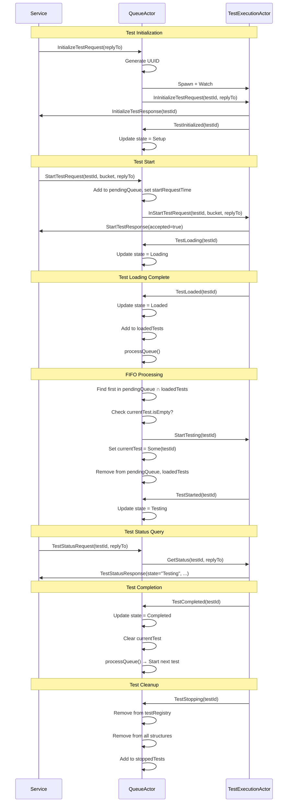

# QueueActor Message Routing Patterns

**Last Updated:** 2025-10-14
**Status:** Implemented
**Component:** `test-probe-core/src/main/scala/io/distia/probe/core/actors/QueueActor.scala`

## Table of Contents

- [Overview](#overview)
- [Routing Architecture](#routing-architecture)
- [Service Command Routing](#service-command-routing)
- [FSM Communication Handling](#fsm-communication-handling)
- [Full Test Lifecycle Message Flow](#full-test-lifecycle-message-flow)
- [FIFO Processing Example](#fifo-processing-example)
- [Error Scenarios](#error-scenarios)
- [Design Patterns](#design-patterns)
- [Testing Message Routing](#testing-message-routing)
- [References](#references)

---

## Overview

QueueActor implements a **pure routing pattern** where all service commands are forwarded to appropriate TestExecutionActors with minimal transformation. The actor serves as a message router, state tracker, and queue coordinator without implementing business logic.

**Routing Responsibilities:**
- **Service Commands:** Forward to TestExecutionActors with replyTo preservation
- **FSM Communications:** Receive state updates, trigger queue processing
- **Queue Management:** FIFO ordering, single test execution enforcement
- **State Tracking:** Monitor test progression through all states
- **Response Routing:** Ensure responses reach original requestor

**Design Principles:**
- **Tell-only pattern:** No ask/pipe complexity
- **Pure routing:** No message transformation or business logic
- **replyTo preservation:** Service responses go directly to original caller
- **State-driven behavior:** FSM communications trigger coordinator actions

---

## Routing Architecture

### Message Flow Layers

```
┌─────────────────────────────────────────────────┐
│         Service Layer (REST/gRPC)               │
│              ↓                ↑                  │
│     Service Commands    Service Responses       │
└──────────────┬──────────────┬───────────────────┘
               ↓              ↑
┌──────────────▼──────────────┴───────────────────┐
│           QueueActor (Router)                    │
│                                                   │
│  ┌────────────────────────────────────────┐     │
│  │  testRegistry: Map[UUID, TestEntry]    │     │
│  │  pendingQueue: Queue[UUID]             │     │
│  │  loadedTests: Set[UUID]                │     │
│  │  currentTest: Option[UUID]             │     │
│  └────────────────────────────────────────┘     │
│              ↓              ↑                    │
│     Internal Commands  FSM Communications       │
└──────────────┬──────────────┬───────────────────┘
               ↓              ↑
┌──────────────▼──────────────┴───────────────────┐
│       TestExecutionActor (FSM)                   │
│                                                   │
│  7-State FSM: Setup → ... → Completed            │
│  5 Child Actors: BlockStorage, Vault, ...       │
└──────────────────────────────────────────────────┘
```

### Message Types

**Ingress (Service → QueueActor):**
- InitializeTestRequest
- StartTestRequest
- TestStatusRequest
- QueueStatusRequest
- CancelRequest

**Routing (QueueActor → TestExecutionActor):**
- InInitializeTestRequest
- InStartTestRequest
- StartTesting (queue-triggered)
- GetStatus
- InCancelRequest

**FSM Communications (TestExecutionActor → QueueActor):**
- TestInitialized
- TestLoading
- TestLoaded
- TestStarted
- TestCompleted
- TestException
- TestStopping

**Egress (TestExecutionActor → Service):**
- InitializeTestResponse
- StartTestResponse
- TestStatusResponse
- TestCancelledResponse

**Special (QueueActor → Service):**
- QueueStatusResponse (QueueActor handles directly)

---

## Service Command Routing

### 1. InitializeTestRequest Routing

**Message Flow:**
```
Service → QueueActor: InitializeTestRequest(replyTo)
QueueActor:
  1. Generate UUID
  2. Spawn TestExecutionActor
  3. Watch actor
  4. Create TestEntry (state=Setup)
  5. Add to testRegistry
QueueActor → TestExecutionActor: InInitializeTestRequest(testId, replyTo)
TestExecutionActor → Service: InitializeTestResponse(testId)
TestExecutionActor → QueueActor: TestInitialized(testId)
QueueActor: Update testRegistry state to Setup
```

**Implementation:**
```scala
case InitializeTestRequest(replyTo) =>
  val testId: UUID = UUID.randomUUID()

  // Spawn TestExecutionActor
  val testActor: ActorRef[TestExecutionCommand] = context.spawn(
    factory(testId, context.self),
    s"test-execution-$testId"
  )

  // Watch for termination
  context.watch(testActor)

  // Create TestEntry
  val testEntry = TestEntry(
    testId = testId,
    actor = testActor,
    state = TestState.Setup,
    replyTo = replyTo
  )

  // Add to registry
  val newState = state.copy(
    testRegistry = state.testRegistry + (testId -> testEntry)
  )

  // Forward to TestExecutionActor
  testActor ! InInitializeTestRequest(testId, replyTo)

  context.log.info(s"Initialized test $testId")
  active(newState, factory)
```

**Key Points:**
- UUID generated by QueueActor, not service
- TestExecutionActor spawned immediately
- replyTo preserved for direct response routing
- Response bypasses QueueActor (sent directly to service)

### 2. StartTestRequest Routing

**Message Flow:**
```
Service → QueueActor: StartTestRequest(testId, bucket, testType, replyTo)
QueueActor:
  1. Lookup test in testRegistry
  2. Update entry with bucket, testType, startRequestTime
  3. Add testId to pendingQueue
QueueActor → TestExecutionActor: InStartTestRequest(testId, bucket, testType, replyTo)
TestExecutionActor → Service: StartTestResponse(testId, accepted=true)
TestExecutionActor → QueueActor: TestLoading(testId)
QueueActor: Update testRegistry state to Loading
```

**Implementation:**
```scala
case StartTestRequest(testId, bucket, testType, replyTo) =>
  state.testRegistry.get(testId) match {
    case Some(entry) =>
      // Update entry with FIFO timestamp
      val updatedEntry = entry.copy(
        bucket = Some(bucket),
        testType = testType,
        startRequestTime = Some(Instant.now()),
        replyTo = replyTo
      )

      // Update state
      val newState = state.copy(
        testRegistry = state.testRegistry.updated(testId, updatedEntry),
        pendingQueue = state.pendingQueue.enqueue(testId)
      )

      // Forward to TestExecutionActor
      entry.actor ! InStartTestRequest(testId, bucket, testType, replyTo)

      context.log.info(s"Start test request for $testId added to queue")
      active(newState, factory)

    case None =>
      context.log.warn(s"StartTestRequest for unknown test $testId")
      replyTo ! ErrorResponse(testId, "Test not found")
      Behaviors.same
  }
```

**Key Points:**
- startRequestTime captured for FIFO ordering
- Test added to pendingQueue (awaiting TestLoaded)
- Pure routing: message forwarded without transformation
- Edge case: Unknown testId results in direct error response

### 3. TestStatusRequest Routing

**Message Flow:**
```
Service → QueueActor: TestStatusRequest(testId, replyTo)
QueueActor:
  1. Lookup test in testRegistry
QueueActor → TestExecutionActor: GetStatus(testId, replyTo)
TestExecutionActor → Service: TestStatusResponse(...)
```

**Implementation:**
```scala
case TestStatusRequest(testId, replyTo) =>
  state.testRegistry.get(testId) match {
    case Some(entry) =>
      // Forward to TestExecutionActor
      entry.actor ! GetStatus(testId, replyTo)

      context.log.debug(s"Status request for $testId forwarded")
      Behaviors.same

    case None =>
      context.log.warn(s"TestStatusRequest for unknown test $testId")
      replyTo ! ErrorResponse(testId, "Test not found")
      Behaviors.same
  }
```

**Key Points:**
- Simplest routing: lookup and forward
- No state changes in QueueActor
- Response bypasses QueueActor

### 4. QueueStatusRequest (Direct Handling)

**Message Flow:**
```
Service → QueueActor: QueueStatusRequest(testIdFilter, replyTo)
QueueActor:
  1. Count tests by state using testRegistry
  2. Build QueueStatusResponse
QueueActor → Service: QueueStatusResponse(counts, currentTest)
```

**Implementation:**
```scala
case QueueStatusRequest(testIdFilter, replyTo) =>
  val response = QueueStatusResponse(
    totalTests = state.testRegistry.size,
    setupCount = countByState(state, TestState.Setup),
    loadingCount = countByState(state, TestState.Loading),
    loadedCount = state.loadedTests.size,
    testingCount = if (state.currentTest.isDefined) 1 else 0,
    completedCount = countByState(state, TestState.Completed),
    exceptionCount = countByState(state, TestState.Exception),
    currentlyTesting = state.currentTest
  )

  replyTo ! response

  context.log.debug(s"Queue status: ${state.testRegistry.size} tests total")
  Behaviors.same
```

**Key Points:**
- ONLY command handled directly by QueueActor
- No forwarding to TestExecutionActor
- Provides aggregate queue statistics

### 5. CancelRequest Routing

**Message Flow:**
```
Service → QueueActor: CancelRequest(testId, replyTo)
QueueActor:
  1. Lookup test in testRegistry
QueueActor → TestExecutionActor: InCancelRequest(testId, replyTo)
TestExecutionActor → Service: TestCancelledResponse(testId, cancelled=true/false)
```

**Implementation:**
```scala
case CancelRequest(testId, replyTo) =>
  state.testRegistry.get(testId) match {
    case Some(entry) =>
      // Forward to TestExecutionActor
      entry.actor ! InCancelRequest(testId, replyTo)

      context.log.info(s"Cancel request for $testId forwarded")
      Behaviors.same

    case None =>
      context.log.warn(s"CancelRequest for unknown test $testId")
      replyTo ! ErrorResponse(testId, "Test not found")
      Behaviors.same
  }
```

**Key Points:**
- TestExecutionActor decides if cancellation is allowed
- QueueActor just routes the request
- Cancellation allowed: Setup, Loading, Loaded states
- Cancellation rejected: Testing, Completed, Exception states

---

## FSM Communication Handling

### State Update Pattern

All FSM communications follow same pattern:

```scala
case TestLoading(testId) =>
  updateTestState(context, state, testId, TestState.Loading, factory)

def updateTestState(
  context: ActorContext[QueueCommand],
  state: QueueState,
  testId: UUID,
  newState: TestState,
  factory: TestExecutionFactory
): Behavior[QueueCommand] = {
  state.testRegistry.get(testId) match {
    case Some(entry) =>
      val updatedEntry = entry.copy(state = newState)
      val updatedState = state.copy(
        testRegistry = state.testRegistry.updated(testId, updatedEntry)
      )
      context.log.debug(s"Test $testId state updated to $newState")
      active(updatedState, factory)

    case None =>
      context.log.warn(s"Update state for unknown test $testId")
      Behaviors.same
  }
}
```

### FSM Communications with Side Effects

Some FSM communications trigger additional actions:

#### TestLoaded → Queue Processing

```scala
case TestLoaded(testId) =>
  state.testRegistry.get(testId) match {
    case Some(entry) =>
      val updatedEntry = entry.copy(state = TestState.Loaded)

      val newState = state.copy(
        testRegistry = state.testRegistry.updated(testId, updatedEntry),
        loadedTests = state.loadedTests + testId  // Add to ready set
      )

      context.log.info(s"Test $testId is loaded and ready")

      // Trigger queue processing
      processQueue(context, newState, factory)

    case None =>
      context.log.warn(s"TestLoaded for unknown test $testId")
      Behaviors.same
  }
```

**Trigger:** Test becomes ready to execute

#### TestCompleted → Clear Current and Process Queue

```scala
case TestCompleted(testId) =>
  state.testRegistry.get(testId) match {
    case Some(entry) =>
      val updatedEntry = entry.copy(state = TestState.Completed)

      val newState = state.copy(
        testRegistry = state.testRegistry.updated(testId, updatedEntry),
        currentTest = if (state.currentTest.contains(testId)) None else state.currentTest
      )

      context.log.info(s"Test $testId completed")

      // Process queue only if this was current test
      if (state.currentTest.contains(testId)) {
        processQueue(context, newState, factory)
      } else {
        active(newState, factory)
      }

    case None =>
      context.log.warn(s"TestCompleted for unknown test $testId")
      Behaviors.same
  }
```

**Trigger:** Current test finishes, start next

#### TestException → Clear Current and Process Queue

```scala
case TestException(testId, exception) =>
  state.testRegistry.get(testId) match {
    case Some(entry) =>
      val updatedEntry = entry.copy(state = TestState.Exception)

      val newState = state.copy(
        testRegistry = state.testRegistry.updated(testId, updatedEntry),
        currentTest = if (state.currentTest.contains(testId)) None else state.currentTest
      )

      context.log.error(s"Test $testId exception: ${exception.getMessage}")

      // Process queue only if this was current test
      if (state.currentTest.contains(testId)) {
        processQueue(context, newState, factory)
      } else {
        active(newState, factory)
      }

    case None =>
      context.log.warn(s"TestException for unknown test $testId")
      Behaviors.same
  }
```

**Trigger:** Current test fails, start next

#### TestStopping → Complete Cleanup

```scala
case TestStopping(testId) =>
  state.testRegistry.get(testId) match {
    case Some(entry) =>
      val newState = state.copy(
        testRegistry = state.testRegistry - testId,  // Remove from registry
        pendingQueue = state.pendingQueue.filterNot(_ == testId),  // Remove from queue
        loadedTests = state.loadedTests - testId,  // Remove from loaded
        currentTest = if (state.currentTest.contains(testId)) None else state.currentTest,  // Clear current
        stoppedTests = state.stoppedTests + testId  // Add to stopped
      )

      context.log.info(s"Test $testId stopping, removed from all structures")

      // Process queue if this was current test
      if (state.currentTest.contains(testId)) {
        processQueue(context, newState, factory)
      } else {
        active(newState, factory)
      }

    case None =>
      context.log.warn(s"TestStopping for unknown test $testId")
      Behaviors.same
  }
```

**Trigger:** Test cleanup complete, remove from all structures

---

## Full Test Lifecycle Message Flow

### Complete Message Sequence



---

## FIFO Processing Example

### Multi-Test Scenario

```
Timeline: Three tests (A, B, C) with different load times

T=0: Test A → InitializeTestRequest
     QueueActor: Generate UUID, spawn TestExecutionActor A

T=1: Test B → InitializeTestRequest
     QueueActor: Generate UUID, spawn TestExecutionActor B

T=2: Test C → InitializeTestRequest
     QueueActor: Generate UUID, spawn TestExecutionActor C

T=3: Test A → StartTestRequest
     QueueActor: Add A to pendingQueue
     pendingQueue = [A]

T=4: Test B → StartTestRequest
     QueueActor: Add B to pendingQueue
     pendingQueue = [A, B]

T=5: Test C → StartTestRequest
     QueueActor: Add C to pendingQueue
     pendingQueue = [A, B, C]

T=6: Test B → TestLoading
     QueueActor: Update state = Loading

T=7: Test B → TestLoaded
     QueueActor: Update state = Loaded, add to loadedTests
     loadedTests = {B}
     processQueue: B is loaded BUT NOT first in queue → Wait

T=8: Test C → TestLoading
     QueueActor: Update state = Loading

T=9: Test C → TestLoaded
     QueueActor: Update state = Loaded, add to loadedTests
     loadedTests = {B, C}
     processQueue: C is loaded BUT NOT first in queue → Wait

T=10: Test A → TestLoading
      QueueActor: Update state = Loading

T=11: Test A → TestLoaded
      QueueActor: Update state = Loaded, add to loadedTests
      loadedTests = {A, B, C}
      processQueue:
        readyTestId = pendingQueue.find(loadedTests.contains)
                    = Some(A)  // First in queue
        currentTest.isEmpty? → true
        QueueActor → Test A: StartTesting
        currentTest = Some(A)
        pendingQueue = [B, C]
        loadedTests = {B, C}

T=12: Test A → TestStarted
      QueueActor: Update state = Testing

T=13: Test A → TestCompleted
      QueueActor: Update state = Completed
      QueueActor: Clear currentTest
      processQueue:
        readyTestId = Some(B)  // Next in queue
        QueueActor → Test B: StartTesting
        currentTest = Some(B)
        pendingQueue = [C]
        loadedTests = {C}

T=14: Test B → TestStarted
      QueueActor: Update state = Testing

T=15: Test B → TestCompleted
      QueueActor: Update state = Completed
      QueueActor: Clear currentTest
      processQueue:
        readyTestId = Some(C)  // Last in queue
        QueueActor → Test C: StartTesting
        currentTest = Some(C)
        pendingQueue = []
        loadedTests = {}

T=16: Test C → TestStarted
      QueueActor: Update state = Testing

T=17: Test C → TestCompleted
      QueueActor: Update state = Completed
      QueueActor: Clear currentTest
      processQueue: No tests ready
```

**FIFO Guarantee:** Despite Test B and C loading before Test A, Test A executes first because it was added to pendingQueue first (T=3).

---

## Error Scenarios

### 1. Unknown Test ID

**Scenario:** Service sends command for non-existent test

**Message Flow:**
```
Service → QueueActor: StartTestRequest(unknownTestId, bucket, replyTo)
QueueActor: Lookup unknownTestId in testRegistry → None
QueueActor → Service: ErrorResponse(unknownTestId, "Test not found")
```

**Implementation:**
```scala
case StartTestRequest(testId, bucket, testType, replyTo) =>
  state.testRegistry.get(testId) match {
    case Some(entry) =>
      // Forward to TestExecutionActor
      // ...

    case None =>
      context.log.warn(s"StartTestRequest for unknown test $testId")
      replyTo ! ErrorResponse(testId, "Test not found")
      Behaviors.same
  }
```

### 2. Actor Termination

**Scenario:** TestExecutionActor crashes unexpectedly

**Message Flow:**
```
TestExecutionActor → (crashes)
QueueActor: Terminated signal received
QueueActor: Find test in testRegistry by actor ref
QueueActor: Update state = Exception
QueueActor: Clear currentTest (if this was current)
QueueActor: processQueue() → Start next test
```

**Implementation:**
```scala
}.receiveSignal {
  case (ctx, Terminated(actor)) =>
    state.testRegistry.find(_._2.actor == actor) match {
      case Some((testId, entry)) =>
        ctx.log.error(s"TestExecutionActor for test $testId terminated unexpectedly")

        val updatedEntry = entry.copy(state = TestState.Exception)
        val newState = state.copy(
          testRegistry = state.testRegistry.updated(testId, updatedEntry),
          currentTest = if (state.currentTest.contains(testId)) None else state.currentTest
        )

        // Process queue if this was the running test
        if (state.currentTest.contains(testId)) {
          processQueue(ctx, newState, factory)
        } else {
          active(newState, factory)
        }

      case None =>
        ctx.log.warn("Terminated actor not found in registry")
        Behaviors.same
    }
}
```

**Key Points:**
- Graceful degradation: Queue continues processing
- Automatic cleanup: currentTest cleared
- Next test started: FIFO order maintained

### 3. Test Exception

**Scenario:** TestExecutionActor reports exception during execution

**Message Flow:**
```
TestExecutionActor → QueueActor: TestException(testId, exception)
QueueActor: Update state = Exception
QueueActor: Log exception
QueueActor: Clear currentTest (if this was current)
QueueActor: processQueue() → Start next test
```

**Impact:** Single test failure doesn't prevent other tests from executing

---

## Design Patterns

### 1. Pure Routing Pattern

**Intent:** Separate message routing from business logic

**Implementation:**
- QueueActor forwards messages without transformation
- TestExecutionActor implements all business logic
- Clear separation of concerns

**Benefits:**
- Simple coordinator
- Easy to test
- Clear responsibility boundaries

### 2. Tell-Only Pattern

**Intent:** Avoid ask/pipe complexity

**Implementation:**
- All interactions use tell (`!`)
- No ask pattern, no futures
- replyTo passed through messages

**Benefits:**
- Maintains actor model purity
- No timeout configuration
- Simpler error handling

### 3. replyTo Preservation

**Intent:** Enable direct service responses

**Implementation:**
```scala
// QueueActor receives replyTo
case StartTestRequest(testId, bucket, testType, replyTo) =>
  // Forward replyTo to TestExecutionActor
  entry.actor ! InStartTestRequest(testId, bucket, testType, replyTo)

// TestExecutionActor responds directly to service
case InStartTestRequest(testId, bucket, testType, replyTo) =>
  // Do work
  replyTo ! StartTestResponse(testId, accepted = true, testType)
```

**Benefits:**
- Responses bypass QueueActor
- Lower latency
- Simpler routing

### 4. State-Driven Coordination

**Intent:** Use FSM communications to trigger coordinator actions

**Implementation:**
- TestLoaded → triggers processQueue
- TestCompleted → clears currentTest, triggers processQueue
- TestException → clears currentTest, triggers processQueue
- TestStopping → cleanup, triggers processQueue

**Benefits:**
- Reactive coordination
- Decoupled components
- Clear event-driven flow

---

## Testing Message Routing

### Unit Test Pattern

```scala
"QueueActor" should {
  "forward StartTestRequest to TestExecutionActor with replyTo" in {
    val queueActor = testKit.spawn(QueueActor(serviceConfig, Some(mockFactory)))
    val serviceProbe = testKit.createTestProbe[ServiceResponse]()
    val testProbe = testKit.createTestProbe[TestExecutionCommand]()

    // Initialize test
    queueActor ! InitializeTestRequest(serviceProbe.ref)
    val initResponse = serviceProbe.expectMessageType[InitializeTestResponse]
    val testId = initResponse.testId

    // Send start request
    queueActor ! StartTestRequest(testId, "test-bucket", Some("functional"), serviceProbe.ref)

    // Verify forwarding
    val forwardedMessage = testProbe.expectMessageType[InStartTestRequest]
    forwardedMessage.testId shouldBe testId
    forwardedMessage.bucket shouldBe "test-bucket"
    forwardedMessage.testType shouldBe Some("functional")
    forwardedMessage.replyTo shouldBe serviceProbe.ref
  }
}
```

### BDD Test Pattern

```gherkin
@ComponentTest @MessageRouting
Scenario: Forward StartTestRequest to TestExecutionActor with replyTo
  Given a test with id "11111111-1111-1111-1111-111111111111" exists in the registry
  When the QueueActor receives a StartTestRequest for testId "11111111-1111-1111-1111-111111111111" with bucket "test-bucket"
  Then the QueueActor should forward "InStartTestRequest" to the TestExecutionActor with testId "11111111-1111-1111-1111-111111111111"
  And the forwarded message should include bucket "test-bucket"
  And the forwarded message should include the original replyTo
```

---

## References

**Implementation Files:**
- QueueActor: `test-probe-core/src/main/scala/io/distia/probe/core/actors/QueueActor.scala` (444 lines)
- Commands: `test-probe-core/src/main/scala/io/distia/probe/core/models/ActorCommands.scala`

**Test Files:**
- Unit Tests: `test-probe-core/src/test/scala/io/distia/probe/core/actors/QueueActorSpec.scala`
- BDD Feature: `test-probe-core/src/test/resources/features/component/actor-lifecycle/queue-actor.feature`
- Step Definitions: `test-probe-core/src/test/scala/io/distia/probe/core/glue/steps/QueueActorSteps.scala`

**Architecture Documentation:**
- QueueActor Overview: [08.1.1-queue-actor.md](./08.1.1-queue-actor.md)
- TestExecutionActor FSM: [../../05 State Machine/05.1-test-execution-actor-fsm.md](../../05%20State%20Machine/05.1-test-execution-actor-fsm.md)
- TestExecutionActor Error Handling: [../../05 State Machine/05.2-test-execution-actor-error-handling.md](../../05%20State%20Machine/05.2-test-execution-actor-error-handling.md)

**Design Documents:**
- Implementation Plan: `working/QueueActorImplementationPlan.md`
- Understanding Document: `working/QueueActorUnderstanding.md`

**External References:**
- Akka Message Delivery: https://doc.akka.io/docs/akka/current/typed/interaction-patterns.html
- Tell vs Ask: https://doc.akka.io/docs/akka/current/typed/interaction-patterns.html#request-response
- Actor Supervision: https://doc.akka.io/docs/akka/current/typed/fault-tolerance.html

---

**Document History:**
- 2025-10-14: Initial creation focusing on message routing patterns
