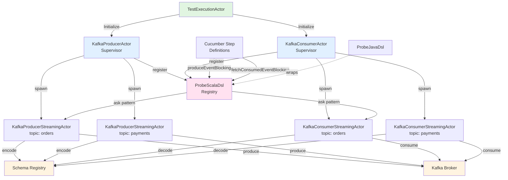
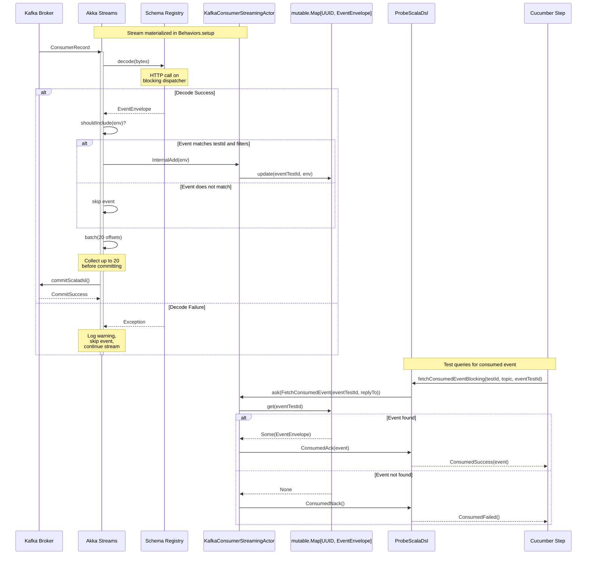
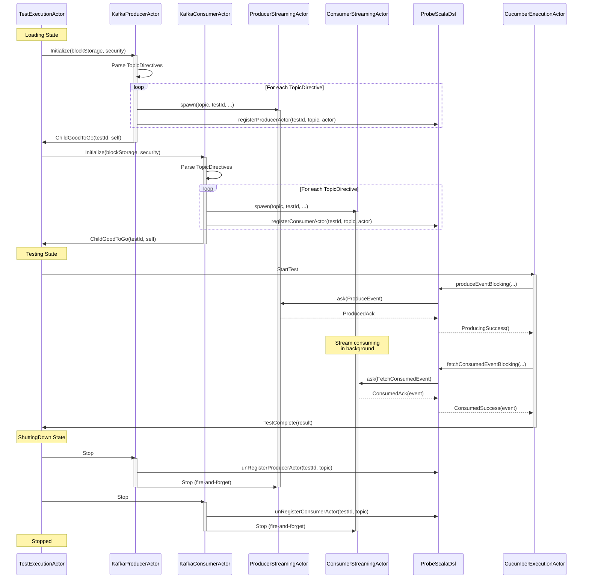

# 10.1 Kafka Streaming Architecture

**Last Updated:** 2025-10-16
**Status:** Complete
**Component:** Kafka Producer/Consumer Streaming Layer + DSL
**Total Implementation:** 848 lines across 6 files

---

## Table of Contents

1. [Overview](#overview)
2. [Architecture Pattern](#architecture-pattern)
3. [Component Hierarchy](#component-hierarchy)
4. [Key Architectural Patterns](#key-architectural-patterns)
5. [Sequence Diagrams](#sequence-diagrams)
6. [Actor Lifecycle](#actor-lifecycle)
7. [Error Handling](#error-handling)
8. [Configuration](#configuration)
9. [Implementation Files](#implementation-files)
10. [Architecture Decision Records](#architecture-decision-records)
11. [Testing Strategy](#testing-strategy)
12. [Future Enhancements](#future-enhancements)

---

## Overview

The Kafka streaming layer provides end-to-end Kafka producer/consumer integration with Schema Registry support and Scala/Java DSL for Cucumber test access. It implements a sophisticated supervisor-streaming actor separation pattern with thread-safe DSL registry for external thread access.

### Design Goals

1. **Isolation**: Stream failures don't affect supervisor lifecycle
2. **Scalability**: One streaming actor per topic, independent failure domains
3. **Testability**: Supervisor logic testable without materializing streams
4. **Accessibility**: Cucumber step definitions can produce/consume events via blocking API
5. **Observability**: OpenTelemetry metrics for all operations
6. **Resilience**: Graceful degradation on Schema Registry failures

### Implementation Status

- ✅ KafkaProducerActor (supervisor): 237 lines
- ✅ KafkaConsumerActor (supervisor): 237 lines
- ✅ KafkaProducerStreamingActor: 89 lines
- ✅ KafkaConsumerStreamingActor: 168 lines
- ✅ ProbeScalaDsl (registry): 150 lines
- ✅ ProbeJavaDsl (stub): CompletableFuture wrapper
- ✅ ADRs 001-004: All architectural decisions documented

---

## Architecture Pattern

### Supervisor-Streaming Separation

**Core Principle**: Separate lifecycle management (supervisor) from stream processing (streaming actor).

```
TestExecutionActor
├── KafkaProducerActor (supervisor)
│   ├── Spawns N streaming actors (one per topic)
│   ├── Registers streaming actors with DSL
│   └── Coordinated shutdown on Stop
│
└── KafkaConsumerActor (supervisor)
    ├── Spawns N streaming actors (one per topic)
    ├── Registers streaming actors with DSL
    └── Coordinated shutdown on Stop

ProbeScalaDsl (singleton)
├── ConcurrentHashMap: (testId, topic) → ActorRef
├── Async API: produceEvent() → Future[ProduceResult]
└── Blocking API: produceEventBlocking() → ProduceResult
```

**Why Separate?**

1. **Fault Isolation**: Stream failure restarts only streaming actor, not supervisor
2. **Scalability**: Independent streams per topic, no shared state
3. **Lifecycle Control**: Supervisor manages child lifecycle independently
4. **Supervision Strategy**: Fine-grained error handling per streaming actor

---

## Component Hierarchy



---

## Key Architectural Patterns

### Pattern 1: Supervisor-Streaming Separation

**Supervisor Actor** (`KafkaProducerActor`, `KafkaConsumerActor`):
- **Responsibility**: Lifecycle management, spawn N streaming actors (one per topic)
- **State**: Map of topic → streaming actor ref
- **Lifecycle**: Created → Initialize → Ready → Stop
- **Message Protocol**:
  - `Initialize(BlockStorageDirective, List[SecurityDirective])` → spawns streaming actors
  - `StartTest` → no-op (streaming actors accessed via DSL)
  - `Stop` → coordinated shutdown, unregister from DSL

**Streaming Actor** (`KafkaProducerStreamingActor`, `KafkaConsumerStreamingActor`):
- **Responsibility**: Akka Streams materialization, Schema Registry integration
- **State**: Materialized stream control handle, registry (consumer only)
- **Lifecycle**: Spawned → PostStop (shutdown stream)
- **Message Protocol**:
  - Producer: `ProduceEvent(envelope, replyTo)` → `ProducedAck | ProducedNack`
  - Consumer: `FetchConsumedEvent(eventTestId, replyTo)` → `ConsumedAck | ConsumedNack`

**Code Example**:

```scala
// Supervisor spawns streaming actors
val streamingActor: ActorRef[ProducerCommand] = context.spawn(
  Behaviors.supervise(
    Behaviors.supervise(
      Behaviors.supervise(
        KafkaProducerStreamingActor(testId, tokenRefresh, topicDir, secDir, bootstrapServers)
      )
      .onFailure[IllegalArgumentException](SupervisorStrategy.restart)  // Schema errors
    )
    .onFailure[IOException](SupervisorStrategy.restart.withLimit(3, 1.minute))  // Network errors
  )
  .onFailure[VirtualMachineError](SupervisorStrategy.stop),  // Fatal JVM errors
  s"kafka-producer-streaming-${topic}-${testId}"
)

// Register with DSL
ProbeScalaDsl.registerProducerActor(testId, topic, streamingActor)
```

---

### Pattern 2: DSL Registry Pattern

**Thread-Safe Registry** (`ProbeScalaDsl`):

```scala
@volatile private var systemOpt: Option[ActorSystem[_]] = None
@volatile private var askTimeoutDuration: FiniteDuration = 3.seconds

private val producers: ConcurrentHashMap[(UUID, String), ActorRef[ProducerCommand]] = ...
private val consumers: ConcurrentHashMap[(UUID, String), ActorRef[ConsumerCommand]] = ...

def registerProducerActor(testId: UUID, topic: String, actor: ActorRef): Unit
def produceEvent(testId: UUID, topic: String, event: EventEnvelope): Future[ProduceResult]
def produceEventBlocking(testId: UUID, topic: String, event: EventEnvelope): ProduceResult
```

**Registration Flow**:

1. Supervisor actor spawns streaming actor
2. Supervisor registers streaming actor with DSL: `ProbeScalaDsl.registerProducerActor(testId, topic, actor)`
3. Cucumber step definition calls DSL: `ProbeScalaDsl.produceEventBlocking(testId, topic, event)`
4. DSL looks up actor: `producers.get((testId, topic))`
5. DSL sends ask message: `actor.ask[ProduceResult](replyTo => ProduceEvent(event, replyTo))`

**Unregistration**:
- Supervisor actor unregisters on `Stop`
- Streaming actor unregisters in `PostStop` (belt-and-suspenders)

**Why ConcurrentHashMap?**
- Cucumber scenarios may run concurrently (PicoContainer controls concurrency)
- Thread-safe access from multiple test threads
- No need for actor for simple get/put operations

**Code Example**:

```scala
// Async API
def produceEvent(testId: UUID, topic: String, event: EventEnvelope): Future[ProduceResult] = {
  implicit val actorSystem: ActorSystem[_] = systemOpt.getOrElse(throw DslNotInitializedException())
  implicit val timeout: Timeout = Timeout(askTimeoutDuration)

  Option(producers.get((testId, topic))) match {
    case Some(producer) =>
      producer.ask[ProduceResult](replyTo => ProduceEvent(event, replyTo)).map {
        case ProducedAck => ProducingSuccess()
        case ProducedNack(ex) => ProducingFailed(ex)
      }
    case None => throw ActorNotRegisteredException(...)
  }
}

// Blocking API (for Cucumber)
def produceEventBlocking(testId: UUID, topic: String, event: EventEnvelope): ProduceResult =
  Await.result(produceEvent(testId, topic, event), 5.seconds)
```

---

### Pattern 3: Custom Materializer + control.stop

**Implementation**:

```scala
// Setup: Custom materializer scoped to this actor
implicit val mat: Materializer = Materializer(ctx)

// PostStop: Stop control, then shutdown materializer
.receiveSignal {
  case (_, PostStop) =>
    ctx.log.info(s"PostStop — shutting down Kafka stream for test $testId, topic ${directive.topic}")
    ProbeScalaDsl.unRegisterConsumerActor(testId, directive.topic)

    // TODO: DO NOT CHANGE without reading ADR-004
    // control.stop stops accepting new messages, DOES NOT drain pending offsets
    // This is intentional: test is over, no need to commit pending offsets
    // If test termination was due to exception, offsets are already invalid
    control.stop.map(_ => mat.shutdown).recover {
      case e: Throwable =>
        ctx.log.error(s"Kafka or materializer was not shutdown. Investigate $e with message ${e.getMessage}")
    }
    Behaviors.same
}
```

**Why NOT drainAndShutdown?**
- Test is already over when PostStop fires
- No need to drain pending messages (test won't see them)
- Faster shutdown (no waiting for drain)
- Exception case: offsets already invalid, test will re-run

**See**: [ADR-004: Consumer Stream Lifecycle Management](../../adr/ADR-004-Consumer-Stream-Lifecycle-Management.md)

---

### Pattern 4: Blocking Dispatcher for Schema Registry

**Problem**: Schema Registry HTTP calls block actor thread pool

**Solution**:

```scala
// Dedicated blocking thread pool (8 threads)
val blockingEc: ExecutionContext =
  ctx.system.dispatchers.lookup(
    akka.actor.typed.DispatcherSelector.fromConfig("akka.actor.blocking-io-dispatcher")
  )

// Producer: Encode on blocking dispatcher
.mapAsync(1) { envelope =>
  Future {
    SchemaRegistryEncoder.encode(envelope, envelope.topic)
  }(blockingEc)  // ← Dedicated blocking pool
}

// Consumer: Decode on blocking dispatcher
.mapAsync(1) { msg =>
  Future {
    Try(SchemaRegistryDecoder.decode(msg.record.value())) match {
      case Success(env) => Some((env, msg.committableOffset))
      case Failure(ex) =>
        ctx.log.warn(s"Decode failed, skipping: ${ex.getMessage}")
        None
    }
  }(blockingEc)  // ← Dedicated blocking pool
}
```

**Configuration** (`reference.conf`):

```hocon
akka.actor.blocking-io-dispatcher {
  type = Dispatcher
  executor = "thread-pool-executor"
  thread-pool-executor {
    fixed-pool-size = 8
  }
  throughput = 1
}
```

---

### Pattern 5: Per-Message Stream (Producer)

**Current Implementation**:

```scala
case ProduceEvent(env, replyTo) =>
  Source.single(env)
    .mapAsync(1) { envelope => /* encode */ }
    .map { encoded => new ProducerRecord(...) }
    .runWith(Producer.plainSink(producerSettings))
    .onComplete {
      case Success(_) => replyTo ! ProducedAck
      case Failure(ex) => replyTo ! ProducedNack(ex)
    }
```

**Why NOT Persistent Stream?**
- JWT TTL >1 hour + Kafka client connection pooling = connection reuse
- Test volume: 20-200 events over 10 mins (1-3 events/min)
- Sequential Cucumber execution (no burst scenario)
- Defer optimization until smoke testing shows actual performance issue

**See**: [ADR-002: Producer Stream Performance Optimization](../../adr/ADR-002-Producer-Stream-Performance-Optimization.md)

---

### Pattern 6: Event Filtering + Batched Commits (Consumer)

**Event Filtering** (extracted for testability):

```scala
def createEventFilter(testId: UUID, directive: TopicDirective): EventEnvelope => Boolean = {
  (env: EventEnvelope) =>
    env.testId == testId &&
      directive.eventFilters.exists { case (tpe, ver) =>
        env.eventType == tpe && env.eventVersion == ver
      }
}
```

**Commit Flow**:

```scala
def unifiedCommitFlow(
  ctx: ActorContext[Command],
  shouldInclude: EventEnvelope => Boolean
)(implicit ec: ExecutionContext): Flow[(EventEnvelope, CommittableOffset), Done, NotUsed] =
  Flow[(EventEnvelope, CommittableOffset)]
    .map { case (env, offset) =>
      if (shouldInclude(env)) {
        ctx.self ! InternalAdd(env)  // Add to registry
      }
      offset
    }
    .batch(max = 20L, first => CommittableOffsetBatch.empty.updated(first))(_.updated(_))
    .mapAsync(1)(_.commitScaladsl())
```

**Batching Strategy**:
- Collect up to 20 offsets before committing
- Reduces Kafka commit overhead
- Balances latency vs throughput
- Trade-off: Last 0-19 events may not commit if actor stops (acceptable per ADR-004)

---

### Pattern 7: Error Handling Strategy

**Producer** ([ADR-003](../../adr/ADR-003-Schema-Registry-Error-Handling.md)):
- **Return ProducedNack immediately** - let test decide retry vs fail
- Schema Registry error → `ProducedNack(exception)`
- Test can inspect exception type:
  - `IOException` → retry (operational error)
  - `IllegalArgumentException` → fail (configuration error)

**Consumer** ([ADR-003](../../adr/ADR-003-Schema-Registry-Error-Handling.md)):
- **Skip malformed events** - log warning, continue stream
- Decode failure → event not added to registry
- Test will get `ConsumedNack()` when polling for missing event
- Stream continues processing (resilient)

**OpenTelemetry** (planned):

```scala
// TODO: OpenTelemetry instrumentation (ADR-003)
// meter.counter("probe_kafka_producer_errors_total")
//   .add(1, Attributes.of(
//     AttributeKey.stringKey("topic") -> topic,
//     AttributeKey.stringKey("error_type") -> classifyError(ex)
//   ))
```

---

## Sequence Diagrams

### Producer Flow

```mermaid
sequenceDiagram
    participant Cucumber as Cucumber Step
    participant DSL as ProbeScalaDsl
    participant Map as ConcurrentHashMap
    participant SA as KafkaProducerStreamingActor
    participant Stream as Akka Streams
    participant SR as Schema Registry
    participant Kafka as Kafka Broker

    Cucumber->>DSL: produceEventBlocking(testId, topic, event)
    DSL->>Map: get((testId, topic))
    Map-->>DSL: ActorRef[ProducerCommand]

    DSL->>SA: ask(ProduceEvent(event, replyTo))
    activate SA

    SA->>Stream: Source.single(event)
    activate Stream

    Stream->>SR: encode(event, topic)
    Note over SR: HTTP call on<br/>blocking dispatcher
    SR-->>Stream: Array[Byte]

    Stream->>Kafka: Producer.plainSink<br/>(ProducerRecord)
    Note over Kafka: Async send

    alt Success
        Kafka-->>Stream: RecordMetadata
        Stream-->>SA: Success
        SA->>DSL: ProducedAck
        deactivate Stream
        deactivate SA
        DSL-->>Cucumber: ProducingSuccess()
    else Failure
        Kafka-->>Stream: Exception
        Stream-->>SA: Failure(ex)
        SA->>DSL: ProducedNack(ex)
        deactivate Stream
        deactivate SA
        DSL-->>Cucumber: ProducingFailed(ex)
    end
```

---

### Consumer Flow



---

### Full Integration Flow



---

## Actor Lifecycle

### Supervisor Lifecycle

**KafkaProducerActor / KafkaConsumerActor**:

```
Created (TestExecutionActor spawns)
    ↓
Behaviors.setup { ctx =>
    ↓
Initialize(blockStorage, security)
    ↓
Parse TopicDirectives
    ↓
For each topic:
  - spawn StreamingActor
  - register with DSL
  - track in Map[topic → ActorRef]
    ↓
Reply: ChildGoodToGo
    ↓
StartTest (no-op)
    ↓
Stop
    ↓
unRegister all from DSL
    ↓
Stop all streaming actors (fire-and-forget)
    ↓
Behaviors.stopped
```

---

### Streaming Actor Lifecycle

**KafkaProducerStreamingActor / KafkaConsumerStreamingActor**:

```
Spawned by supervisor
    ↓
Behaviors.setup { ctx =>
  - Create custom materializer
  - Materialize Akka Stream
  - Store control handle
    ↓
receiveBehavior()
  - Producer: ProduceEvent → ProducedAck/Nack
  - Consumer: FetchConsumedEvent → ConsumedAck/Nack
    ↓
PostStop
  - control.stop
  - mat.shutdown
  - unRegister from DSL
    ↓
Behaviors.stopped
```

---

## Error Handling

### Layered Supervision Strategy

```scala
Behaviors.supervise(
  Behaviors.supervise(
    Behaviors.supervise(StreamingActor(...))
      .onFailure[IllegalArgumentException](SupervisorStrategy.restart)  // Schema errors
  )
  .onFailure[IOException](SupervisorStrategy.restart.withLimit(3, 1.minute))  // Network errors
)
.onFailure[VirtualMachineError](SupervisorStrategy.stop)  // Fatal JVM errors
```

**Rationale**:
- **Schema errors** (IllegalArgumentException): Restart immediately, likely configuration issue
- **Network errors** (IOException): Restart with limit (3 retries/1 min), transient issue
- **Fatal JVM errors** (VirtualMachineError): Stop actor, cannot recover

---

### Producer Error Handling

```scala
case ProduceEvent(env, replyTo) =>
  Source.single(env)
    .mapAsync(1) { envelope => /* encode */ }
    .map { encoded => /* ProducerRecord */ }
    .runWith(Producer.plainSink(producerSettings))
    .onComplete {
      case Success(_) =>
        ctx.log.info(s"Produced event ${env.eventTestId} to ${topicDirective.topic}")
        replyTo ! ProducedAck
      case Failure(ex) =>
        ctx.log.error(s"Producer failed for event ${env.eventTestId}: ${ex.getMessage}", ex)
        // TODO: OpenTelemetry metric
        replyTo ! ProducedNack(ex)  // Return exception to caller
    }
  Behaviors.same
```

**Key Points**:
- `onComplete` catches ALL failures (Schema Registry, network, Kafka)
- Exception passed to caller via `ProducedNack(ex)`
- Actor continues processing (stream isolated per message with `Source.single`)
- Test decides retry strategy based on exception type

---

### Consumer Error Handling

```scala
.mapAsync(1) { msg =>
  Future {
    Try(SchemaRegistryDecoder.decode(msg.record.value())) match {
      case Success(env) => Some((env, msg.committableOffset))
      case Failure(ex) =>
        ctx.log.warn(s"Schema decode failed for message on topic ${directive.topic}, skipping: ${ex.getMessage}")
        // TODO: OpenTelemetry metric
        None
    }
  }(blockingEc)
}
.collect { case Some(tuple) => tuple }  // Filter out decode failures
```

**Key Points**:
- `Try` wrapper prevents stream termination
- Event skipped, never added to registry
- Actor never sees the error
- Stream continues processing (resilient to malformed events)

---

## Configuration

### reference.conf

```hocon
test-probe {
  kafka {
    # Bootstrap servers (externalized via environment variable)
    bootstrap-servers = "localhost:9092"
    bootstrap-servers = ${?KAFKA_BOOTSTRAP_SERVERS}

    # Schema registry URL
    schema-registry-url = ${?SCHEMA_REGISTRY_URL}

    # OAuth2 configuration
    oauth {
      token-endpoint = ${?OAUTH_TOKEN_ENDPOINT}
      client-scope = ${?OAUTH_CLIENT_SCOPE}
    }
  }

  dsl {
    # Timeout for ask pattern operations in DSL
    ask-timeout = 3 seconds
  }
}

akka.actor.blocking-io-dispatcher {
  type = Dispatcher
  executor = "thread-pool-executor"
  thread-pool-executor {
    fixed-pool-size = 8
  }
  throughput = 1
}
```

### Environment Variable Overrides

- `KAFKA_BOOTSTRAP_SERVERS` → Kafka broker addresses
- `SCHEMA_REGISTRY_URL` → Schema Registry endpoint
- `OAUTH_TOKEN_ENDPOINT` → OAuth token service
- `OAUTH_CLIENT_SCOPE` → OAuth scope for Kafka

---

## Implementation Files

### Core Actors

**Supervisors**:
- `test-probe-core/src/main/scala/io/distia/probe/core/actors/KafkaProducerActor.scala` (237 lines)
- `test-probe-core/src/main/scala/io/distia/probe/core/actors/KafkaConsumerActor.scala` (237 lines)

**Streaming**:
- `test-probe-core/src/main/scala/io/distia/probe/core/actors/KafkaProducerStreamingActor.scala` (89 lines)
- `test-probe-core/src/main/scala/io/distia/probe/core/actors/KafkaConsumerStreamingActor.scala` (168 lines)

### DSL Layer

- `test-probe-core/src/main/scala/io/distia/probe/core/pubsub/ProbeScalaDsl.scala` (150 lines)
- `test-probe-core/src/main/scala/io/distia/probe/core/pubsub/ProbeJavaDsl.scala` (stub)

### Schema Registry (Stubs)

- `test-probe-core/src/main/scala/io/distia/probe/core/pubsub/SchemaRegistryEncoder.scala`
- `test-probe-core/src/main/scala/io/distia/probe/core/pubsub/SchemaRegistryDecoder.scala`
- `test-probe-core/src/main/scala/io/distia/probe/core/pubsub/SchemaRegistryHelper.scala`

### Models

- `test-probe-core/src/main/scala/io/distia/probe/core/pubsub/models/PubSubModels.scala`
- `test-probe-core/src/main/scala/io/distia/probe/core/pubsub/models/TopicDirective.scala`

### Commands

- `test-probe-core/src/main/scala/io/distia/probe/core/models/ActorCommands.scala` (KafkaProducerCommands, KafkaConsumerCommands)

---

## Architecture Decision Records

1. **[ADR-001: Consumer Registry Memory Management](../../adr/ADR-001-Consumer-Registry-Memory-Management.md)**
   - **Decision**: No cache eviction needed
   - **Rationale**: Test lifetime bounded (≤40 mins), acceptable memory footprint (20-200 events typical)
   - **Alternative**: LRU cache, TTL eviction - rejected as over-engineering for test-probe

2. **[ADR-002: Producer Stream Performance Optimization](../../adr/ADR-002-Producer-Stream-Performance-Optimization.md)**
   - **Decision**: Keep per-message stream, defer optimization until smoke testing
   - **Rationale**: JWT TTL >1 hour, Kafka connection pooling, low volume (1-3 events/min)
   - **Trigger for Revision**: Smoke testing shows P99 latency >500ms or throughput <10 events/sec

3. **[ADR-003: Schema Registry Error Handling](../../adr/ADR-003-Schema-Registry-Error-Handling.md)**
   - **Decision**: Producer NACKs immediately, consumer skips events, test decides retry
   - **Rationale**: Test has better context for retry strategy (timeout, business logic)
   - **Implementation**: OpenTelemetry metrics planned (TODO added)

4. **[ADR-004: Consumer Stream Lifecycle Management](../../adr/ADR-004-Consumer-Stream-Lifecycle-Management.md)**
   - **Decision**: Custom materializer + control.stop (no drainAndShutdown)
   - **Rationale**: Test over when PostStop fires, no need to drain pending messages
   - **Trade-off**: Last 0-19 events may not commit (acceptable for test re-runs)

---

## Testing Strategy

### Unit Tests (Planned)

**KafkaProducerStreamingActor**:
- ProduceEvent with Schema Registry failure → ProducedNack
- ProduceEvent timeout → ProducedNack
- PostStop unregisters from DSL

**KafkaConsumerStreamingActor**:
- `createEventFilter` with matching testId → returns true
- `createEventFilter` with wrong testId → returns false
- `unifiedCommitFlow` with 25 events → 2 commits (20 + 5)
- Schema decode failure → event skipped, stream continues
- FetchConsumedEvent hit/miss scenarios

**ProbeScalaDsl**:
- produceEvent before registerSystem → DslNotInitializedException
- produceEvent with unregistered topic → ActorNotRegisteredException
- Concurrent access from multiple threads → thread safety verified

### Component Tests (Existing)

**Integration with Testcontainers**:
- Real Kafka cluster
- Schema Registry container
- End-to-end produce → consume flow

### BDD Scenarios (Planned)

**Producer Scenarios**:
```gherkin
Feature: Kafka Producer Streaming
  Scenario: Successfully produce event with Avro schema
    Given a KafkaProducerStreamingActor for topic "orders"
    When a ProduceEvent command is sent
    Then the event should be encoded with Avro
    And the producer should respond with ProducedAck
```

**Consumer Scenarios**:
```gherkin
Feature: Kafka Consumer Streaming
  Scenario: Consumer filters events by testId
    Given a KafkaConsumerStreamingActor for test "abc-123"
    When events with testIds "abc-123" and "xyz-789" are consumed
    Then only events with testId "abc-123" should be in registry
```

---

## Future Enhancements

### Phase 1: OpenTelemetry Instrumentation

- Error classification helper: `classifyError(ex): String`
- Metrics: `probe_kafka_producer_errors_total`, `probe_kafka_consumer_decode_errors_total`
- Dashboard for Schema Registry health monitoring

### Phase 2: Performance Optimization (If Needed)

- Benchmark per-message vs persistent stream
- Implement `Source.queue` pattern if throughput requirements increase
- Circuit breaker for Schema Registry

### Phase 3: Advanced Features

- Multi-topic transactions
- Exactly-once semantics validation
- Consumer lag monitoring

---

## References

- Implementation Summary: `/working/KafkaStreamingImplementationSummary-2025-10-16.md`
- CLAUDE.md: `/CLAUDE.md` (Kafka Streaming Layer section)
- Akka Streams Documentation: https://doc.akka.io/docs/akka/current/stream/
- Alpakka Kafka: https://doc.akka.io/docs/alpakka-kafka/current/
- Schema Registry: https://docs.confluent.io/platform/current/schema-registry/

---

## Document History

- 2025-10-16: Initial creation with complete Kafka streaming architecture documentation
- 2025-10-16: Added all sequence diagrams (producer, consumer, full integration)
- 2025-10-16: Documented 7 key architectural patterns
- 2025-10-16: Linked all 4 ADRs with summaries
