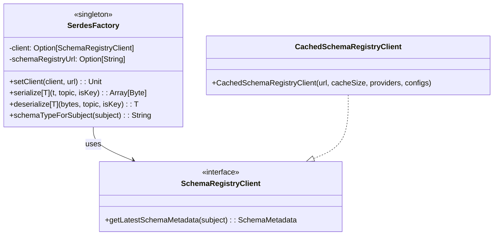
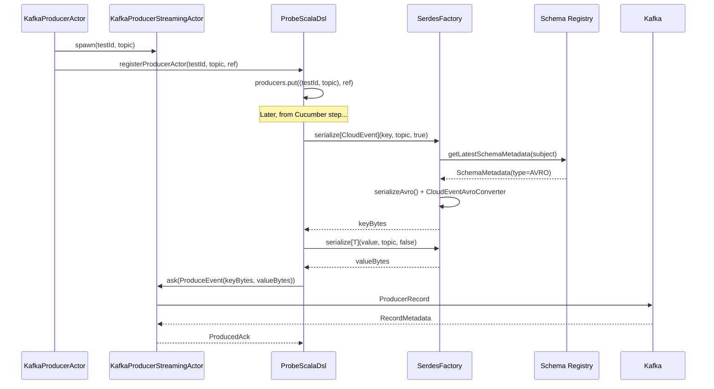

# 10.2 Serialization & DSL Architecture

**Last Updated:** 2025-11-22
**Status:** Complete
**Component:** SerdesFactory + ProbeScalaDsl + Schema Converters
**Total Implementation:** ~650 lines across 9 files

---

## Table of Contents

1. [Overview](#overview)
2. [SerdesFactory Architecture](#serdesfactory-architecture)
3. [ProbeScalaDsl Architecture](#probescaladsl-architecture)
4. [CloudEvent Converters](#cloudevent-converters)
5. [Schema Type Support](#schema-type-support)
6. [Thread Safety Considerations](#thread-safety-considerations)
7. [Sequence Diagrams](#sequence-diagrams)
8. [Configuration](#configuration)
9. [Error Handling](#error-handling)
10. [Implementation Files](#implementation-files)
11. [Testing Strategy](#testing-strategy)
12. [Future Enhancements](#future-enhancements)

---

## Overview

The Serialization & DSL layer provides a unified interface for Kafka message serialization/deserialization with Schema Registry support and a thread-safe DSL for Cucumber test step access. It supports three schema formats: Avro, Protobuf, and JSON Schema.

### Design Goals

1. **Schema Agnostic**: Single API regardless of underlying schema format
2. **CloudEvent Keys**: Consistent CloudEvent envelope for all message keys
3. **Thread Safety**: Safe concurrent access from multiple Cucumber test threads
4. **Blocking & Async APIs**: Both patterns supported for different use cases
5. **Type Safety**: Scala ClassTag-based type inference at runtime
6. **Production Ready**: Confluent 8.1.0 serializers with Schema Registry caching

### Key Components

```
SerdesFactory (singleton)
├── Schema type dispatch based on Schema Registry metadata
├── Avro: KafkaAvroSerializer/Deserializer + CloudEventAvroConverter
├── Protobuf: KafkaProtobufSerializer/Deserializer + CloudEventProtoConverter
└── JSON: ScalaConfluentJsonSerializer/Deserializer (custom Scala wrappers)

ProbeScalaDsl (singleton)
├── System registration (ActorSystem + SchemaRegistryClient)
├── Producer/Consumer actor registry (ConcurrentHashMap)
├── Async API: produceEvent(), fetchConsumedEvent() → Future
└── Blocking API: produceEventBlocking(), fetchConsumedEventBlocking()
```

---

## SerdesFactory Architecture

### Overview

`SerdesFactory` is a singleton object that manages Schema Registry client lifecycle and provides unified serialization/deserialization for all supported schema types.

### Client Management

```scala
object SerdesFactory:
  @volatile private[core] var client: Option[SchemaRegistryClient] = None
  @volatile private[core] var schemaRegistryUrl: Option[String] = None

  def setClient(srClient: SchemaRegistryClient): Unit
  def setClient(srClient: SchemaRegistryClient, url: String): Unit
  def extractClient: SchemaRegistryClient  // Throws if not initialized
  def extractSchemaRegistryUrl: String     // Throws if not initialized
```

**Thread Safety**:
- `@volatile` ensures visibility across threads
- Client set once during system initialization
- Read-only after initialization (no concurrent modifications)

### Schema Type Dispatch

The factory determines schema type by querying Schema Registry metadata:

```scala
def serialize[T: ClassTag](t: T, topic: String, isKey: Boolean): Array[Byte] =
  val clazz = summon[ClassTag[T]].runtimeClass.getSimpleName
  val subject: String = s"$topic-$clazz"
  val schemaType: String = schemaTypeForSubject(subject)
  schemaType match {
    case "AVRO" => serializeAvro(t, topic, isKey, clazz)
    case "PROTOBUF" => serializeProtobuf(t, topic, isKey, clazz)
    case "JSON" | "JSONSCHEMA" => serializeJsonSchema(t, topic, isKey)
    case _ => throw new IllegalArgumentException(s"Unsupported schema type: $schemaType")
  }
```

**Subject Naming Strategy**: `{topic}-{className}` (TopicRecordNameStrategy)

This allows multiple event types on the same topic, each with its own schema.

### Class Diagram



**Full diagram**: [serdes-factory-class-diagram.mermaid](../../../diagrams/10-kafka-streaming/serdes-factory-class-diagram.mermaid)

---

## ProbeScalaDsl Architecture

### Overview

`ProbeScalaDsl` provides a thread-safe DSL for Cucumber step definitions to produce and consume Kafka events. It manages actor references via ConcurrentHashMap and provides both async (Future) and blocking APIs.

### Registry Management

```scala
object ProbeScalaDsl {
  @volatile private var systemOpt: Option[ActorSystem[_]] = None
  @volatile private var askTimeoutDuration: FiniteDuration = 3.seconds

  private val producers: ConcurrentHashMap[(UUID, String), ActorRef[KafkaProducerStreamingCommand]] =
    new ConcurrentHashMap[(UUID, String), ActorRef[KafkaProducerStreamingCommand]]()

  private val consumers: ConcurrentHashMap[(UUID, String), ActorRef[KafkaConsumerStreamingCommand]] =
    new ConcurrentHashMap[(UUID, String), ActorRef[KafkaConsumerStreamingCommand]]()
}
```

**Key Design Decisions**:
- **ConcurrentHashMap**: Thread-safe without external synchronization
- **Composite Key**: `(UUID, String)` = (testId, topic) for unique lookup
- **Volatile System Reference**: Ensures visibility of initialization

### System Initialization

```scala
private[core] def registerSystem(system: ActorSystem[_]): Unit =
  systemOpt = Some(system)
  askTimeoutDuration = system.settings.config
    .getDuration("test-probe.core.dsl.ask-timeout").toMillis.millis
  val schemaRegistryUri: String = system.settings.config
    .getString("test-probe.core.kafka.schema-registry-url")
  val schemaProviders: java.util.List[SchemaProvider] = java.util.Arrays.asList[SchemaProvider](
    new AvroSchemaProvider(),
    new ProtobufSchemaProvider(),
    new JsonSchemaProvider()
  )
  SerdesFactory.setClient(
    new CachedSchemaRegistryClient(schemaRegistryUri, 100, schemaProviders, null),
    schemaRegistryUri
  )
```

**Initialization Flow**:
1. Store ActorSystem reference
2. Read configuration (ask-timeout, schema-registry-url)
3. Create CachedSchemaRegistryClient with all schema providers
4. Initialize SerdesFactory with client and URL

### Actor Registration API

```scala
private[core] def registerProducerActor(
  testId: UUID,
  topic: String,
  producer: ActorRef[KafkaProducerStreamingCommand]
): Unit =
  producers.put((testId, topic), producer)

private[core] def registerConsumerActor(
  testId: UUID,
  topic: String,
  consumer: ActorRef[KafkaConsumerStreamingCommand]
): Unit =
  consumers.put((testId, topic), consumer)

private[core] def unRegisterProducerActor(testId: UUID, topic: String): Unit =
  producers.remove((testId, topic))

private[core] def unRegisterConsumerActor(testId: UUID, topic: String): Unit =
  consumers.remove((testId, topic))
```

**Visibility**: `private[core]` - only accessible within core package (actors register/unregister themselves)

### Producer API

```scala
def produceEvent[T: ClassTag](
  testId: UUID,
  topic: String,
  key: CloudEvent,
  value: T,
  headers: Map[String, String]
): Future[ProduceResult] =
  implicit val actorSystem: ActorSystem[_] = systemOpt.getOrElse(throw DslNotInitializedException())
  implicit val timeout: Timeout = Timeout(askTimeoutDuration)
  implicit val scheduler: Scheduler = actorSystem.scheduler
  val actorEc: ExecutionContext = actorSystem.executionContext
  val blockingEc: ExecutionContext = actorSystem.dispatchers
    .lookup(DispatcherSelector.fromConfig("pekko.actor.blocking-io-dispatcher"))

  Option(producers.get((testId, topic))) match {
    case Some(producer) => Future {
      val keyBytes: Array[Byte] = SerdesFactory.serialize[CloudEvent](key, topic, true)
      val valueBytes: Array[Byte] = SerdesFactory.serialize[T](value, topic, false)
      (producer, keyBytes, valueBytes)
    }(blockingEc)
      .flatMap { (producer, keyBytes, valueBytes) =>
        sendEventToKafka(keyBytes, valueBytes, headers, producer)(actorEc)
      }(actorEc)
      .recoverWith { /* error handling */ }(actorEc)
    case None => throw ActorNotRegisteredException(...)
  }

def produceEventBlocking[T: ClassTag](...): ProduceResult =
  Await.result(produceEvent(...), 5.seconds)
```

**Key Design Decisions**:
1. **Blocking Dispatcher for Serialization**: Schema Registry HTTP calls run on `blocking-io-dispatcher` to avoid starving actor thread pool
2. **Async Internal, Blocking External**: `produceEvent()` returns Future, `produceEventBlocking()` wraps with `Await.result`
3. **Error Recovery**: Wraps exceptions in domain-specific types (KafkaProduceException, etc.)

### Consumer API

```scala
def fetchConsumedEvent[T: ClassTag](
  testId: UUID,
  topic: String,
  correlationId: String
): Future[ConsumedResult] =
  // Similar pattern: lookup actor, ask, deserialize on blocking dispatcher
```

---

## CloudEvent Converters

### Overview

CloudEvent keys require special handling because the `CloudEvent` case class must be converted to schema-specific record types for serialization.

### Avro Converter

**CloudEventAvroRecord**: Implements `SpecificRecord` interface for Confluent Avro serializer compatibility.

```scala
private[pubsub] class CloudEventAvroRecord(
  private var _id: String,
  private var _source: String,
  // ... all fields
) extends CloudEventAvro:
  override def getSchema: Schema = CloudEventAvroRecord.SCHEMA
  override def get(field: Int): AnyRef = field match { ... }
  override def put(field: Int, value: Any): Unit = field match { ... }
```

**CloudEventAvroConverter**: Bidirectional conversion between `CloudEvent` case class and `CloudEventAvro` record.

```scala
private[pubsub] object CloudEventAvroConverter:
  def toAvro(ce: CloudEvent): CloudEventAvro
  def toCloudEvent(avro: CloudEventAvro): CloudEvent
  def fromGenericRecord(record: GenericRecord): CloudEvent  // For deserialization
```

**Why fromGenericRecord?**: The Schema Registry returns `GenericRecord` when deserializing because our `CloudEventAvroRecord` class isn't discoverable by namespace. We explicitly convert `GenericRecord` to `CloudEvent`.

### Protobuf Converter

**CloudEventProtoWrapper**: Wraps CloudEvent data and converts to/from `DynamicMessage`.

```scala
private[pubsub] class CloudEventProtoWrapper(...):
  def toDynamicMessage(schema: ProtobufSchema): DynamicMessage =
    val descriptor = schema.toDescriptor
    DynamicMessage.newBuilder(descriptor)
      .setField(descriptor.findFieldByNumber(1), id)
      // ... set all fields by number
      .build()
```

**CloudEventProtoConverter**: Bidirectional conversion.

```scala
private[pubsub] object CloudEventProtoConverter:
  def toProto(ce: CloudEvent): CloudEventProtoWrapper
  def toCloudEvent(wrapper: CloudEventProtoWrapper): CloudEvent
  def fromDynamicMessage(msg: DynamicMessage): CloudEvent
```

### JSON Schema

JSON Schema does not require special CloudEvent handling - the `CloudEvent` case class serializes directly via Jackson with `DefaultScalaModule`.

---

## Schema Type Support

### Avro

**Serializer Configuration**:
```scala
ser.configure(Map(
  "schema.registry.url" -> extractSchemaRegistryUrl,
  "key.subject.name.strategy" -> classOf[TopicRecordNameStrategy].getName,
  "value.subject.name.strategy" -> classOf[TopicRecordNameStrategy].getName,
  "auto.register.schemas" -> "true",
  "use.latest.version" -> "false",
  "avro.use.logical.type.converters" -> "true",
  "avro.remove.java.properties" -> "true",
).asJava, isKey)
```

**Key Features**:
- TopicRecordNameStrategy for multi-event topics
- Auto-register schemas (for testing convenience)
- Logical type converters for dates/times

### Protobuf

**Serializer Configuration**:
```scala
ser.configure(Map(
  "schema.registry.url" -> extractSchemaRegistryUrl,
  "key.subject.name.strategy" -> classOf[TopicRecordNameStrategy].getName,
  "value.subject.name.strategy" -> classOf[TopicRecordNameStrategy].getName,
  "auto.register.schemas" -> "true",
  "use.latest.version" -> "false",
  "skip.known.types" -> "true",
).asJava, isKey)
```

**Key Features**:
- DynamicMessage for CloudEvent keys (no generated classes needed)
- skip.known.types for standard proto types

### JSON Schema

**Custom Scala Wrappers**: `ScalaConfluentJsonSerializer` and `ScalaConfluentJsonDeserializer`

```scala
class ScalaConfluentJsonSerializer[T: ClassTag](
  schemaRegistryClient: SchemaRegistryClient,
  schemaRegistryUrl: String
) extends KafkaJsonSchemaSerializer[T](schemaRegistryClient):

  private def configureObjectMapper(): Unit =
    objectMapper()
      .registerModule(DefaultScalaModule)
      .setSerializationInclusion(JsonInclude.Include.NON_NULL)
      .configure(SerializationFeature.WRITE_DATES_AS_TIMESTAMPS, true)
      .configure(DeserializationFeature.FAIL_ON_UNKNOWN_PROPERTIES, false)
```

**Why Custom Wrappers?**:
- Confluent 8.1.0 allows direct ObjectMapper configuration (no workarounds needed)
- `DefaultScalaModule` required for Scala 3.3.6 LTS case class support
- JSON Schema Draft 2020-12 specification

**Deserialization Strategy**:
```scala
class ScalaConfluentJsonDeserializer[T: ClassTag](...):
  private val des = new KafkaJsonSchemaDeserializer[JsonNode](schemaRegistryClient)
  private lazy val mapper: ObjectMapper = ...

  def deserialize(topic: String, bytes: Array[Byte]): T =
    val node: JsonNode = des.deserialize(topic, bytes)
    mapper.treeToValue(node, summon[ClassTag[T]].runtimeClass.asInstanceOf[Class[T]])
```

**Two-Stage Deserialization**:
1. Confluent deserializer returns `JsonNode` (schema-validated)
2. Local ObjectMapper with Scala module converts to typed class

---

## Thread Safety Considerations

### SerdesFactory

| Component | Thread Safety | Notes |
|-----------|---------------|-------|
| `client` | `@volatile` | Set once, read-only after init |
| `schemaRegistryUrl` | `@volatile` | Set once, read-only after init |
| `KafkaAvroSerializer` | New instance per call | Confluent serializers not thread-safe |
| `KafkaProtobufSerializer` | New instance per call | Confluent serializers not thread-safe |
| `ScalaConfluentJsonSerializer` | New instance per call | Custom wrapper, new per call |

**Pattern**: Create new serializer/deserializer instances per serialize/deserialize call. Performance impact minimal due to Confluent's internal caching.

### ProbeScalaDsl

| Component | Thread Safety | Notes |
|-----------|---------------|-------|
| `systemOpt` | `@volatile` | Set once during init |
| `askTimeoutDuration` | `@volatile` | Set once during init |
| `producers` | `ConcurrentHashMap` | Thread-safe without locking |
| `consumers` | `ConcurrentHashMap` | Thread-safe without locking |

**Concurrent Access Patterns**:
1. Multiple Cucumber threads can call `produceEventBlocking()` simultaneously
2. ConcurrentHashMap handles concurrent reads safely
3. Serialization runs on blocking-io-dispatcher (dedicated thread pool)
4. Actor asks are independent (no shared mutable state)

---

## Sequence Diagrams

### Producer Registration and Message Flow



**Full diagram**: [probe-scala-dsl-sequence-diagram.mermaid](../../../diagrams/10-kafka-streaming/probe-scala-dsl-sequence-diagram.mermaid)

### Data Flow Overview

**Full diagram**: [dsl-data-flow-diagram.mermaid](../../../diagrams/10-kafka-streaming/dsl-data-flow-diagram.mermaid)

---

## Configuration

### reference.conf

```hocon
test-probe {
  core {
    kafka {
      # Schema Registry URL (required)
      schema-registry-url = ${?SCHEMA_REGISTRY_URL}
    }

    dsl {
      # Timeout for ask pattern operations
      ask-timeout = 3 seconds
    }
  }
}

pekko.actor.blocking-io-dispatcher {
  type = Dispatcher
  executor = "thread-pool-executor"
  thread-pool-executor {
    fixed-pool-size = 8
  }
  throughput = 1
}
```

### Environment Variables

| Variable | Purpose | Required |
|----------|---------|----------|
| `SCHEMA_REGISTRY_URL` | Confluent Schema Registry endpoint | Yes |

---

## Error Handling

### Exception Types

```scala
sealed trait DslException

case class DslNotInitializedException(...) extends RuntimeException with DslException
case class ActorNotRegisteredException(...) extends RuntimeException with DslException
case class SchemaRegistryNotInitializedException(...) extends RuntimeException with DslException
case class SchemaNotFoundException(...) extends RuntimeException with DslException
case class KafkaProduceException(...) extends RuntimeException with DslException
case class ProducerNotAvailableException(...) extends RuntimeException with DslException
case class ConsumerNotAvailableException(...) extends RuntimeException with DslException
```

### Error Handling Strategy

**SerdesFactory**:
- Schema not found: `SchemaNotFoundException`
- Client not initialized: `SchemaRegistryNotInitializedException`
- Type mismatch: `ClassCastException` with descriptive message

**ProbeScalaDsl**:
- System not initialized: `DslNotInitializedException`
- Actor not registered: `ActorNotRegisteredException`
- Kafka failures: Wrapped in `KafkaProduceException` with cause

### Recovery Pattern

```scala
.recoverWith {
  case ex: DslException => Future.failed(ex)  // Pass through domain exceptions
  case ex: Exception => Future.failed(
    KafkaProduceException(
      s"Failed to produce event for test $testId, topic '$topic': ${ex.getMessage}",
      Some(ex)  // Preserve original cause
    )
  )
}(actorEc)
```

---

## Implementation Files

### Core Files

| File | Lines | Purpose |
|------|-------|---------|
| `SerdesFactory.scala` | 150 | Schema type dispatch and serialization |
| `ProbeScalaDsl.scala` | 148 | Thread-safe DSL registry |
| `CloudEventAvroBuilder.scala` | 201 | Avro conversion for CloudEvent |
| `CloudEventProtoBuilder.scala` | 164 | Protobuf conversion for CloudEvent |
| `ScalaConfluentJsonSerializer.scala` | 69 | Scala-friendly JSON serializer |
| `ScalaConfluentJsonDeserializer.scala` | 65 | Scala-friendly JSON deserializer |
| `package.scala` | 41 | Type aliases for pubsub package |

### Model Files

| File | Lines | Purpose |
|------|-------|---------|
| `PubSubModels.scala` | 44 | CloudEvent, ProduceResult, ConsumedResult |
| `PubSubExceptions.scala` | 41 | DSL exception types |

### Location

All files in: `test-probe-core/src/main/scala/com/company/probe/core/pubsub/`

---

## Testing Strategy

### Unit Tests

**SerdesFactory**:
- Schema type dispatch (AVRO, PROTOBUF, JSON)
- CloudEvent key serialization/deserialization
- Exception handling for missing schemas
- Exception handling for uninitialized client

**ProbeScalaDsl**:
- System not initialized → DslNotInitializedException
- Actor not registered → ActorNotRegisteredException
- Concurrent access from multiple threads
- Registration/unregistration lifecycle

**CloudEvent Converters**:
- Round-trip conversion (CloudEvent → Avro → CloudEvent)
- Round-trip conversion (CloudEvent → Proto → CloudEvent)
- GenericRecord/DynamicMessage conversion

### Integration Tests

**With Testcontainers**:
- Real Schema Registry
- Register schema → serialize → deserialize
- Multi-schema topic (Avro + JSON on same topic)

### BDD Scenarios (Planned)

```gherkin
Feature: SerdesFactory Schema Type Dispatch

  Scenario: Serialize event with Avro schema
    Given a Schema Registry with Avro schema for subject "orders-OrderCreated"
    When I serialize an OrderCreated event for topic "orders"
    Then the event should be serialized using Avro format
    And the serialized bytes should contain Avro magic byte

  Scenario: Serialize CloudEvent key with Protobuf schema
    Given a Schema Registry with Protobuf schema for CloudEvent
    When I serialize a CloudEvent key for topic "payments"
    Then the CloudEvent should be converted to CloudEventProtoWrapper
    And serialized to Protobuf format
```

---

## Future Enhancements

### Phase 1: Performance Optimization

- **Connection Pooling**: Consider pooling Schema Registry HTTP connections
- **Serializer Caching**: Cache serializer instances per schema (thread-local)
- **Batch Serialization**: Support batch serialize for high-throughput scenarios

### Phase 2: Schema Evolution

- **Compatibility Checking**: Validate schema compatibility before produce
- **Schema Migration**: Support for schema evolution in tests
- **Version Pinning**: Force specific schema versions for deterministic tests

### Phase 3: Observability

- **OpenTelemetry Metrics**:
  - `probe_serdes_serialize_duration_seconds`
  - `probe_serdes_deserialize_duration_seconds`
  - `probe_serdes_schema_registry_errors_total`
- **Tracing**: Span per serialize/deserialize operation

---

## References

- Parent Architecture: [10.1 Kafka Streaming Architecture](../10.1-kafka-streaming-architecture.md)
- DSL API Reference: [probe-scala-dsl-api.md](../../../../api/probe-scala-dsl-api.md)
- Confluent Schema Registry: https://docs.confluent.io/platform/current/schema-registry/
- Jackson Scala Module: https://github.com/FasterXML/jackson-module-scala

---

## Document History

- 2025-11-22: Initial creation with complete SerdesFactory and ProbeScalaDsl architecture documentation
- 2025-11-22: Added CloudEvent converter documentation (Avro, Protobuf)
- 2025-11-22: Added JSON Schema custom wrapper documentation
- 2025-11-22: Created 3 Mermaid diagrams (class, sequence, data flow)
