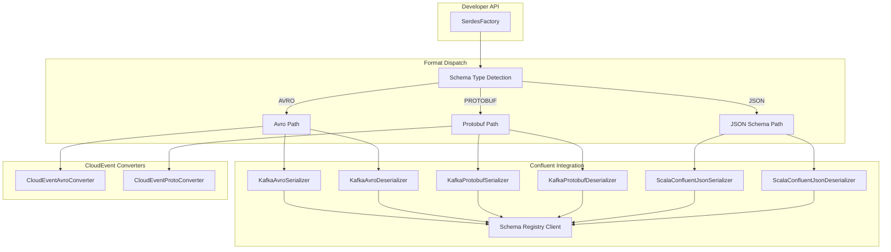

# 10.2.1 SerdesFactory Pattern Deep Dive

**Last Updated:** 2025-11-22
**Status:** Active
**Component:** `test-probe-core/src/main/scala/com/company/probe/core/pubsub/SerdesFactory.scala`
**Parent Document:** [10.2 Serialization & DSL Architecture](./10.2-serdes-dsl-architecture.md)
**ADRs:** [ADR-SERDES-001](../../../adr/ADR-SERDES-001-confluent-json-schema-serialization-strategy.md), [ADR-SERDES-002](../../../adr/ADR-SERDES-002-json-schema-oneof-polymorphic-events.md)

---

## Table of Contents

1. [Overview](#overview)
2. [Architecture Pattern](#architecture-pattern)
3. [Multi-Format Support](#multi-format-support)
4. [Schema Type Dispatch](#schema-type-dispatch)
5. [Format-Specific Implementations](#format-specific-implementations)
6. [CloudEvent Key Encapsulation](#cloudevent-key-encapsulation)
7. [Configuration Strategy](#configuration-strategy)
8. [Thread Safety](#thread-safety)
9. [Error Handling](#error-handling)
10. [Testing Strategy](#testing-strategy)
11. [Related Documentation](#related-documentation)

---

## Overview

### Purpose

SerdesFactory provides a **unified serialization/deserialization facade** for Kafka messages in the Test Probe framework. It abstracts away the complexity of Confluent Schema Registry integration, supporting multiple schema formats while providing a consistent API.

### Key Capabilities

- **Multi-Format Support**: Avro, Protobuf, and JSON Schema formats
- **Automatic Schema Type Detection**: Queries Schema Registry to determine format
- **CloudEvent Key Encapsulation**: Transparent conversion between Scala case classes and format-specific types
- **TopicRecordNameStrategy**: Enables polymorphic events (multiple event types per topic)
- **Type-Safe Generics**: Uses Scala ClassTag for compile-time type safety

### Design Philosophy

```
Developer API (Simple)           Internal Complexity (Hidden)
+------------------------+       +--------------------------------+
| SerdesFactory          |       | Schema Registry Integration    |
|   .serialize[T](...)   | ----> | Format Detection               |
|   .deserialize[T](...) |       | Type Conversion                |
+------------------------+       | CloudEvent Encapsulation       |
                                 +--------------------------------+
```

---

## Architecture Pattern

### Component Diagram



### Layered Architecture

```
+--------------------------------------------------+
|                Developer Interface               |
|  serialize[T](t, topic, isKey)                  |
|  deserialize[T](bytes, topic, isKey)            |
+--------------------------------------------------+
                        |
                        v
+--------------------------------------------------+
|              Schema Type Dispatch                |
|  schemaTypeForSubject(subject) -> AVRO/PROTO/JSON|
+--------------------------------------------------+
                        |
          +-------------+-------------+
          v             v             v
+----------------+ +----------------+ +----------------+
| Avro Handler   | | Protobuf Handler| | JSON Handler  |
| serializeAvro  | | serializeProtobuf| | serializeJson |
| deserializeAvro| | deserializeProto | | deserializeJson|
+----------------+ +----------------+ +----------------+
          |             |             |
          v             v             v
+--------------------------------------------------+
|           Confluent Schema Registry              |
|  - Schema validation                             |
|  - Schema ID embedding                           |
|  - Subject naming (TopicRecordNameStrategy)      |
+--------------------------------------------------+
```

---

## Multi-Format Support

### Supported Formats

| Format | Serializer | Deserializer | Wire Format | Use Case |
|--------|------------|--------------|-------------|----------|
| **Avro** | `KafkaAvroSerializer` | `KafkaAvroDeserializer` | Binary | High throughput, compact storage |
| **Protobuf** | `KafkaProtobufSerializer` | `KafkaProtobufDeserializer` | Binary | Polyglot environments, performance |
| **JSON Schema** | `ScalaConfluentJsonSerializer` | `ScalaConfluentJsonDeserializer` | Text | Human-readable, debugging, APIs |

### Wire Format (All Formats)

```
+--------+---------------+-------------------+
| Magic  | Schema ID     | Payload           |
| (1B)   | (4B)          | (variable)        |
| 0x00   | big-endian    | format-specific   |
+--------+---------------+-------------------+
```

### Format Selection

The factory automatically detects the schema format by querying Schema Registry:

```scala
def schemaTypeForSubject(subject: String): String =
  val meta: SchemaMetadata = extractClient.getLatestSchemaMetadata(subject)
  Option(meta.getSchemaType) match
    case Some(sType) => sType.toUpperCase  // "AVRO", "PROTOBUF", "JSON"
    case None => throw SchemaNotFoundException(...)
```

---

## Schema Type Dispatch

### Subject Naming Convention

SerdesFactory uses **TopicRecordNameStrategy** for subject naming:

```
Subject = {topic}-{RecordName}
```

**Examples:**
- `orders-OrderCreated` (value schema)
- `orders-CloudEvent` (key schema)
- `payments-PaymentProcessed` (value schema)

**No `-key` or `-value` suffix** is added (unlike TopicNameStrategy).

### Dispatch Flow

```scala
def serialize[T: ClassTag](t: T, topic: String, isKey: Boolean): Array[Byte] =
  val clazz = summon[ClassTag[T]].runtimeClass.getSimpleName  // e.g., "OrderCreated"
  val subject: String = s"$topic-$clazz"                       // e.g., "orders-OrderCreated"
  val schemaType: String = schemaTypeForSubject(subject)       // Query Schema Registry

  schemaType match
    case "AVRO" => serializeAvro(t, topic, isKey, clazz)
    case "PROTOBUF" => serializeProtobuf(t, topic, isKey, clazz)
    case "JSON" | "JSONSCHEMA" => serializeJsonSchema(t, topic, isKey)
    case _ => throw new IllegalArgumentException(s"Unsupported schema type: $schemaType")
```

### Benefits

1. **Format Agnostic API**: Developers don't need to know which format is used
2. **Schema Registry as Source of Truth**: Format determined by registered schema
3. **Independent Evolution**: Different event types can use different formats
4. **Seamless Migration**: Change format by re-registering schema

---

## Format-Specific Implementations

### Avro Implementation

**Serialization:**
```scala
def serializeAvro[T: ClassTag](t: T, topic: String, isKey: Boolean, clazz: String): Array[Byte] =
  val ser = new KafkaAvroSerializer(extractClient)
  ser.configure(Map(
    "schema.registry.url" -> extractSchemaRegistryUrl,
    "key.subject.name.strategy" -> classOf[TopicRecordNameStrategy].getName,
    "value.subject.name.strategy" -> classOf[TopicRecordNameStrategy].getName,
    "auto.register.schemas" -> "true",
    "use.latest.version" -> "false",
    "avro.use.logical.type.converters" -> "true",  // Handle dates, decimals
    "avro.remove.java.properties" -> "true"        // Better schema evolution
  ).asJava, isKey)

  // CloudEvent special handling
  ser.serialize(topic,
    if isKey && clazz == "CloudEvent" then
      CloudEventAvroConverter.toAvro(t.asInstanceOf[CloudEvent])
    else
      t.asInstanceOf[SpecificRecord]
  )
```

**Deserialization:**
```scala
def deserializeAvro[T: ClassTag](bytes: Array[Byte], topic: String, isKey: Boolean, clazz: String): T =
  val des = new KafkaAvroDeserializer(extractClient)
  val useSpecificReader = !(isKey && clazz == "CloudEvent")  // GenericRecord for CloudEvent
  des.configure(Map(
    "schema.registry.url" -> extractSchemaRegistryUrl,
    "specific.avro.reader" -> useSpecificReader.toString,
    // ... other config
  ).asJava, isKey)

  val result = des.deserialize(topic, bytes)
  if isKey && clazz == "CloudEvent" then
    CloudEventAvroConverter.fromGenericRecord(result.asInstanceOf[GenericRecord]).asInstanceOf[T]
  else
    result.asInstanceOf[T]
```

### Protobuf Implementation

**Serialization:**
```scala
def serializeProtobuf[T: ClassTag](t: T, topic: String, isKey: Boolean, clazz: String): Array[Byte] =
  val ser = new KafkaProtobufSerializer[Message](extractClient)
  ser.configure(Map(
    "schema.registry.url" -> extractSchemaRegistryUrl,
    "key.subject.name.strategy" -> classOf[TopicRecordNameStrategy].getName,
    "value.subject.name.strategy" -> classOf[TopicRecordNameStrategy].getName,
    "auto.register.schemas" -> "true",
    "skip.known.types" -> "true"  // Skip google.protobuf.* types
  ).asJava, isKey)

  ser.serialize(topic,
    if isKey && clazz == "CloudEvent" then
      CloudEventProtoConverter.toProto(t.asInstanceOf[CloudEvent]).toDynamicMessage(...)
    else
      t.asInstanceOf[Message]
  )
```

**Deserialization:**
```scala
def deserializeProtobuf[T: ClassTag](bytes: Array[Byte], topic: String, isKey: Boolean, clazz: String): T =
  val des = new KafkaProtobufDeserializer[Message](extractClient)
  val isCloudEventKey = isKey && clazz == "CloudEvent"

  val config = if isCloudEventKey then
    baseConfig + ("derive.type" -> "false")  // Return DynamicMessage
  else
    baseConfig + ("derive.type" -> "true") + ("specific.protobuf.value.type" -> clazz)

  des.configure(config.asJava, isKey)
  val result = des.deserialize(topic, bytes)

  if isCloudEventKey then
    CloudEventProtoConverter.fromDynamicMessage(result.asInstanceOf[DynamicMessage]).asInstanceOf[T]
  else
    result.asInstanceOf[T]
```

### JSON Schema Implementation

**Key Insight:** JSON Schema uses a two-step deserialization pattern (JsonNode intermediate) for polymorphic support.

**Serialization:**
```scala
def serializeJsonSchema[T: ClassTag](t: T, topic: String, isKey: Boolean): Array[Byte] =
  val ser = new ScalaConfluentJsonSerializer[T](extractClient, extractSchemaRegistryUrl)
  ser.serialize(topic, t, isKey)
```

**Deserialization:**
```scala
def deserializeJsonSchema[T: ClassTag](bytes: Array[Byte], topic: String, isKey: Boolean): T =
  val des = new ScalaConfluentJsonDeserializer[T](extractClient, extractSchemaRegistryUrl, isKey)
  des.deserialize(topic, bytes)
```

See [ADR-SERDES-001](../../../adr/ADR-SERDES-001-confluent-json-schema-serialization-strategy.md) for the detailed JsonNode pattern.

---

## CloudEvent Key Encapsulation

### Problem

CloudEvent is a Scala case class used as the Kafka message key. It does NOT extend:
- `SpecificRecord` (Avro)
- `Message` (Protobuf)

This creates a type mismatch when using Confluent serializers.

### Solution: Transparent Conversion

SerdesFactory provides transparent conversion between CloudEvent (Scala case class) and format-specific types:

```
CloudEvent (Scala)
    |
    v [serialize]
CloudEventAvro / CloudEventProto / JSON
    |
    v [wire format]
[0x00][Schema ID][Payload]
    |
    v [deserialize]
CloudEventAvro / CloudEventProto / JSON
    |
    v [convert]
CloudEvent (Scala)
```

### Converters

**CloudEventAvroConverter:**
```scala
private[pubsub] object CloudEventAvroConverter:
  def toAvro(ce: CloudEvent): CloudEventAvro =
    // Convert case class fields to Avro SpecificRecord

  def fromGenericRecord(record: GenericRecord): CloudEvent =
    // Extract fields from GenericRecord to case class
```

**CloudEventProtoConverter:**
```scala
private[pubsub] object CloudEventProtoConverter:
  def toProto(ce: CloudEvent): CloudEventProtoWrapper =
    // Convert case class fields to Protobuf builder

  def fromDynamicMessage(msg: DynamicMessage): CloudEvent =
    // Extract fields from DynamicMessage to case class
```

### Detection Logic

```scala
// In serializeAvro:
if isKey && clazz == "CloudEvent" then
  CloudEventAvroConverter.toAvro(t.asInstanceOf[CloudEvent])
else
  t.asInstanceOf[SpecificRecord]
```

The `clazz` parameter comes from `ClassTag[T].runtimeClass.getSimpleName`.

---

## Configuration Strategy

### TopicRecordNameStrategy

All formats use `TopicRecordNameStrategy` for subject naming:

```scala
Map(
  "key.subject.name.strategy" -> classOf[TopicRecordNameStrategy].getName,
  "value.subject.name.strategy" -> classOf[TopicRecordNameStrategy].getName
)
```

This enables **polymorphic events** (multiple event types per topic).

### Schema Registration

| Setting | Value | Reason |
|---------|-------|--------|
| `auto.register.schemas` | `true` (dev) / `false` (prod) | Dev: convenience; Prod: governance |
| `use.latest.version` | `false` | Explicit schema versioning |
| `normalize.schemas` | `true` (JSON keys) | Deterministic partitioning |

### Format-Specific Settings

**Avro:**
```scala
"avro.use.logical.type.converters" -> "true"  // Handle dates, decimals
"avro.remove.java.properties" -> "true"       // Better schema evolution
"specific.avro.reader" -> "true"              // Return SpecificRecord (not GenericRecord)
```

**Protobuf:**
```scala
"skip.known.types" -> "true"                  // Skip google.protobuf.* types
"derive.type" -> "true"                       // Derive type from schema
"specific.protobuf.value.type" -> clazz       // Target class for deserialization
```

**JSON Schema:**
```scala
"json.fail.invalid.schema" -> "true"          // Strict validation
"json.fail.unknown.properties" -> "false"     // Flexible for evolution
"json.schema.spec.version" -> "draft_2020_12" // Latest spec
```

---

## Thread Safety

### Singleton State

SerdesFactory uses `@volatile` for shared state:

```scala
@volatile private[core] var client: Option[SchemaRegistryClient] = None
@volatile private[core] var schemaRegistryUrl: Option[String] = None
```

### Initialization Pattern

```scala
// Called once at application startup
SerdesFactory.setClient(schemaRegistryClient, "http://localhost:8081")
```

### Serializer/Deserializer Lifecycle

Each call creates a new serializer/deserializer instance:

```scala
def serializeAvro[T: ClassTag](...): Array[Byte] =
  val ser = new KafkaAvroSerializer(extractClient)  // New instance per call
  ser.configure(...)
  ser.serialize(...)
```

**Trade-off:** Simplicity over performance. For high-throughput scenarios, consider caching serializers.

---

## Error Handling

### Exception Types

| Exception | Cause | Recovery |
|-----------|-------|----------|
| `SchemaRegistryNotInitializedException` | `setClient` not called | Call `setClient` before use |
| `SchemaNotFoundException` | Schema not registered | Register schema in Schema Registry |
| `ClassCastException` | Type mismatch | Check ClassTag matches schema |
| `IllegalArgumentException` | Unsupported schema type | Register with supported format |

### Validation Points

1. **Client Initialization**: Throws if `client` is `None`
2. **Schema Lookup**: Throws if subject not found in Registry
3. **Type Conversion**: Throws if deserialized type doesn't match expected

```scala
def extractClient: SchemaRegistryClient = client match
  case Some(c) => c
  case None => throw SchemaRegistryNotInitializedException()

def deserializeAvro[T: ClassTag](...): T =
  // ...
  if !summon[ClassTag[T]].runtimeClass.isInstance(result) then
    throw new ClassCastException(
      s"Deserialized type ${result.getClass.getName} does not match expected ${summon[ClassTag[T]].runtimeClass.getName}"
    )
```

---

## Testing Strategy

### Unit Tests

**File:** `SerdesFactorySpec.scala`

```scala
"SerdesFactory" should {
  "serialize and deserialize Avro round-trip" in { ... }
  "serialize and deserialize Protobuf round-trip" in { ... }
  "serialize and deserialize JSON Schema round-trip" in { ... }
  "handle CloudEvent key encapsulation for Avro" in { ... }
  "handle CloudEvent key encapsulation for Protobuf" in { ... }
  "throw SchemaRegistryNotInitializedException when not initialized" in { ... }
  "detect schema type from Schema Registry" in { ... }
}
```

### Integration Tests

**File:** `SerdesFactoryIntegrationSpec.scala`

Uses Testcontainers with real Schema Registry:

```scala
"SerdesFactory with Schema Registry" should {
  "round-trip CloudEvent through Avro serialization" in {
    withRunningSchemaRegistry { url =>
      SerdesFactory.setClient(client, url)
      val ce = CloudEvent(...)
      val bytes = SerdesFactory.serialize(ce, "topic", isKey = true)
      val deserialized = SerdesFactory.deserialize[CloudEvent](bytes, "topic", isKey = true)
      deserialized shouldEqual ce
    }
  }
}
```

### Test Fixtures

**File:** `SerdesFactoryFixtures.scala`

Provides test data builders for CloudEvent, event payloads, and schema registration.

---

## Related Documentation

### ADRs

- [ADR-SERDES-001: Confluent JSON Schema Serialization Strategy](../../../adr/ADR-SERDES-001-confluent-json-schema-serialization-strategy.md)
- [ADR-SERDES-002: JSON Schema OneOf for Polymorphic Event Types](../../../adr/ADR-SERDES-002-json-schema-oneof-polymorphic-events.md)

### API Documentation

- [SerdesFactory API Reference](../../../../api/serdes-factory-api.md)

### Working Documents (Historical)

- `working/serdesRefactor/UNION-SCHEMA-STRATEGY.md` - Union schema patterns for all formats
- `working/serdesRefactor/CLOUDEVENT-TERMINOLOGY-ARCHITECTURE.md` - CloudEvent field semantics
- `working/serdesRefactor/AVRO-SPECIFICRECORD-ISSUE.md` - Avro GenericRecord vs SpecificRecord

### External References

- [Confluent Schema Registry Documentation](https://docs.confluent.io/platform/current/schema-registry/)
- [TopicRecordNameStrategy](https://docs.confluent.io/platform/current/schema-registry/serdes-develop/index.html#subject-name-strategy)
- [CloudEvents Specification](https://cloudevents.io/)

---

**Document History:**
- 2025-11-22: Initial creation from Serdes refactor working documents
