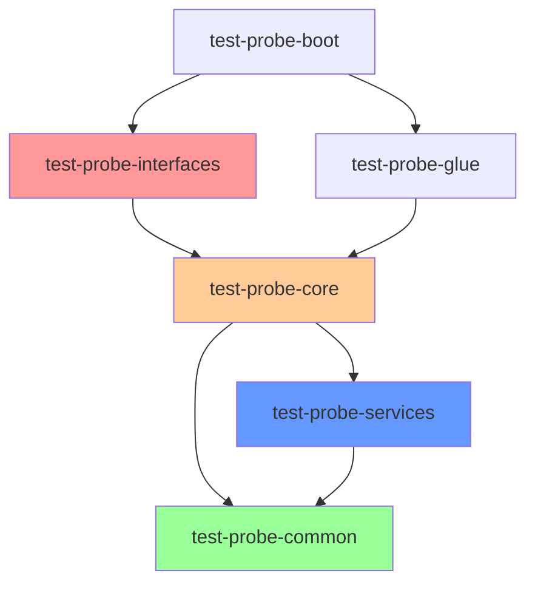

# Component Architecture

**Last Updated:** 2025-11-26
**Status:** Active - Core components complete
**Component:** High-Level Architecture
**Related Documents:**
- [System Overview](system-overview.md)
- [Deployment Architecture](deployment-architecture.md)
- [05.1 TestExecutionActor FSM](../blueprint/05%20State%20Machine/05.1-test-execution-actor-fsm.md)

---

## Table of Contents

- [Overview](#overview)
- [C4 Component Diagram](#c4-component-diagram)
- [Module Relationships](#module-relationships)
- [Actor Hierarchy](#actor-hierarchy)
- [Service Layer](#service-layer)
- [Component Responsibilities](#component-responsibilities)

---

## Overview

Test-Probe follows hexagonal (ports and adapters) architecture with clear separation between interface adapters, business logic, and external integrations. The system is built on Apache Pekko Typed Actors with immutable domain models and functional service layer.

**Architectural Patterns:**

1. **Hexagonal Architecture:** Ports (interfaces) and Adapters (implementations)
2. **Actor Model:** Concurrent, fault-tolerant message passing
3. **Error Kernel:** Let it crash, supervisor handles recovery
4. **Service Layer:** Curried functions for testability
5. **Anti-Corruption Layer:** REST DTOs separate from core models

---

## C4 Component Diagram

```mermaid
graph TB
    subgraph test-probe-interfaces [test-probe-interfaces Module]
        REST[REST API<br/>RestRoutes]
        CLI[CLI Interface<br/>Planned]
    end

    subgraph test-probe-core [test-probe-core Module]
        GA[GuardianActor<br/>Error Kernel]
        QA[QueueActor<br/>FIFO Queue]
        TEA[TestExecutionActor<br/>7-State FSM]

        subgraph Child Actors
            BSA[BlockStorageActor]
            VA[VaultActor]
            CEA[CucumberExecutionActor]
            KPA[KafkaProducerActor]
            KCA[KafkaConsumerActor]
        end

        subgraph Streaming Actors
            KPSA[KafkaProducerStreamingActor]
            KCSA[KafkaConsumerStreamingActor]
        end
    end

    subgraph test-probe-services [test-probe-services Module]
        BSS[BlockStorageService<br/>S3/Azure/GCS]
        VS[VaultService<br/>AWS/Azure/GCP]
        CS[CucumberService<br/>Main.run() executor]
    end

    subgraph test-probe-common [test-probe-common Module]
        MODELS[Domain Models<br/>TopicDirective, BlockStorageDirective, etc.]
    end

    REST -->|HTTP → Actor messages| GA
    CLI -.->|CLI args → Actor messages| GA

    GA -->|supervise| QA
    QA -->|spawn per test| TEA
    TEA -->|supervise| BSA
    TEA -->|supervise| VA
    TEA -->|supervise| CEA
    TEA -->|supervise| KPA
    TEA -->|supervise| KCA

    KPA -->|spawn| KPSA
    KCA -->|spawn| KCSA

    BSA -->|call| BSS
    VA -->|call| VS
    CEA -->|call| CS

    KPSA -->|produce| KAFKA[Kafka Brokers]
    KCSA -->|consume| KAFKA

    BSS -->|download/upload| S3[AWS S3/Azure/GCS]
    VS -->|invoke| VAULT[Vault Functions]

    style REST fill:#99ff99
    style GA fill:#ff9999
    style TEA fill:#ffcc99
    style BSS fill:#6699ff
    style VS fill:#6699ff
```

---

## Module Relationships

### Maven Multi-Module Structure

```
test-probe-parent/
├── test-probe-common/         # Shared models, utilities, contracts
├── test-probe-core/           # Actor system, FSM, business logic
├── test-probe-services/       # Service layer implementations
├── test-probe-interfaces/     # REST API, CLI (future)
├── test-probe-glue/           # Cucumber framework step definitions
├── test-probe-boot/           # Application bootstrap & lifecycle
└── test-probe-client-adapters/# External system clients (future)
```

---

### Dependency Graph



**Dependency Rules:**
- `common` has NO dependencies (foundation)
- `core` depends on `common` + `services`
- `services` depends on `common` only
- `interfaces` depends on `core`
- `boot` depends on `interfaces` + `glue`

---

## Actor Hierarchy

### Actor Supervision Tree

```
ActorSystem
└── GuardianActor (Error Kernel)
    └── QueueActor (FIFO Queue)
        └── TestExecutionActor (per test, 7-state FSM)
            ├── BlockStorageActor (supervised)
            │   └── BlockStorageService (curried function)
            ├── VaultActor (supervised)
            │   └── VaultService (curried function)
            ├── CucumberExecutionActor (supervised)
            │   └── CucumberExecutor (curried function)
            ├── KafkaProducerActor (supervised)
            │   └── KafkaProducerStreamingActor (spawned)
            └── KafkaConsumerActor (supervised)
                └── KafkaConsumerStreamingActor (spawned)
```

---

### Actor Responsibilities

**GuardianActor:**
- Root supervisor (error kernel pattern)
- Spawn QueueActor on startup
- Route commands to QueueActor
- Provide health check endpoint

**QueueActor:**
- FIFO queue management
- Spawn TestExecutionActor per test
- Dequeue tests when capacity available
- Track queue size

**TestExecutionActor:**
- 7-state FSM (Idle → Completed/Failed)
- Supervise 5 child actors
- Maintain test execution state
- Handle cancellation

**BlockStorageActor:**
- Download test data from S3/Azure/GCS
- Upload test evidence
- Call BlockStorageService

**VaultActor:**
- Fetch OAuth credentials from vault
- Call VaultService
- Return KafkaSecurityDirectives

**CucumberExecutionActor:**
- Run Cucumber scenarios
- Call CucumberExecutor
- Collect test results

**KafkaProducerActor:**
- Spawn KafkaProducerStreamingActor
- Supervise streaming actor
- Handle produce errors

**KafkaConsumerActor:**
- Spawn KafkaConsumerStreamingActor
- Supervise streaming actor
- Handle consume errors

**Reference:** [05.1 TestExecutionActor FSM](../blueprint/05%20State%20Machine/05.1-test-execution-actor-fsm.md)

---

## Service Layer

### Service Function Currying

**Pattern:**

```scala
// Service trait (contract)
trait ProbeStorageService {
  def fetchFromBlockStorage(testId: UUID, bucket: String): Future[BlockStorageDirective]
}

// Service implementation
class S3BlockStorageService extends ProbeStorageService { ... }

// Curried function extraction
object StorageServiceFunctions {
  def fromService(service: ProbeStorageService): FetchFromBlockStorage = {
    (testId: UUID, bucket: String) => service.fetchFromBlockStorage(testId, bucket)
  }
}

// Actor consumption
class BlockStorageActor(fetchFromBlockStorage: FetchFromBlockStorage) {
  // Call function directly (no service reference)
  fetchFromBlockStorage(testId, bucket).pipeTo(self)
}
```

**Benefits:**
- Actors don't depend on service objects
- Functions testable in isolation
- Easy to mock for testing
- Prevents signature churn

**Reference:** [04.1 Service Layer Architecture](../blueprint/04%20Adapters/04.1-service-layer-architecture.md)

---

### Service Implementations

**Block Storage Services:**

| Service | Provider | Status |
|---------|----------|--------|
| `LocalBlockStorageService` | jimfs (in-memory) | ✅ Complete |
| `S3BlockStorageService` | AWS S3 | ⏳ Skeleton |
| `AzureBlobStorageService` | Azure Blob Storage | ⏳ Skeleton |
| `GcsBlockStorageService` | GCP Cloud Storage | ⏳ Skeleton |

**Vault Services:**

| Service | Provider | Status |
|---------|----------|--------|
| `LocalVaultService` | jimfs (in-memory) | ✅ Complete |
| `AwsVaultService` | AWS Lambda + Secrets Manager | ✅ Complete |
| `AzureVaultService` | Azure Functions + Key Vault | ✅ Complete |
| `GcpVaultService` | GCP Cloud Functions + Secret Manager | ✅ Complete |

**Cucumber Service:**

| Service | Purpose | Status |
|---------|---------|--------|
| `CucumberExecutor` | Run Cucumber via Main.run() | ✅ Complete |
| `TestExecutionEventListener` | Collect test results | ✅ Complete |

---

## Component Responsibilities

### test-probe-common

**Purpose:** Shared models and contracts

**Key Components:**
- `TopicDirective`: Kafka topic configuration
- `BlockStorageDirective`: Test data location
- `KafkaSecurityDirective`: Kafka authentication
- `SecurityProtocol`: PLAINTEXT or SASL_SSL enum

**Why Separate Module?**
- No dependencies (foundation)
- Shared by core, services, interfaces
- Compile-time contracts

---

### test-probe-core

**Purpose:** Business logic and actor system

**Key Components:**
- GuardianActor, QueueActor, TestExecutionActor
- 5 child actors (BlockStorage, Vault, Cucumber, Kafka Producer/Consumer)
- Streaming actors (Kafka Producer/Consumer Streaming)
- Domain models (ActorCommands, TestExecutionResult)
- ProbeScalaDsl (event registry)

**Why Separate from Services?**
- Protocol-agnostic (no HTTP, AWS SDK, etc.)
- Pure actor logic
- Testable with mock functions

---

### test-probe-services

**Purpose:** External integration implementations

**Key Components:**
- Block storage services (S3, Azure, GCS, local)
- Vault services (AWS, Azure, GCP, local)
- Cucumber executor
- Rosetta mapping utilities

**Why Separate from Core?**
- Cloud SDK dependencies
- Business logic implementations
- Pluggable (swap S3 for GCS)

---

### test-probe-interfaces

**Purpose:** Client-facing interfaces

**Key Components:**
- RestRoutes (Pekko HTTP)
- RestExceptionHandler, RestRejectionHandler
- RestErrorResponse (RFC 7807-inspired)
- RestModels (kebab-case DTOs)
- RestModelConversions (anti-corruption layer)

**Why Separate Module?**
- HTTP concerns don't leak into core
- Multiple interfaces (REST, CLI, gRPC)
- Anti-corruption layer

---

### test-probe-glue

**Purpose:** Cucumber framework integration

**Key Components:**
- Framework glue package
- ProbeScalaDsl integration
- Event matching utilities

**Why Separate Module?**
- Cucumber dependency isolation
- User can provide custom glue packages

---

### test-probe-boot

**Purpose:** Application lifecycle and bootstrap

**Key Components:**
- Main application entry point
- ActorSystem initialization
- HTTP server startup
- Graceful shutdown

**Why Separate Module?**
- Single entry point
- Coordinates all modules
- Deployment artifact

---

## Related Documents

**Architecture:**
- [System Overview](system-overview.md)
- [Deployment Architecture](deployment-architecture.md)

**Blueprint:**
- [02.1 GuardianActor](../blueprint/02%20Booting/02.1-guardian-actor.md)
- [05.1 TestExecutionActor FSM](../blueprint/05%20State%20Machine/05.1-test-execution-actor-fsm.md)
- [04.1 Service Layer Architecture](../blueprint/04%20Adapters/04.1-service-layer-architecture.md)

---

**Last Updated:** 2025-11-26
**Status:** Active - Core components complete
