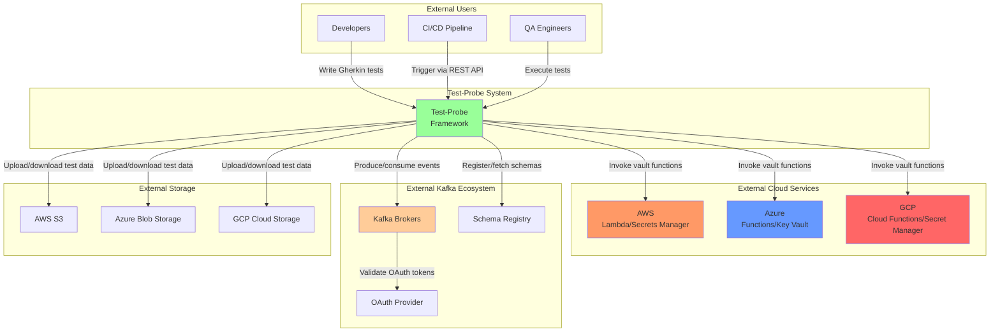

# System Overview

**Last Updated:** 2025-11-26
**Status:** Active - Core system operational
**Component:** High-Level Architecture
**Related Documents:**
- [Component Architecture](component-architecture.md)
- [Deployment Architecture](deployment-architecture.md)
- [Product Requirements Document](../../product/PRODUCT-REQUIREMENTS-DOCUMENT.md)

---

## Table of Contents

- [Overview](#overview)
- [C4 Context Diagram](#c4-context-diagram)
- [System Boundaries](#system-boundaries)
- [External Dependencies](#external-dependencies)
- [User Personas](#user-personas)
- [Integration Points](#integration-points)

---

## Overview

Test-Probe is an enterprise-grade event-driven architecture (EDA) testing framework that enables teams to write BDD-style tests for Kafka-based event systems using Gherkin specifications. The system provides HTTP and CLI interfaces for test execution, integrates with cloud vault services for credential management, and validates event flows through Kafka clusters.

**Philosophy:** Make it as simple as possible for teams to adopt the framework so that they actually test.

**Five Core Principles:**

1. **Easability** - Low-effort capability to test event-driven architectures
2. **Testability** - Eat our own dogfood, thoroughly tested end-to-end
3. **Performability** - High-performance runtimes for performant testing
4. **Reliability** - Proven technologies and patterns, no drama
5. **Extensibility** - Fits with enterprise tools, languages, and environments

---

## C4 Context Diagram



---

## System Boundaries

### Inside Test-Probe

**Core Responsibilities:**

1. **Test Orchestration**
   - Accept test execution requests (REST API, CLI)
   - Queue tests for sequential execution
   - Manage test lifecycle (initialize → execute → complete)

2. **Credential Management**
   - Fetch OAuth credentials from cloud vaults
   - Construct Kafka JAAS configuration
   - Secure credential handling (in-memory only)

3. **Kafka Integration**
   - Produce events to Kafka topics
   - Consume events from Kafka topics
   - Filter events by CloudEvent metadata
   - Register events in thread-safe registry

4. **Test Execution**
   - Run Cucumber/Gherkin scenarios
   - Execute user-provided step definitions
   - Collect test evidence (reports, logs, events)

5. **Evidence Management**
   - Upload test evidence to block storage
   - Generate Cucumber HTML/JSON reports
   - Store produced/consumed events

---

### Outside Test-Probe (External)

**Not Test-Probe's Responsibility:**

1. **Kafka Cluster Management**
   - Broker provisioning
   - Topic creation
   - ACL management
   - Monitoring/alerting

2. **Vault Management**
   - Credential rotation
   - Secret storage
   - Access policies

3. **OAuth Provider**
   - Token generation
   - Token validation
   - User/service account management

4. **Schema Registry**
   - Schema storage
   - Compatibility checks
   - Subject-level ACLs

5. **Block Storage**
   - Bucket/container provisioning
   - Access policies
   - Lifecycle management

---

## External Dependencies

### Cloud Vault Services

**Purpose:** Provide Kafka OAuth credentials

**Providers:**

| Provider | Service | Authentication |
|----------|---------|---------------|
| AWS | Lambda + Secrets Manager | IAM roles |
| Azure | Functions + Key Vault | Function keys |
| GCP | Cloud Functions + Secret Manager | Network isolation + IAM |

**Integration Pattern:**

```
Test-Probe → HTTP POST → Vault Function → Returns OAuth credentials
```

**Reference:** [01.1 Vault Integration](../blueprint/01%20Security/01.1-vault-integration.md)

---

### Kafka Ecosystem

#### Kafka Brokers

**Purpose:** Event streaming platform

**Protocol:** SASL_SSL (OAuth 2.0 + TLS)

**Operations:**
- Produce events (with schema validation)
- Consume events (with consumer groups)
- Topic metadata queries

**Requirements:**
- Kafka 2.8+ (SASL/OAUTHBEARER support)
- ACLs configured for Test-Probe principals
- Network connectivity from Test-Probe workload

---

#### Schema Registry

**Purpose:** Centralized schema management

**Protocol:** HTTP/REST

**Operations:**
- Register schemas (CloudEvent, event payloads)
- Fetch schemas by ID
- Compatibility checks

**Requirements:**
- Confluent Schema Registry 7.x+
- Subject-level ACLs for Test-Probe principals
- Network connectivity from Test-Probe workload

---

#### OAuth Provider

**Purpose:** OAuth 2.0 token generation and validation

**Protocol:** HTTP/REST (Client Credentials flow)

**Operations:**
- Request access tokens
- Validate tokens (by Kafka brokers)

**Requirements:**
- OAuth 2.0 compliant provider
- Client credentials (from vault)
- Token endpoint accessible from Test-Probe and Kafka brokers

---

### Block Storage

**Purpose:** Store test data and evidence

**Providers:**

| Provider | Service | Protocol |
|----------|---------|----------|
| AWS | S3 | AWS SDK |
| Azure | Blob Storage | Azure SDK |
| GCP | Cloud Storage | GCP SDK |

**Operations:**
- Download test data (feature files, configurations)
- Upload test evidence (reports, logs, events)

**Requirements:**
- Bucket/container provisioned
- IAM permissions for Test-Probe workload
- Network connectivity

---

## User Personas

### 1. Developer

**Goals:**
- Write BDD tests for event-driven features
- Run tests locally during development
- Debug failing scenarios

**Interactions:**
- Write Gherkin feature files
- Implement custom step definitions (optional)
- Upload test data to S3/Azure/GCS
- Trigger tests via REST API or CLI
- Review test evidence

**Example:**
```bash
# Upload test data
aws s3 cp ./tests s3://test-bucket/tests/abc-123 --recursive

# Trigger test
curl -X POST http://test-probe.company.com/api/v1/test/start \
  -H "Content-Type: application/json" \
  -d '{
    "test-id": "abc-123",
    "block-storage-path": "s3://test-bucket/tests/abc-123",
    "test-type": "smoke"
  }'

# Check status
curl http://test-probe.company.com/api/v1/test/abc-123/status

# Download evidence
aws s3 cp s3://test-bucket/tests/abc-123/evidence/ ./evidence --recursive
```

---

### 2. CI/CD Pipeline

**Goals:**
- Automate test execution on deployments
- Fail pipeline on test failures
- Collect test evidence as artifacts

**Interactions:**
- Initialize test ID
- Upload test data to block storage
- Trigger test execution via REST API
- Poll for test completion
- Download test evidence
- Parse Cucumber reports for pass/fail

**Example (GitHub Actions):**
```yaml
- name: Run Test-Probe Tests
  run: |
    TEST_ID=$(curl -X POST http://test-probe.company.com/api/v1/test/initialize | jq -r '.["test-id"]')
    aws s3 cp ./tests s3://test-bucket/tests/$TEST_ID --recursive
    curl -X POST http://test-probe.company.com/api/v1/test/start \
      -d "{\"test-id\": \"$TEST_ID\", \"block-storage-path\": \"s3://test-bucket/tests/$TEST_ID\"}"
    # Poll for completion
    while true; do
      STATUS=$(curl http://test-probe.company.com/api/v1/test/$TEST_ID/status | jq -r '.status')
      [ "$STATUS" = "completed" ] && break
      sleep 10
    done
```

---

### 3. QA Engineer

**Goals:**
- Execute regression test suites
- Validate event flows end-to-end
- Investigate test failures

**Interactions:**
- Organize test suites in block storage
- Trigger test executions
- Monitor test queue
- Review test evidence
- Analyze Cucumber reports

**Example:**
```bash
# Queue multiple tests
for TEST in smoke regression performance; do
  curl -X POST http://test-probe.company.com/api/v1/test/start \
    -d "{\"test-id\": \"$TEST-$(uuidgen)\", \"test-type\": \"$TEST\"}"
done

# Monitor queue
watch -n 5 'curl http://test-probe.company.com/api/v1/queue'
```

---

## Integration Points

### Inbound Integrations

**REST API:**
- Endpoint: `/api/v1/test/start`
- Protocol: HTTP/JSON
- Authentication: None (future: OAuth/API keys)
- Use Case: CI/CD pipelines, manual testing

**CLI (Planned):**
- Command: `test-probe run --test-id <id> --bucket <path>`
- Protocol: Command-line
- Authentication: Cloud credentials (AWS/Azure/GCP CLI)
- Use Case: Local development, scripting

---

### Outbound Integrations

**Cloud Vaults:**
- Protocol: HTTP/REST (HTTPS)
- Authentication: IAM roles, function keys, network isolation
- Purpose: Fetch Kafka OAuth credentials

**Kafka Brokers:**
- Protocol: Kafka protocol (SASL_SSL)
- Authentication: OAuth 2.0
- Purpose: Produce/consume events

**Schema Registry:**
- Protocol: HTTP/REST
- Authentication: Schema Registry ACLs
- Purpose: Register/fetch schemas

**Block Storage:**
- Protocol: AWS SDK, Azure SDK, GCP SDK
- Authentication: IAM roles
- Purpose: Download test data, upload evidence

**OAuth Provider:**
- Protocol: HTTP/REST (HTTPS)
- Authentication: Client credentials (from vault)
- Purpose: Acquire Kafka access tokens

---

## Related Documents

**Architecture:**
- [Component Architecture](component-architecture.md)
- [Deployment Architecture](deployment-architecture.md)

**Product:**
- [Product Requirements Document](../../product/PRODUCT-REQUIREMENTS-DOCUMENT.md)

**Blueprint:**
- [01 Security Overview](../blueprint/01%20Security/01-security-overview.md)
- [03.1 REST API Architecture](../blueprint/03%20APIs/03.1%20REST%20API/03.1-rest-api-architecture.md)
- [10.1 Kafka Streaming Architecture](../blueprint/10%20Kafka%20Streaming/10.1-kafka-streaming-architecture.md)

---

**Last Updated:** 2025-11-26
**Status:** Active - Core system operational
