# Test-Probe Builder Pattern Guide

Complete guide to bootstrapping the Test-Probe framework using the ServiceDsl builder with compile-time safety guarantees.

## Table of Contents

1. [Overview](#overview)
2. [Quick Start](#quick-start)
3. [ServiceDsl API Reference](#servicedsl-api-reference)
4. [Module Implementations](#module-implementations)
5. [ServiceContext - The Result](#servicecontext---the-result)
6. [Configuration Requirements](#configuration-requirements)
7. [Complete Examples](#complete-examples)
8. [Compile-Time Safety](#compile-time-safety)
9. [Three-Phase Lifecycle](#three-phase-lifecycle)
10. [Troubleshooting](#troubleshooting)

---

## Overview

### What is the Builder Pattern in Test-Probe?

The Test-Probe framework uses a **type-safe builder pattern** (ServiceDsl) to construct the entire runtime environment. This pattern ensures that:

1. **All required modules are provided** - Won't compile if you forget a module
2. **Order doesn't matter** - Add modules in any sequence
3. **Compile-time validation** - Errors caught before runtime
4. **Impossible invalid states** - Type system prevents broken configurations

### Why Phantom Types?

Test-Probe uses **phantom types** to track which modules have been added at compile time:

```scala
// Won't compile - missing VaultService module
val serviceContext = ServiceDsl()
  .withConfig(DefaultConfig())
  .withActorSystem(DefaultActorSystem())
  .withInterface(DefaultRestInterface())
  .withStorageService(LocalBlockStorageService())
  // .withVaultServiceModule(LocalVaultService())  // <-- MISSING!
  .build()  // ❌ COMPILE ERROR: Cannot prove VaultService is present
```

The compiler tracks the type as you add modules:

```scala
// Type evolution:
ServiceDsl()                                          // ServiceDsl[Nil]
  .withConfig(...)                                    // ServiceDsl[Cons[ProbeConfig, Nil]]
  .withActorSystem(...)                               // ServiceDsl[Cons[ProbeActorSystem, Cons[ProbeConfig, Nil]]]
  .withInterface(...)                                 // ServiceDsl[Cons[ProbeInterface, Cons[ProbeActorSystem, Cons[ProbeConfig, Nil]]]]
  .withStorageService(...)                            // ... and so on
  .withVaultServiceModule(...)
  .build()  // ✅ COMPILES - all required modules present
```

**Visual Type-Level Set:**

```mermaid
graph LR
    Empty[ServiceDsl Nil] --> AddConfig[+Config]
    AddConfig --> Type1[Cons Config Nil]
    Type1 --> AddActor[+ActorSystem]
    AddActor --> Type2[Cons ActorSystem<br/>Cons Config Nil]
    Type2 --> AddInterface[+Interface]
    AddInterface --> Type3[Cons Interface<br/>Cons ActorSystem<br/>Cons Config Nil]
    Type3 --> AddStorage[+Storage]
    AddStorage --> Type4[Cons Storage<br/>Cons Interface<br/>Cons ActorSystem<br/>Cons Config Nil]
    Type4 --> AddVault[+Vault]
    AddVault --> Type5[Cons Vault<br/>Cons Storage<br/>Cons Interface<br/>Cons ActorSystem<br/>Cons Config Nil]
    Type5 --> Build[.build<br/>✅ All modules present]

    style Empty fill:#ffebee
    style Type1 fill:#fff3e0
    style Type2 fill:#fff9c4
    style Type3 fill:#f1f8e9
    style Type4 fill:#e0f2f1
    style Type5 fill:#e8eaf6
    style Build fill:#c8e6c9
```



**Compiler Proof:**
The `.build()` method requires compile-time proof that all 5 modules are present:

```scala
def build()(using
  hasConfig: Contains[Features, ProbeConfig],           // ✓ Compiler finds this
  hasActorSystem: Contains[Features, ProbeActorSystem], // ✓ Compiler finds this
  hasInterface: Contains[Features, ProbeInterface],     // ✓ Compiler finds this
  hasStorageService: Contains[Features, ProbeStorageService], // ✓ Compiler finds this
  hasVaultService: Contains[Features, ProbeVaultService]      // ✓ Compiler finds this
): Future[ServiceContext]
```

If any module is missing, the compiler cannot find the required `Contains` implicit, and compilation fails.

### The Three-Phase Module Lifecycle

Every module implements a three-phase lifecycle executed by ServiceDsl:

```
Phase 1: preFlight  → Validate dependencies (no side effects)
Phase 2: initialize → Create resources, decorate context
Phase 3: finalCheck → Verify resources are ready
```

**Visual Flow:**

```mermaid
graph TD
    Start[ServiceDsl Builder] --> Config[Add Modules<br/>withConfig, withActorSystem, etc.]
    Config --> Build[Call .build]
    Build --> Phase1[Phase 1: preFlight]

    Phase1 --> P1Config[Config.preFlight]
    P1Config --> P1Storage[Storage.preFlight]
    P1Storage --> P1Vault[Vault.preFlight]
    P1Vault --> P1External[External Services.preFlight]
    P1External --> P1Actor[ActorSystem.preFlight]
    P1Actor --> P1Interface[Interface.preFlight]

    P1Interface --> Phase2[Phase 2: initialize]

    Phase2 --> P2Config[Config.initialize<br/>+ config, coreConfig]
    P2Config --> P2External[External Services.initialize]
    P2External --> P2Actor[ActorSystem.initialize<br/>+ actorSystem, queueActorRef]
    P2Actor --> P2Storage[Storage.initialize<br/>+ storageService]
    P2Storage --> P2Vault[Vault.initialize<br/>+ vaultService]
    P2Vault --> P2Interface[Interface.initialize<br/>Bind REST API]

    P2Interface --> Phase3[Phase 3: finalCheck]

    Phase3 --> P3Config[Config.finalCheck]
    P3Config --> P3External[External Services.finalCheck]
    P3External --> P3Actor[ActorSystem.finalCheck]
    P3Actor --> P3Storage[Storage.finalCheck]
    P3Storage --> P3Vault[Vault.finalCheck]
    P3Vault --> P3Interface[Interface.finalCheck]

    P3Interface --> Result[ServiceContext]

    style Phase1 fill:#e1f5ff
    style Phase2 fill:#fff4e1
    style Phase3 fill:#e8f5e9
    style Result fill:#f3e5f5
```



**Example flow:**
```scala
for {
  // Phase 1: Validation (all modules validate first)
  ctx0 <- configModule.preFlight(emptyContext)
  ctx0 <- storageModule.preFlight(ctx0)
  ctx0 <- vaultModule.preFlight(ctx0)
  ctx0 <- actorSystemModule.preFlight(ctx0)
  ctx0 <- interfaceModule.preFlight(ctx0)

  // Phase 2: Initialization (context threading - each adds to context)
  ctx1 <- configModule.initialize(ctx0)       // Adds Config + CoreConfig
  ctx2 <- storageModule.initialize(ctx1)      // Adds StorageService
  ctx3 <- vaultModule.initialize(ctx2)        // Adds VaultService
  ctx4 <- actorSystemModule.initialize(ctx3)  // Adds ActorSystem + QueueActorRef
  ctx5 <- interfaceModule.initialize(ctx4)    // Adds REST interface

  // Phase 3: Final validation (verify everything is ready)
  ctx5 <- configModule.finalCheck(ctx5)
  ctx5 <- storageModule.finalCheck(ctx5)
  ctx5 <- vaultModule.finalCheck(ctx5)
  ctx5 <- actorSystemModule.finalCheck(ctx5)
  ctx5 <- interfaceModule.finalCheck(ctx5)
} yield ctx5.toServiceContext
```

---

## Quick Start

### Minimal Working Example

Here's the simplest way to bootstrap Test-Probe with default modules:

```scala
import io.distia.probe.core.ServiceDsl
import io.distia.probe.core.builder.modules._
import io.distia.probe.core.builder.ServiceContext

import scala.concurrent.{Await, Future}
import scala.concurrent.duration._
import scala.concurrent.ExecutionContext.Implicits.global

// Build the framework
val serviceContextFuture: Future[ServiceContext] = ServiceDsl()
  .withConfig(DefaultConfig())
  .withActorSystem(DefaultActorSystem())
  .withInterface(DefaultRestInterface())
  .withStorageService(LocalBlockStorageService())
  .withVaultServiceModule(LocalVaultService())
  .build()

// Wait for initialization to complete
val serviceContext: ServiceContext = Await.result(serviceContextFuture, 30.seconds)

println(s"✓ Test-Probe initialized successfully")
println(s"  - Actor system: ${serviceContext.actorSystem.name}")
println(s"  - Queue actor: ${serviceContext.queueActorRef}")
```

### Required Modules

Test-Probe requires **exactly 5 modules** to build:

| Module | Purpose | Default Implementation |
|--------|---------|------------------------|
| **Config** | Configuration loading | `DefaultConfig()` |
| **ActorSystem** | Actor system + GuardianActor | `DefaultActorSystem()` |
| **StorageService** | Block storage (evidence) | `LocalBlockStorageService()` |
| **VaultService** | Security vault (secrets) | `LocalVaultService()` |
| **Interface** | REST API | `DefaultRestInterface()` |

### Optional Modules

| Module | Purpose | Example |
|--------|---------|---------|
| **ExternalServices** | Custom actor behaviors | REST/gRPC/DB adapters |

---

## ServiceDsl API Reference

### Core Methods

#### `.withConfig(ProbeConfig)`

Adds the configuration module. Loads `reference.conf` and `application.conf` from classpath.

**Method Signature:**
```scala
def withConfig[T <: ProbeConfig, Out <: FeatureSet](config: T)
  (using add: AddIfAbsent.Aux[Features, ProbeConfig, Out]): ServiceDsl[Out]
```

**Parameters:**
- `config: T <: ProbeConfig` - Configuration module implementation

**Returns:**
- New `ServiceDsl` instance with `ProbeConfig` added to the type-level feature set

**Implementations:**
- `DefaultConfig()` - Load from default locations (classpath)
- `DefaultConfig.withAltConfigLocation(path)` - Load from custom file path

**Example:**
```scala
// Default configuration
ServiceDsl().withConfig(DefaultConfig())

// Custom configuration file
ServiceDsl().withConfig(DefaultConfig.withAltConfigLocation("/opt/config/app.conf"))
```

**Configuration Requirements:**
The config module validates that `test-probe.core.actor-system.name` is present in config.

---

#### `.withActorSystem(ProbeActorSystem)`

Adds the actor system module. Creates the Akka Typed ActorSystem with GuardianActor as the root actor.

**Method Signature:**
```scala
def withActorSystem[T <: ProbeActorSystem, Out <: FeatureSet](actorSystem: T)
  (using add: AddIfAbsent.Aux[Features, ProbeActorSystem, Out]): ServiceDsl[Out]
```

**Parameters:**
- `actorSystem: T <: ProbeActorSystem` - Actor system module implementation

**Returns:**
- New `ServiceDsl` instance with `ProbeActorSystem` added to the type-level feature set

**Implementations:**
- `DefaultActorSystem()` - Creates Akka Typed ActorSystem with production GuardianActor

**Example:**
```scala
ServiceDsl()
  .withConfig(DefaultConfig())
  .withActorSystem(DefaultActorSystem())
```

**What It Does:**
1. Creates `ActorSystem[GuardianCommand]` with configured name
2. Spawns GuardianActor and sends `Initialize` message
3. Spawns QueueActor for test execution management
4. Creates curried functions for REST interface
5. Registers ActorSystem with ProbeScalaDsl for Kafka streaming

**Dependencies:**
- Requires `ProbeConfig` module (validates config exists)
- Requires `ProbeVaultService` module (validates vault exists)
- Requires `ProbeStorageService` module (validates storage exists)

---

#### `.withInterface(ProbeInterface)`

Adds the REST interface module. Binds HTTP server to configured host/port.

**Method Signature:**
```scala
def withInterface[T <: ProbeInterface, Out <: FeatureSet](interface: T)
  (using add: AddIfAbsent.Aux[Features, ProbeInterface, Out]): ServiceDsl[Out]
```

**Parameters:**
- `interface: T <: ProbeInterface` - Interface module implementation

**Returns:**
- New `ServiceDsl` instance with `ProbeInterface` added to the type-level feature set

**Implementations:**
- `DefaultRestInterface()` - Akka HTTP server with routes for test submission

**Example:**
```scala
ServiceDsl()
  .withConfig(DefaultConfig())
  .withActorSystem(DefaultActorSystem())
  .withInterface(DefaultRestInterface())
```

**What It Does:**
1. Creates Akka HTTP routes for:
   - `POST /api/v1/tests/initialize` - Initialize new test
   - `POST /api/v1/tests/start` - Start test execution
   - `GET /api/v1/tests/{testId}/status` - Get test status
   - `DELETE /api/v1/tests/{testId}` - Cancel test
   - `GET /api/v1/queue/status` - Get queue status
2. Binds HTTP server to configured host/port
3. Injects curried functions from ActorSystem module

**Configuration:**
```hocon
test-probe.interfaces.rest {
  host = "localhost"
  port = 8080
  timeout = 30s
}
```

---

#### `.withStorageService(ProbeStorageService)`

Adds the storage service module. Provides block storage for test evidence (feature files, results, logs).

**Method Signature:**
```scala
def withStorageService[T <: ProbeStorageService, Out <: FeatureSet](storageService: T)
  (using add: AddIfAbsent.Aux[Features, ProbeStorageService, Out]): ServiceDsl[Out]
```

**Parameters:**
- `storageService: T <: ProbeStorageService` - Storage service module implementation

**Returns:**
- New `ServiceDsl` instance with `ProbeStorageService` added to the type-level feature set

**Implementations:**
- `LocalBlockStorageService()` - Local filesystem storage (development)
- `AwsBlockStorageService()` - AWS S3 storage (production)
- `AzureBlockStorageService()` - Azure Blob Storage (production)
- `GcpBlockStorageService()` - Google Cloud Storage (production)

**Example:**
```scala
// Development (local filesystem)
ServiceDsl()
  .withConfig(DefaultConfig())
  .withStorageService(LocalBlockStorageService())

// Production (AWS S3)
ServiceDsl()
  .withConfig(DefaultConfig())
  .withStorageService(AwsBlockStorageService())
```

**API:**
```scala
trait ProbeStorageService {
  // Fetch test artifacts from storage
  def fetchFromBlockStorage(testId: UUID, bucket: String): Future[BlockStorageDirective]

  // Upload test evidence to storage
  def loadToBlockStorage(testId: UUID, bucket: String, evidence: String): Future[Unit]
}
```

---

#### `.withVaultServiceModule(ProbeVaultService)`

Adds the vault service module. Provides secure storage for Kafka credentials and secrets.

**Method Signature:**
```scala
def withVaultServiceModule[T <: ProbeVaultService, Out <: FeatureSet](vaultService: T)
  (using add: AddIfAbsent.Aux[Features, ProbeVaultService, Out]): ServiceDsl[Out]
```

**Parameters:**
- `vaultService: T <: ProbeVaultService` - Vault service module implementation

**Returns:**
- New `ServiceDsl` instance with `ProbeVaultService` added to the type-level feature set

**Implementations:**
- `LocalVaultService()` - Local vault (development, no secrets)
- `AwsVaultService()` - AWS Secrets Manager (production)
- `AzureVaultService()` - Azure Key Vault (production)
- `GcpVaultService()` - Google Secret Manager (production)

**Example:**
```scala
// Development (no secrets)
ServiceDsl()
  .withConfig(DefaultConfig())
  .withVaultServiceModule(LocalVaultService())

// Production (AWS Secrets Manager)
ServiceDsl()
  .withConfig(DefaultConfig())
  .withVaultServiceModule(AwsVaultService())
```

**API:**
```scala
trait ProbeVaultService {
  // Fetch Kafka security directives (credentials, keystores, etc.)
  def fetchSecurityDirectives(directive: BlockStorageDirective): Future[List[KafkaSecurityDirective]]

  // Shutdown vault connection
  def shutdown(): Future[Unit]
}
```

---

#### `.withExternalServicesModule(ProbeActorBehavior)`

Adds an optional external service module. Can be called multiple times to add multiple services.

**Method Signature:**
```scala
def withExternalServicesModule[T <: ProbeActorBehavior](externalService: T): ServiceDsl[Features]
```

**Parameters:**
- `externalService: T <: ProbeActorBehavior` - External service behavior implementation

**Returns:**
- New `ServiceDsl` instance with same feature set (external services don't affect type-level requirements)

**Use Cases:**
- REST API adapters for downstream services
- gRPC client behaviors
- Database connection pools
- Custom message handlers

**Example:**
```scala
ServiceDsl()
  .withConfig(DefaultConfig())
  .withActorSystem(DefaultActorSystem())
  .withInterface(DefaultRestInterface())
  .withStorageService(LocalBlockStorageService())
  .withVaultServiceModule(LocalVaultService())
  .withExternalServicesModule(RestApiAdapter())      // Optional
  .withExternalServicesModule(GrpcClientBehavior())  // Optional
  .withExternalServicesModule(DatabasePool())        // Optional
  .build()
```

**Note:** External services are optional - the type system does NOT require them for `.build()`.

---

#### `.build()`

Builds the complete ServiceContext. Only available when all required modules are present.

**Method Signature:**
```scala
def build()(using
  hasConfig: Contains[Features, ProbeConfig],
  hasActorSystem: Contains[Features, ProbeActorSystem],
  hasInterface: Contains[Features, ProbeInterface],
  hasStorageService: Contains[Features, ProbeStorageService],
  hasVaultService: Contains[Features, ProbeVaultService]
): Future[ServiceContext]
```

**Type Constraints:**
- Requires `Contains[Features, ProbeConfig]` - Config module must be present
- Requires `Contains[Features, ProbeActorSystem]` - ActorSystem module must be present
- Requires `Contains[Features, ProbeInterface]` - Interface module must be present
- Requires `Contains[Features, ProbeStorageService]` - StorageService module must be present
- Requires `Contains[Features, ProbeVaultService]` - VaultService module must be present

**Returns:**
- `Future[ServiceContext]` - Fully initialized framework context

**Lifecycle Execution:**
The build method executes all modules through the three-phase lifecycle:

```
Phase 1: preFlight (validation)
  Config → Storage → Vault → [ExternalServices] → ActorSystem → Interface

Phase 2: initialize (resource creation)
  Config → [ExternalServices] → ActorSystem → Storage → Vault → Interface

Phase 3: finalCheck (verification)
  Config → [ExternalServices] → ActorSystem → Storage → Vault → Interface
```

**Error Handling:**
If any phase fails:
1. The Future fails immediately (fail-fast)
2. Error is logged at FATAL level
3. Partially initialized resources may be inconsistent
4. System must be restarted (no recovery)

**Example:**
```scala
val serviceContextFuture: Future[ServiceContext] = ServiceDsl()
  .withConfig(DefaultConfig())
  .withActorSystem(DefaultActorSystem())
  .withInterface(DefaultRestInterface())
  .withStorageService(LocalBlockStorageService())
  .withVaultServiceModule(LocalVaultService())
  .build()

// Handle success/failure
serviceContextFuture.onComplete {
  case Success(ctx) =>
    println(s"✓ Framework initialized: ${ctx.actorSystem.name}")
  case Failure(ex) =>
    println(s"✗ Framework initialization failed: ${ex.getMessage}")
    System.exit(1)
}
```

---

## Module Implementations

### Configuration Modules

#### DefaultConfig

Loads configuration from classpath using Typesafe Config's default resolution:

1. System properties (`-Dconfig.file=...`)
2. `application.conf` (if present)
3. `reference.conf` (auto-merged from all JARs)

**Usage:**
```scala
// Load from classpath
ServiceDsl().withConfig(DefaultConfig())

// Load from custom file
ServiceDsl().withConfig(DefaultConfig.withAltConfigLocation("/opt/config/app.conf"))
```

**Configuration Structure:**
```hocon
test-probe {
  core {
    actor-system {
      name = "TestProbeSystem"
      timeout = 30s
    }
  }

  interfaces {
    rest {
      host = "localhost"
      port = 8080
      timeout = 30s
    }
  }
}
```

---

### ActorSystem Modules

#### DefaultActorSystem

Creates Akka Typed ActorSystem with GuardianActor as the root actor.

**Usage:**
```scala
ServiceDsl()
  .withConfig(DefaultConfig())
  .withStorageService(LocalBlockStorageService())
  .withVaultServiceModule(LocalVaultService())
  .withActorSystem(DefaultActorSystem())
```

**What It Creates:**
- `ActorSystem[GuardianCommand]` - Root actor system
- `GuardianActor` - Root supervisor implementing Error Kernel pattern
- `QueueActor` - FIFO queue for test execution requests
- Curried functions for REST interface (test submission, status, cancel)

**Dependencies:**
Must be called AFTER:
- `.withConfig(...)` - Needs actor system name from config
- `.withStorageService(...)` - Needs storage functions
- `.withVaultServiceModule(...)` - Needs vault functions

---

### Storage Service Modules

#### LocalBlockStorageService

Local filesystem storage for development and testing.

**Usage:**
```scala
ServiceDsl().withStorageService(LocalBlockStorageService())
```

**Storage Location:**
- Default: `./test-probe-storage/`
- Configurable via `test-probe.core.storage.local.base-path`

**Directory Structure:**
```
test-probe-storage/
├── <testId>/
│   ├── feature-files/       # Gherkin feature files
│   ├── step-definitions/    # Custom step definitions
│   ├── evidence/            # Test execution evidence
│   │   ├── cucumber-reports/
│   │   ├── event-logs/
│   │   └── metadata.json
│   └── results/             # Final test results
```

**Best For:**
- Local development
- CI/CD pipelines (ephemeral storage)
- Integration tests

---

#### AwsBlockStorageService

AWS S3 storage for production deployments.

**Usage:**
```scala
ServiceDsl().withStorageService(AwsBlockStorageService())
```

**Configuration:**
```hocon
test-probe.core.storage.aws {
  region = "us-east-1"
  bucket = "test-probe-evidence"
  prefix = "test-executions/"
}
```

**Credentials:**
Uses AWS SDK default credential provider chain:
1. Environment variables (`AWS_ACCESS_KEY_ID`, `AWS_SECRET_ACCESS_KEY`)
2. JVM system properties (`aws.accessKeyId`, `aws.secretKey`)
3. Web identity token (EKS, Fargate)
4. EC2 instance profile credentials
5. ECS task role credentials

**Best For:**
- Production deployments on AWS
- Long-term evidence retention
- Multi-region replication

---

#### AzureBlockStorageService

Azure Blob Storage for production deployments.

**Usage:**
```scala
ServiceDsl().withStorageService(AzureBlockStorageService())
```

**Configuration:**
```hocon
test-probe.core.storage.azure {
  account-name = "testprobestorage"
  container = "test-evidence"
  connection-string = "${AZURE_STORAGE_CONNECTION_STRING}"
}
```

**Best For:**
- Production deployments on Azure
- Azure-native integrations

---

#### GcpBlockStorageService

Google Cloud Storage for production deployments.

**Usage:**
```scala
ServiceDsl().withStorageService(GcpBlockStorageService())
```

**Configuration:**
```hocon
test-probe.core.storage.gcp {
  project-id = "my-project"
  bucket = "test-probe-evidence"
  credentials-path = "/etc/secrets/gcp-service-account.json"
}
```

**Best For:**
- Production deployments on GCP
- BigQuery integration for analytics

---

### Vault Service Modules

#### LocalVaultService

Local vault with no actual secret storage. Returns empty security directives.

**Usage:**
```scala
ServiceDsl().withVaultServiceModule(LocalVaultService())
```

**Security:**
- No encryption
- No authentication required
- Suitable ONLY for development

**Best For:**
- Local development
- CI/CD with plaintext Kafka (Testcontainers)

---

#### AwsVaultService

AWS Secrets Manager for production secret storage.

**Usage:**
```scala
ServiceDsl().withVaultServiceModule(AwsVaultService())
```

**Configuration:**
```hocon
test-probe.core.vault.aws {
  region = "us-east-1"
  secret-prefix = "test-probe/"
}
```

**Secret Naming Convention:**
```
test-probe/kafka/<cluster-name>/bootstrap-servers
test-probe/kafka/<cluster-name>/credentials/username
test-probe/kafka/<cluster-name>/credentials/password
test-probe/kafka/<cluster-name>/ssl/keystore
test-probe/kafka/<cluster-name>/ssl/truststore
```

**Best For:**
- Production deployments on AWS
- Automated secret rotation
- IAM-based access control

---

#### AzureVaultService

Azure Key Vault for production secret storage.

**Usage:**
```scala
ServiceDsl().withVaultServiceModule(AzureVaultService())
```

**Configuration:**
```hocon
test-probe.core.vault.azure {
  vault-url = "https://my-keyvault.vault.azure.net"
  tenant-id = "${AZURE_TENANT_ID}"
}
```

**Best For:**
- Production deployments on Azure
- Azure AD integration

---

#### GcpVaultService

Google Secret Manager for production secret storage.

**Usage:**
```scala
ServiceDsl().withVaultServiceModule(GcpVaultService())
```

**Configuration:**
```hocon
test-probe.core.vault.gcp {
  project-id = "my-project"
  credentials-path = "/etc/secrets/gcp-service-account.json"
}
```

**Best For:**
- Production deployments on GCP
- Workload Identity integration

---

### Interface Modules

#### DefaultRestInterface

Akka HTTP REST API for test submission and management.

**Usage:**
```scala
ServiceDsl().withInterface(DefaultRestInterface())
```

**Endpoints:**

| Method | Path | Description |
|--------|------|-------------|
| POST | `/api/v1/tests/initialize` | Initialize new test (upload feature files) |
| POST | `/api/v1/tests/start` | Start test execution |
| GET | `/api/v1/tests/{testId}/status` | Get test execution status |
| DELETE | `/api/v1/tests/{testId}` | Cancel running test |
| GET | `/api/v1/queue/status` | Get queue status (pending tests) |

**Configuration:**
```hocon
test-probe.interfaces.rest {
  host = "0.0.0.0"
  port = 8080
  timeout = 30s
}
```

**Best For:**
- REST-based test submission
- CI/CD integration
- Web dashboards

---

## ServiceContext - The Result

After calling `.build()`, you receive a `ServiceContext` with all initialized resources:

```scala
case class ServiceContext(
  actorSystem: ActorSystem[GuardianCommand],
  config: com.typesafe.config.Config,
  coreConfig: CoreConfig,
  queueActorRef: ActorRef[QueueCommand],
  curriedFunctions: ServiceInterfaceFunctions
)
```

### Fields

#### `actorSystem: ActorSystem[GuardianCommand]`

The Akka Typed ActorSystem with GuardianActor as the root actor.

**Usage:**
```scala
val ctx: ServiceContext = Await.result(ServiceDsl()...build(), 30.seconds)

println(s"Actor system name: ${ctx.actorSystem.name}")
println(s"Actor system uptime: ${ctx.actorSystem.uptime}")

// Access the scheduler
implicit val scheduler: Scheduler = ctx.actorSystem.scheduler

// Access the execution context
implicit val ec: ExecutionContext = ctx.actorSystem.executionContext

// Terminate the actor system
ctx.actorSystem.terminate()
```

---

#### `config: com.typesafe.config.Config`

The raw Typesafe Config object with all configuration merged.

**Usage:**
```scala
val restHost = ctx.config.getString("test-probe.interfaces.rest.host")
val restPort = ctx.config.getInt("test-probe.interfaces.rest.port")
val timeout = ctx.config.getDuration("test-probe.core.actor-system.timeout")
```

---

#### `coreConfig: CoreConfig`

Type-safe configuration object for core settings.

**Fields:**
```scala
case class CoreConfig(
  actorSystemName: String,
  actorSystemTimeout: FiniteDuration,
  restHost: String,
  restPort: Int,
  restTimeout: FiniteDuration
)
```

**Usage:**
```scala
println(s"REST API available at http://${ctx.coreConfig.restHost}:${ctx.coreConfig.restPort}")
```

---

#### `queueActorRef: ActorRef[QueueCommand]`

Reference to the QueueActor for direct interaction.

**Usage:**
```scala
import org.apache.pekko.actor.typed.scaladsl.AskPattern._
import org.apache.pekko.util.Timeout

implicit val timeout: Timeout = Timeout(10.seconds)
implicit val scheduler: Scheduler = ctx.actorSystem.scheduler

// Get queue status
val statusFuture: Future[QueueStatusResponse] =
  ctx.queueActorRef.ask(ref => QueueCommands.GetStatus(ref))

statusFuture.foreach { status =>
  println(s"Queue depth: ${status.queueDepth}")
  println(s"Tests in progress: ${status.testsInProgress}")
}
```

---

#### `curriedFunctions: ServiceInterfaceFunctions`

Curried functions for test operations. Used by REST interface.

**API:**
```scala
case class ServiceInterfaceFunctions(
  initializeTest: InitializeTestRequest => Future[InitializeTestResponse],
  startTest: StartTestRequest => Future[StartTestResponse],
  getTestStatus: TestId => Future[TestStatusResponse],
  cancelTest: TestId => Future[TestCancelledResponse],
  getQueueStatus: Unit => Future[QueueStatusResponse]
)
```

**Usage:**
```scala
import java.util.UUID
import io.distia.probe.common.models._

// Initialize test
val testId = UUID.randomUUID()
val initRequest = InitializeTestRequest(
  testId = testId,
  featureFilesLocation = "/path/to/features",
  bucketName = "test-evidence"
)

ctx.curriedFunctions.initializeTest(initRequest).foreach {
  case InitializeTestSuccess(id) =>
    println(s"Test $id initialized successfully")
  case InitializeTestFailure(id, error) =>
    println(s"Test $id failed to initialize: $error")
}

// Start test execution
val startRequest = StartTestRequest(testId)
ctx.curriedFunctions.startTest(startRequest).foreach {
  case StartTestSuccess(id) =>
    println(s"Test $id started successfully")
  case StartTestFailure(id, error) =>
    println(s"Test $id failed to start: $error")
}

// Get test status
ctx.curriedFunctions.getTestStatus(testId).foreach {
  case TestStatusSuccess(id, status, progress) =>
    println(s"Test $id status: $status (${progress}% complete)")
  case TestStatusFailure(id, error) =>
    println(s"Failed to get test $id status: $error")
}

// Cancel test
ctx.curriedFunctions.cancelTest(testId).foreach {
  case TestCancelledSuccess(id) =>
    println(s"Test $id cancelled successfully")
  case TestCancelledFailure(id, error) =>
    println(s"Failed to cancel test $id: $error")
}

// Get queue status
ctx.curriedFunctions.getQueueStatus(()).foreach {
  case QueueStatusSuccess(depth, inProgress) =>
    println(s"Queue: $depth pending, $inProgress in progress")
  case QueueStatusFailure(error) =>
    println(s"Failed to get queue status: $error")
}
```

---

## Configuration Requirements

Test-Probe requires configuration files on the classpath.

### Minimal Configuration

Create `src/main/resources/application.conf`:

```hocon
test-probe {
  core {
    actor-system {
      name = "TestProbeSystem"
      timeout = 30s
    }

    storage {
      local {
        base-path = "./test-probe-storage"
      }
    }
  }

  interfaces {
    rest {
      host = "localhost"
      port = 8080
      timeout = 30s
    }
  }
}
```

### Full Configuration Reference

See `test-probe-core/src/main/resources/reference.conf` for all configuration options:

```hocon
test-probe {
  core {
    actor-system {
      name = "TestProbeSystem"
      timeout = 30s
      shutdown-timeout = 10s
    }

    queue {
      max-concurrent-tests = 10
      max-queue-depth = 100
    }

    storage {
      local {
        base-path = "./test-probe-storage"
      }

      aws {
        region = "us-east-1"
        bucket = "test-probe-evidence"
        prefix = "test-executions/"
      }

      azure {
        account-name = "testprobestorage"
        container = "test-evidence"
        connection-string = "${?AZURE_STORAGE_CONNECTION_STRING}"
      }

      gcp {
        project-id = "my-project"
        bucket = "test-probe-evidence"
        credentials-path = "${?GOOGLE_APPLICATION_CREDENTIALS}"
      }
    }

    vault {
      aws {
        region = "us-east-1"
        secret-prefix = "test-probe/"
      }

      azure {
        vault-url = "${?AZURE_VAULT_URL}"
        tenant-id = "${?AZURE_TENANT_ID}"
      }

      gcp {
        project-id = "my-project"
        credentials-path = "${?GOOGLE_APPLICATION_CREDENTIALS}"
      }
    }
  }

  interfaces {
    rest {
      host = "0.0.0.0"
      port = 8080
      timeout = 30s

      cors {
        enabled = true
        allowed-origins = ["*"]
      }
    }
  }
}

# Akka configuration
akka {
  loglevel = "INFO"

  actor {
    provider = "local"

    typed {
      timeout = 30s
    }
  }

  http {
    server {
      request-timeout = 30s
      idle-timeout = 60s
    }
  }
}
```

---

## Complete Examples

### Example 1: Local Development

Minimal setup for local development with filesystem storage and no secrets:

```scala
import io.distia.probe.core.ServiceDsl
import io.distia.probe.core.builder.modules._
import io.distia.probe.core.builder.ServiceContext

import scala.concurrent.{Await, Future}
import scala.concurrent.duration._
import scala.concurrent.ExecutionContext.Implicits.global

object LocalDevelopmentBootstrap extends App {

  println("Starting Test-Probe in local development mode...")

  val serviceContextFuture: Future[ServiceContext] = ServiceDsl()
    .withConfig(DefaultConfig())
    .withStorageService(LocalBlockStorageService())
    .withVaultServiceModule(LocalVaultService())
    .withActorSystem(DefaultActorSystem())
    .withInterface(DefaultRestInterface())
    .build()

  serviceContextFuture.onComplete {
    case scala.util.Success(ctx) =>
      println("✓ Test-Probe initialized successfully")
      println(s"  - Actor system: ${ctx.actorSystem.name}")
      println(s"  - REST API: http://${ctx.coreConfig.restHost}:${ctx.coreConfig.restPort}")
      println(s"  - Storage: ./test-probe-storage")
      println("\nReady to accept test submissions!")

    case scala.util.Failure(ex) =>
      println(s"✗ Test-Probe initialization failed: ${ex.getMessage}")
      ex.printStackTrace()
      System.exit(1)
  }

  // Keep application running
  Await.result(serviceContextFuture, Duration.Inf)
}
```

**Run:**
```bash
sbt run
# or
mvn exec:java -Dexec.mainClass="LocalDevelopmentBootstrap"
```

---

### Example 2: Production (AWS)

Production deployment with AWS S3 storage and Secrets Manager:

```scala
import io.distia.probe.core.ServiceDsl
import io.distia.probe.core.builder.modules._
import io.distia.probe.core.builder.ServiceContext

import scala.concurrent.{Await, Future}
import scala.concurrent.duration._
import scala.concurrent.ExecutionContext.Implicits.global

object AwsProductionBootstrap extends App {

  println("Starting Test-Probe in AWS production mode...")

  val serviceContextFuture: Future[ServiceContext] = ServiceDsl()
    .withConfig(DefaultConfig())
    .withStorageService(AwsBlockStorageService())
    .withVaultServiceModule(AwsVaultService())
    .withActorSystem(DefaultActorSystem())
    .withInterface(DefaultRestInterface())
    .build()

  serviceContextFuture.onComplete {
    case scala.util.Success(ctx) =>
      println("✓ Test-Probe initialized successfully (AWS)")
      println(s"  - Actor system: ${ctx.actorSystem.name}")
      println(s"  - REST API: http://${ctx.coreConfig.restHost}:${ctx.coreConfig.restPort}")
      println(s"  - Storage: AWS S3 (${ctx.config.getString("test-probe.core.storage.aws.bucket")})")
      println(s"  - Vault: AWS Secrets Manager")
      println("\nReady to accept test submissions!")

      // Register shutdown hook
      sys.addShutdownHook {
        println("\nShutting down Test-Probe...")
        ctx.actorSystem.terminate()
        Await.result(ctx.actorSystem.whenTerminated, 30.seconds)
        println("✓ Shutdown complete")
      }

    case scala.util.Failure(ex) =>
      println(s"✗ Test-Probe initialization failed: ${ex.getMessage}")
      ex.printStackTrace()
      System.exit(1)
  }

  // Keep application running
  Await.result(serviceContextFuture, Duration.Inf)
}
```

**Kubernetes Deployment:**
```yaml
apiVersion: apps/v1
kind: Deployment
metadata:
  name: test-probe
spec:
  replicas: 3
  template:
    spec:
      serviceAccountName: test-probe-sa  # IAM role for S3 + Secrets Manager
      containers:
      - name: test-probe
        image: test-probe:latest
        env:
        - name: AWS_REGION
          value: "us-east-1"
        - name: TEST_PROBE_CONFIG
          value: "production"
        ports:
        - containerPort: 8080
        resources:
          requests:
            memory: "2Gi"
            cpu: "1000m"
          limits:
            memory: "4Gi"
            cpu: "2000m"
```

---

### Example 3: Testing with Mock Modules

Integration test with mock modules for fast, isolated testing:

```scala
import io.distia.probe.core.ServiceDsl
import io.distia.probe.core.builder.modules._
import io.distia.probe.core.builder.{BuilderContext, ServiceContext}
import io.distia.probe.common.models._

import scala.concurrent.{ExecutionContext, Future}
import scala.concurrent.ExecutionContext.Implicits.global
import java.util.UUID

// Mock storage for testing (in-memory)
class MockStorageService extends ProbeStorageService {
  private val storage = scala.collection.mutable.Map.empty[UUID, String]

  override def preFlight(ctx: BuilderContext)(implicit ec: ExecutionContext): Future[BuilderContext] =
    Future.successful(ctx)

  override def initialize(ctx: BuilderContext)(implicit ec: ExecutionContext): Future[BuilderContext] =
    Future.successful(ctx)

  override def finalCheck(ctx: BuilderContext)(implicit ec: ExecutionContext): Future[BuilderContext] =
    Future.successful(ctx)

  override def fetchFromBlockStorage(testId: UUID, bucket: String)(implicit ec: ExecutionContext): Future[BlockStorageDirective] =
    Future.successful(BlockStorageDirective(
      jimfsLocation = s"/jimfs/mock-$testId",
      bucket = bucket,
      testId = testId
    ))

  override def loadToBlockStorage(testId: UUID, bucket: String, evidence: String)(implicit ec: ExecutionContext): Future[Unit] = {
    storage.put(testId, evidence)
    Future.successful(())
  }
}

// Mock vault for testing (no secrets)
class MockVaultService extends ProbeVaultService {
  override def preFlight(ctx: BuilderContext)(implicit ec: ExecutionContext): Future[BuilderContext] =
    Future.successful(ctx)

  override def initialize(ctx: BuilderContext)(implicit ec: ExecutionContext): Future[BuilderContext] =
    Future.successful(ctx)

  override def finalCheck(ctx: BuilderContext)(implicit ec: ExecutionContext): Future[BuilderContext] =
    Future.successful(ctx)

  override def fetchSecurityDirectives(directive: BlockStorageDirective)(implicit ec: ExecutionContext): Future[List[KafkaSecurityDirective]] =
    Future.successful(List.empty)

  override def shutdown()(implicit ec: ExecutionContext): Future[Unit] =
    Future.successful(())
}

// Integration test
class ServiceDslIntegrationSpec extends AnyWordSpec with Matchers with ScalaFutures {

  "ServiceDsl" should {
    "build successfully with mock modules" in {
      val serviceContextFuture = ServiceDsl()
        .withConfig(DefaultConfig())
        .withStorageService(new MockStorageService())
        .withVaultServiceModule(new MockVaultService())
        .withActorSystem(DefaultActorSystem())
        .withInterface(DefaultRestInterface())
        .build()

      whenReady(serviceContextFuture) { ctx =>
        ctx should not be null
        ctx.actorSystem.name shouldBe "TestProbeSystem"
      }
    }
  }
}
```

---

### Example 4: Custom Module Implementation

Implement a custom storage module for your infrastructure:

```scala
import io.distia.probe.core.builder.modules.ProbeStorageService
import io.distia.probe.core.builder.BuilderContext
import io.distia.probe.common.models.BlockStorageDirective

import scala.concurrent.{ExecutionContext, Future}
import java.util.UUID

class CustomStorageService(apiEndpoint: String, apiKey: String) extends ProbeStorageService {

  // Phase 1: Validate configuration
  override def preFlight(ctx: BuilderContext)(implicit ec: ExecutionContext): Future[BuilderContext] = Future {
    require(apiEndpoint.nonEmpty, "API endpoint must not be empty")
    require(apiKey.nonEmpty, "API key must not be empty")
    ctx
  }

  // Phase 2: Initialize HTTP client
  override def initialize(ctx: BuilderContext)(implicit ec: ExecutionContext): Future[BuilderContext] = {
    // Initialize your HTTP client, connection pool, etc.
    println(s"Connecting to custom storage API at $apiEndpoint...")
    Future.successful(ctx)
  }

  // Phase 3: Verify connection
  override def finalCheck(ctx: BuilderContext)(implicit ec: ExecutionContext): Future[BuilderContext] = {
    // Ping the API to verify connectivity
    println("Verifying custom storage connection...")
    Future.successful(ctx)
  }

  // Fetch test artifacts from your storage
  override def fetchFromBlockStorage(testId: UUID, bucket: String)(implicit ec: ExecutionContext): Future[BlockStorageDirective] = {
    // Call your API to fetch test artifacts
    // Return BlockStorageDirective with location information
    Future.successful(BlockStorageDirective(
      jimfsLocation = s"/jimfs/$testId",
      bucket = bucket,
      testId = testId
    ))
  }

  // Upload test evidence to your storage
  override def loadToBlockStorage(testId: UUID, bucket: String, evidence: String)(implicit ec: ExecutionContext): Future[Unit] = {
    // Call your API to upload evidence
    println(s"Uploading evidence for test $testId to bucket $bucket")
    Future.successful(())
  }
}

// Usage
val serviceContext = ServiceDsl()
  .withConfig(DefaultConfig())
  .withStorageService(new CustomStorageService(
    apiEndpoint = "https://api.example.com/storage",
    apiKey = sys.env("STORAGE_API_KEY")
  ))
  .withVaultServiceModule(LocalVaultService())
  .withActorSystem(DefaultActorSystem())
  .withInterface(DefaultRestInterface())
  .build()
```

---

## Compile-Time Safety

The phantom type system provides ironclad compile-time guarantees.

### Example: Missing Module

```scala
// ❌ COMPILE ERROR: Cannot prove Contains[Features, ProbeVaultService]
val ctx = ServiceDsl()
  .withConfig(DefaultConfig())
  .withActorSystem(DefaultActorSystem())
  .withInterface(DefaultRestInterface())
  .withStorageService(LocalBlockStorageService())
  // .withVaultServiceModule(LocalVaultService())  // <-- MISSING!
  .build()

// Compiler error:
//   error: Cannot prove that Contains[Cons[ProbeStorageService, Cons[ProbeInterface, Cons[ProbeActorSystem, Cons[ProbeConfig, Nil]]]], ProbeVaultService]
//   .build()
//   ^
```

### Example: Order Independence

```scala
// ✅ COMPILES - Order doesn't matter
val ctx1 = ServiceDsl()
  .withConfig(DefaultConfig())
  .withActorSystem(DefaultActorSystem())
  .withInterface(DefaultRestInterface())
  .withStorageService(LocalBlockStorageService())
  .withVaultServiceModule(LocalVaultService())
  .build()

// ✅ COMPILES - Same modules, different order
val ctx2 = ServiceDsl()
  .withVaultServiceModule(LocalVaultService())
  .withStorageService(LocalBlockStorageService())
  .withInterface(DefaultRestInterface())
  .withActorSystem(DefaultActorSystem())
  .withConfig(DefaultConfig())
  .build()
```

### Example: Duplicate Prevention

```scala
// ✅ COMPILES - Duplicate calls are idempotent (last one wins)
val ctx = ServiceDsl()
  .withConfig(DefaultConfig())
  .withConfig(DefaultConfig.withAltConfigLocation("/custom.conf"))  // Overwrites first
  .withActorSystem(DefaultActorSystem())
  .withInterface(DefaultRestInterface())
  .withStorageService(LocalBlockStorageService())
  .withVaultServiceModule(LocalVaultService())
  .build()

// Result: Uses /custom.conf (second call)
```

### How It Works

The type system uses **phantom types** to track modules at compile time:

```scala
// Type evolution as you add modules:
ServiceDsl()
// Type: ServiceDsl[Nil]

.withConfig(DefaultConfig())
// Type: ServiceDsl[Cons[ProbeConfig, Nil]]

.withActorSystem(DefaultActorSystem())
// Type: ServiceDsl[Cons[ProbeActorSystem, Cons[ProbeConfig, Nil]]]

.withInterface(DefaultRestInterface())
// Type: ServiceDsl[Cons[ProbeInterface, Cons[ProbeActorSystem, Cons[ProbeConfig, Nil]]]]

.withStorageService(LocalBlockStorageService())
// Type: ServiceDsl[Cons[ProbeStorageService, Cons[ProbeInterface, Cons[ProbeActorSystem, Cons[ProbeConfig, Nil]]]]]

.withVaultServiceModule(LocalVaultService())
// Type: ServiceDsl[Cons[ProbeVaultService, Cons[ProbeStorageService, Cons[ProbeInterface, Cons[ProbeActorSystem, Cons[ProbeConfig, Nil]]]]]]

.build()  // ✅ COMPILES - All required modules present
// The build() method requires:
//   - Contains[Features, ProbeConfig]        ✓
//   - Contains[Features, ProbeActorSystem]   ✓
//   - Contains[Features, ProbeInterface]     ✓
//   - Contains[Features, ProbeStorageService] ✓
//   - Contains[Features, ProbeVaultService]  ✓
```

**Key Points:**
- Zero runtime cost - all validation at compile time
- Impossible to create invalid configurations
- IDE autocomplete shows only `.build()` when all modules present
- Clear compiler errors when modules are missing

---

## Three-Phase Lifecycle

Every module goes through three phases during `.build()`:

```
┌─────────────────────────────────────────────────────┐
│ Phase 1: preFlight (Validation)                    │
│ - Validate configuration                           │
│ - Check dependencies from previous modules         │
│ - NO side effects, NO context mutation             │
│ - Returns SAME context                             │
└─────────────────────────────────────────────────────┘
                      ↓
┌─────────────────────────────────────────────────────┐
│ Phase 2: initialize (Resource Creation)            │
│ - Create services, actors, connections             │
│ - Decorate context with new resources              │
│ - Returns DECORATED context                        │
└─────────────────────────────────────────────────────┘
                      ↓
┌─────────────────────────────────────────────────────┐
│ Phase 3: finalCheck (Verification)                 │
│ - Verify resources are ready                       │
│ - Check final state consistency                    │
│ - Returns SAME context                             │
└─────────────────────────────────────────────────────┘
```

### Execution Order

The order of execution is **fixed** by ServiceDsl.build(), regardless of the order you call `.with*()` methods:

```scala
for {
  // Phase 1: preFlight (validation only)
  ctx0 <- configModule.preFlight(BuilderContext())
  ctx0 <- storageModule.preFlight(ctx0)
  ctx0 <- vaultModule.preFlight(ctx0)
  ctx0 <- externalServicesModules[0].preFlight(ctx0)  // If present
  ctx0 <- externalServicesModules[1].preFlight(ctx0)  // If present
  ctx0 <- actorSystemModule.preFlight(ctx0)
  ctx0 <- interfaceModule.preFlight(ctx0)

  // Phase 2: initialize (context decoration)
  ctx1 <- configModule.initialize(ctx0)               // Adds: config, coreConfig
  ctx2 <- externalServicesModules[0].initialize(ctx1) // Optional
  ctx2 <- externalServicesModules[1].initialize(ctx2) // Optional
  ctx3 <- actorSystemModule.initialize(ctx2)          // Adds: actorSystem, queueActorRef, curriedFunctions
  ctx4 <- storageModule.initialize(ctx3)              // Adds: storageService
  ctx5 <- vaultModule.initialize(ctx4)                // Adds: vaultService
  ctx6 <- interfaceModule.initialize(ctx5)            // Binds REST interface

  // Phase 3: finalCheck (verification)
  ctx6 <- configModule.finalCheck(ctx6)
  ctx6 <- externalServicesModules[0].finalCheck(ctx6)
  ctx6 <- externalServicesModules[1].finalCheck(ctx6)
  ctx6 <- actorSystemModule.finalCheck(ctx6)
  ctx6 <- storageModule.finalCheck(ctx6)
  ctx6 <- vaultModule.finalCheck(ctx6)
  ctx6 <- interfaceModule.finalCheck(ctx6)
} yield ctx6.toServiceContext
```

### Why Three Phases?

1. **preFlight** - Fail fast if configuration is invalid (before expensive resource creation)
2. **initialize** - Create resources in dependency order (config → storage → vault → actors → interface)
3. **finalCheck** - Verify everything is ready (connection pools, actors started, endpoints bound)

### Context Threading

The BuilderContext is **immutably threaded** through all phases:

```scala
BuilderContext()                           // Empty context
  → ctx.withConfig(config, coreConfig)     // + config, coreConfig
  → ctx.withActorSystem(system)            // + actorSystem
  → ctx.withQueueActorRef(queueRef)        // + queueActorRef
  → ctx.withCurriedFunctions(functions)    // + curriedFunctions
  → ctx.toServiceContext                   // Convert to ServiceContext
```

Each module receives the context from the previous module and returns a potentially decorated context.

---

## Troubleshooting

### Problem: "Cannot prove Contains[Features, ProbeConfig]"

**Error:**
```
error: Cannot prove that Contains[Cons[...], ProbeConfig]
.build()
^
```

**Cause:** You forgot to call `.withConfig(...)`

**Solution:**
```scala
ServiceDsl()
  .withConfig(DefaultConfig())  // ← Add this
  .withActorSystem(DefaultActorSystem())
  .withInterface(DefaultRestInterface())
  .withStorageService(LocalBlockStorageService())
  .withVaultServiceModule(LocalVaultService())
  .build()
```

---

### Problem: "Config not initialized in BuilderContext"

**Error:**
```
java.lang.IllegalStateException: Config not initialized in BuilderContext
```

**Cause:** Internal bug - this should never happen if the code compiles (phantom types guarantee Config is present).

**Solution:** Report as a bug. This indicates a mismatch between phantom types and runtime validation.

---

### Problem: "ActorSystem initialization failed"

**Error:**
```
RuntimeException: Guardian initialization failed: <reason>
```

**Cause:** GuardianActor failed to initialize. Common reasons:
- Invalid configuration
- Storage service not available
- Vault service not available

**Solution:**
1. Check logs for detailed error
2. Verify config file has `test-probe.core.actor-system.name`
3. Verify storage service is reachable
4. Verify vault service is reachable

---

### Problem: "REST interface failed to bind"

**Error:**
```
java.net.BindException: Address already in use
```

**Cause:** Another process is using port 8080.

**Solution:**
```scala
// Change port in application.conf
test-probe.interfaces.rest.port = 8081

// Or use environment variable
-Dtest-probe.interfaces.rest.port=8081
```

---

### Problem: "Build timeout after 30 seconds"

**Error:**
```
TimeoutException: Futures timed out after [30 seconds]
```

**Cause:** Module initialization is taking too long (network, slow disk, etc.).

**Solution:**
```scala
// Increase timeout
val ctx = Await.result(serviceContext, 2.minutes)

// Or use callbacks
serviceContext.onComplete {
  case Success(ctx) => println("Ready!")
  case Failure(ex) => ex.printStackTrace()
}
```

---

### Problem: "How do I add custom modules?"

**Answer:** Implement the `ProbeActorBehavior` trait:

```scala
class MyCustomModule extends ProbeActorBehavior {
  override def preFlight(ctx: BuilderContext)(implicit ec: ExecutionContext): Future[BuilderContext] = {
    // Validate your module can initialize
    Future.successful(ctx)
  }

  override def initialize(ctx: BuilderContext)(implicit ec: ExecutionContext): Future[BuilderContext] = {
    // Create your resources
    println("Initializing custom module...")
    Future.successful(ctx)
  }

  override def finalCheck(ctx: BuilderContext)(implicit ec: ExecutionContext): Future[BuilderContext] = {
    // Verify resources are ready
    Future.successful(ctx)
  }
}

// Add to builder
ServiceDsl()
  .withConfig(DefaultConfig())
  .withActorSystem(DefaultActorSystem())
  .withInterface(DefaultRestInterface())
  .withStorageService(LocalBlockStorageService())
  .withVaultServiceModule(LocalVaultService())
  .withExternalServicesModule(new MyCustomModule())  // ← Custom module
  .build()
```

---

### Problem: "How do I test with mock modules?"

**Answer:** Create mock implementations for testing:

```scala
class MockConfig extends ProbeConfig {
  override def validate(implicit ec: ExecutionContext): Future[CoreConfig] =
    Future.successful(CoreConfig(...))

  override def preFlight(ctx: BuilderContext)(implicit ec: ExecutionContext): Future[BuilderContext] =
    Future.successful(ctx)

  override def initialize(ctx: BuilderContext)(implicit ec: ExecutionContext): Future[BuilderContext] =
    Future.successful(ctx.withConfig(mockConfig, mockCoreConfig))

  override def finalCheck(ctx: BuilderContext)(implicit ec: ExecutionContext): Future[BuilderContext] =
    Future.successful(ctx)
}

// Use in tests
val ctx = ServiceDsl()
  .withConfig(new MockConfig())
  .withActorSystem(new MockActorSystem())
  .withInterface(new MockInterface())
  .withStorageService(new MockStorage())
  .withVaultServiceModule(new MockVault())
  .build()
```

See `test-probe-core/src/test/scala/io/distia/probe/core/builder/ServiceDslSpec.scala` for complete examples.

---

## Summary

The ServiceDsl builder pattern provides:

1. **Type-safe construction** - Compiler guarantees all required modules are present
2. **Order independence** - Add modules in any sequence
3. **Three-phase lifecycle** - Validate → Initialize → Verify
4. **Extensibility** - Add custom modules via `ProbeActorBehavior`
5. **Production-ready** - Cloud provider integrations (AWS, Azure, GCP)
6. **Testability** - Mock modules for fast, isolated testing

**Typical usage:**
```scala
val serviceContext: Future[ServiceContext] = ServiceDsl()
  .withConfig(DefaultConfig())
  .withStorageService(LocalBlockStorageService())
  .withVaultServiceModule(LocalVaultService())
  .withActorSystem(DefaultActorSystem())
  .withInterface(DefaultRestInterface())
  .build()
```

**Next steps:**
- [Getting Started Guide](GETTING-STARTED.md) - Complete tutorial
- [Architecture Documentation](../architecture/README.md) - Deep dive into actors and FSM
- [API Reference](../api/README.md) - Complete API documentation
